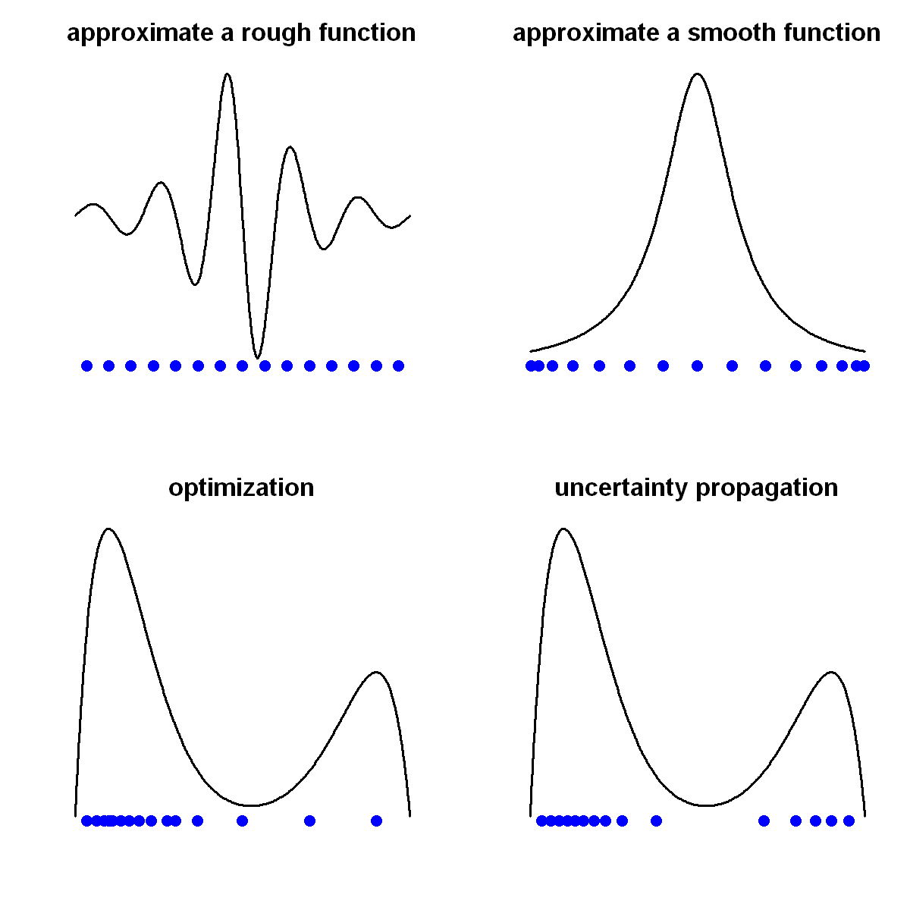

$$
\bigstar\;\diamond\;\bigstar\quad\boxed{\sigma_{\omega}\sigma}\quad\bigstar\;\diamond\;\bigstar
$$

# 图 1.4



$$
\bigstar\;\diamond\;\bigstar\quad\boxed{\sigma_{\omega}\sigma}\quad\bigstar\;\diamond\;\bigstar
$$

## 背景信息

若研究目标是对响应曲面进行近似拟合:

- 当响应曲面起伏粗糙时,采用能够均匀填充参数空间的试验设计会更合适(左上);
- 而当函数曲面光滑平缓时,在参数边界附近布置更多采样点的设计方案效果更佳(右上);
- 若目标为求取函数最大值,则应在全局极大值附近加密布置试验采样点(左下);
- 与之相对,若研究目标是开展不确定性传递分析,采样点的排布方式则需要贴合输入参数的概率分布特征(右下).

$$
\bigstar\;\diamond\;\bigstar\quad\boxed{\sigma_{\omega}\sigma}\quad\bigstar\;\diamond\;\bigstar
$$

## 指令

创建宽 10 英寸,高 10 英寸的画布:

```r
options(repr.plot.width=10, repr.plot.height=10)
```

将画布划分为 2x2 的网格:

```r
par(mfrow=c(2,2))
```

创建从 $0$ 到 $1$ 的 301 个点:

```r
x=seq(0,1,length=301)
```

1. 左上图:令函数

$$
y:=\frac{\sin(10\pi x)}{1+64(x-1/2)^{2}},
$$

```r
y=sin(10*pi*x)/(1+64*(x-.5)^2)
```

作图 $(x,y)$,其中:

- 折线类型为光滑曲线;
- 不显示坐标轴;
- 不显示 $x$,$y$ 轴;
- 线宽为 3;
- 颜色为黑色;
- $y$ 轴范围为其最小值下延 $0.05$ 至其最大值;
- 图形主标题为"approximate a rough function";
- 主标题缩放倍数为 2:

```r
plot(x,y,type="l",axes=FALSE,xlab="",ylab="",lwd=3,col=1,ylim=c(min(y)-.05,max(y)),main="approximate a rough function",cex.main=2)
```

生成 15 个在 $[0,1]$ 区间上均匀分布的点:

```r
n=15
D=((1:n)-.5)/n
```

在已有图形上添加散点,其中:

- 点的横坐标为上述 15 个点,纵坐标取 $y$ 的最小值向下偏移 $0.05$;
- 点的形状为实心圆;
- 点的缩放倍数为 2;
- 点的颜色为蓝色:

```r
points(cbind(D,min(y)-0.05),pch=16,cex=2,col="blue")
```

2. 右上图:令函数

$$
y:=\frac{1}{1+64(x-1/2)^{2}},
$$

```r
y=1/(1+64*(x-.5)^2)
```

作图 $(x,y)$,其中:

- 折线类型为光滑曲线;
- 不显示坐标轴;
- 不显示 $x$,$y$ 轴;
- 线宽为 3;
- 颜色为黑色;
- $y$ 轴范围为其最小值下延 $0.05$ 至其最大值;
- 图形主标题为"approximate a smooth function";
- 主标题缩放倍数为 2:

```r
plot(x,y,type="l",axes=FALSE,xlab="",ylab="",lwd=3,col=1,ylim=c(min(y)-.05,max(y)),main="approximate a smooth function",cex.main=2)
```

两端密集,中间稀疏的点分布由 Beta 分布实现:给定的概率值为 15 个在 $[0,1]$ 区间上均匀分布的点,返回满足 $P(X\le x)=p$ 的分位数 $x$,其中 $X\sim\mathrm{Beta}(1/2,1/2)$:

```r
D=qbeta(((1:n)-.5)/n,.5,.5)
```

在已有图形上添加散点,其中:

- 点的横坐标为上述 15 个点,纵坐标取 $y$ 的最小值向下偏移 $0.05$;
- 点的形状为实心圆;
- 点的缩放倍数为 2;
- 点的颜色为蓝色:

```r
points(cbind(D,min(y)-0.05),pch=16,cex=2,col="blue")
```

3. 左下图:令函数

$$
y:=\frac{2}{3}f_{B(2,10)}(x)+\frac{1}{3}f_{B(10,2)}(x),
$$

其中 $f_{B(\alpha,\beta)}$ 是 Beta 分布的概率密度函数:

```r
y=2/3*dbeta(x,2,10)+1/3*dbeta(x,10,2)
```

作图 $(x,y)$,其中:

- 折线类型为光滑曲线;
- 不显示坐标轴;
- 不显示 $x$,$y$ 轴;
- 线宽为 3;
- 颜色为黑色;
- $y$ 轴范围为其最小值下延 $0.05$ 至其最大值;
- 图形主标题为"optimization";
- 主标题缩放倍数为 2:

```r
plot(x,y,type="l",axes=FALSE,xlab="",ylab="",lwd=3,col=1,ylim=c(min(y)-.05,max(y)),main="optimization",cex.main=2)
```

生成 5 个在 $[0,1]$ 区间上均匀分布的点:

```r
n1=n*2/3
n2=n/3
D0=((1:n2)-.5)/n2
```

集中在左侧的点分布由 Beta 分布实现:给定的概率值为 10 个在 $[0,1]$ 区间上均匀分布的点,返回满足 $P(X\le x)=p$ 的分位数 $x$,其中 $X\sim\mathrm{Beta}(2,10)$,再与 5 个在 $[0,1]$ 区间上均匀分布的点叠加成最终选取的 15 个点:

```r
D=c(D0,qbeta(((1:n1)-.5)/n1,2,10))
```

在已有图形上添加散点,其中:

- 点的横坐标为上述 15 个点,纵坐标取 $y$ 的最小值向下偏移 $0.05$;
- 点的形状为实心圆;
- 点的缩放倍数为 2;
- 点的颜色为蓝色:

```r
points(cbind(D,min(y)-0.05),pch=16,cex=2,col="blue")
```

4. 右下图:令函数

$$
y:=\frac{2}{3}f_{B(2,10)}(x)+\frac{1}{3}f_{B(10,2)}(x),
$$

其中 $f_{B(\alpha,\beta)}$ 是 Beta 分布的概率密度函数:

```r
y=2/3*dbeta(x,2,10)+1/3*dbeta(x,10,2)
```

作图 $(x,y)$,其中:

- 折线类型为光滑曲线;
- 不显示坐标轴;
- 不显示 $x$,$y$ 轴;
- 线宽为 3;
- 颜色为黑色;
- $y$ 轴范围为其最小值下延 $0.05$ 至其最大值;
- 图形主标题为"uncertainty propagation";
- 主标题缩放倍数为 2:

```r
plot(x,y,type="l",axes=FALSE,xlab="",ylab="",lwd=3,col=1,ylim=c(min(y)-.05,max(y)),main="uncertainty propagation",cex.main=2)
```

依据左右峰的权重比为 1:2,在 $B(2,10)$ 中随机生成 10000 个样本,在 $B(10,2)$ 中随机生成 5000 个样本,叠加成 15000 个样本:

```r
x=c(rbeta(1000*n1,2,10),rbeta(1000*n2,10,2))
```

使用 `support` 包中的函数 `sp` 来从 15000 个样本中选取最能代表原始分布的 15 个支持点,在返回的列表中选取列名为 `sp` 的成员作为最终选取的 15 个点:

```r
library(support)
a=sp(n,1,dist.samp = cbind(x))
D=a$sp
```

在已有图形上添加散点,其中:

- 点的横坐标为上述 15 个点,纵坐标取 $y$ 的最小值向下偏移 $0.05$;
- 点的形状为实心圆;
- 点的缩放倍数为 2;
- 点的颜色为蓝色:

```r
points(cbind(D,min(y)-0.05),pch=16,cex=2,col="blue")
```

将画布分割还原成默认的 1x1:

```r
par(mfrow=c(1,1))
```

$$
\bigstar\;\diamond\;\bigstar\quad\boxed{\sigma_{\omega}\sigma}\quad\bigstar\;\diamond\;\bigstar
$$

## 最终效果

```r
# 图 1.4

options(repr.plot.width=10, repr.plot.height=10)
par(mfrow=c(2,2))
x=seq(0,1,length=301)

## 1
y=sin(10*pi*x)/(1+64*(x-.5)^2)
plot(x,y,type="l",axes=FALSE,xlab="",ylab="",lwd=3,col=1,ylim=c(min(y)-.05,max(y)),main="approximate a rough function",cex.main=2)
n=15
D=((1:n)-.5)/n
points(cbind(D,min(y)-.05),pch=16,cex=2,col="blue")

## 2
y=1/(1+64*(x-.5)^2)
plot(x,y,type="l",axes=FALSE,xlab="",ylab="",lwd=3,col=1,ylim=c(min(y)-.05,max(y)),main="approximate a smooth function",cex.main=2)
D=qbeta(((1:n)-.5)/n,.5,.5)
points(cbind(D,min(y)-.05),pch=16,cex=2,col="blue")

## 3
y=2/3*dbeta(x,2,10)+1/3*dbeta(x,10,2)
plot(x,y,type="l",axes=FALSE,xlab="",ylab="",lwd=3,col=1,ylim=c(min(y)-.05,max(y)),main="optimization",cex.main=2)
n1=n*2/3
n2=n/3
D0=((1:n2)-.5)/n2
D=c(D0,qbeta(((1:n1)-.5)/n1,2,10))
points(cbind(D,min(y)-.05),pch=16,cex=2,col="blue")

## 4
y=2/3*dbeta(x,2,10)+1/3*dbeta(x,10,2)
plot(x,y,type="l",axes=FALSE,xlab="",ylab="",lwd=3,col=1,ylim=c(min(y)-.05,max(y)),main="uncertainty propagation",cex.main=2)
x=c(rbeta(1000*n1,2,10),rbeta(1000*n2,10,2))
library(support)
a=sp(n,1,dist.samp = cbind(x))
D=a$sp
points(cbind(D,min(y)-.05),pch=16,cex=2,col="blue")
par(mfrow=c(1,1))
```


$$
\bigstar\;\diamond\;\bigstar\quad\boxed{\sigma_{\omega}\sigma}\quad\bigstar\;\diamond\;\bigstar
$$
