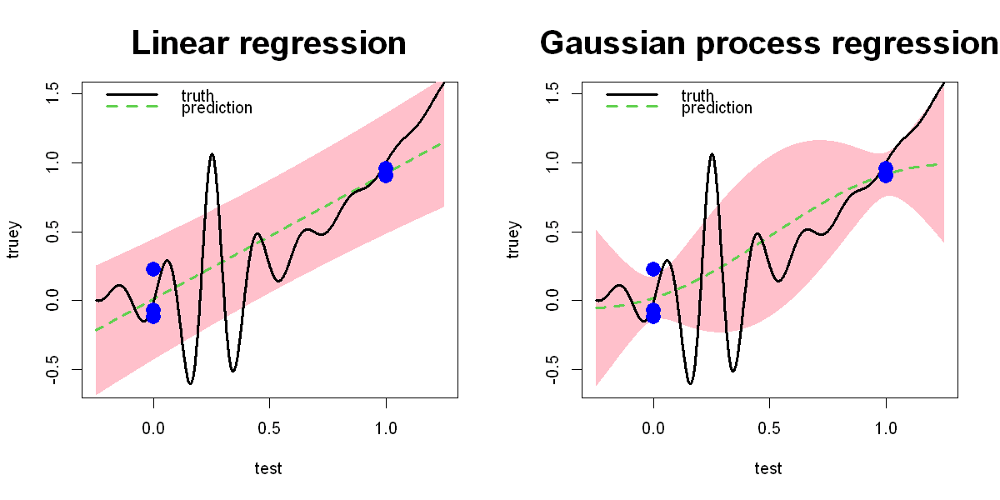

$$
\bigstar\;\diamond\;\bigstar\quad\boxed{\sigma_{\omega}\sigma}\quad\bigstar\;\diamond\;\bigstar
$$

# 图 1.5



$$
\bigstar\;\diamond\;\bigstar\quad\boxed{\sigma_{\omega}\sigma}\quad\bigstar\;\diamond\;\bigstar
$$

## 背景信息

假设开展单因子两水平试验,因子水平取 $x=0$ 和 $x=1$,各设置 3 次重复试验,试验数据如图 1.5 中蓝色实心圆点所示.$h(\cdot)$ 为图中黑色实线对应的真实函数,试验者事先未知该函数形式.线性回归模型广泛应用于物理试验研究.采用模型 $y_{i}=\beta_{0}+\beta_{1}x_{i}+\varepsilon_{i}$ 拟合试验数据,其中 $i=1,\dots,n$(本例样本量 $n=6$),误差项满足 $\varepsilon_{i}\stackrel{\text{i.i.d.}}{\sim}\mathcal{N}(0,\sigma^{2})$.图左侧子图展示了线性模型拟合直线及其 95% 置信区间.Gauss 过程回归在该类试验场景中应用较少,其拟合结果见同图右侧子图.

$$
\bigstar\;\diamond\;\bigstar\quad\boxed{\sigma_{\omega}\sigma}\quad\bigstar\;\diamond\;\bigstar
$$

## 指令

创建宽 10 英寸,高 5 英寸的画布:

```r
options(repr.plot.width=10,repr.plot.height=5)
```

将画布分为 1×2:

```r
par(mfrow=c(1,2))
```

创建向量 $\boldsymbol{x}=(0,0,0,1,1,1)$:

```r
n=6
x=rep(c(0,1),c(n/2,n/2))
```

定义"未知"(做试验时是未知的,此处为了展示两种拟合的精度比较便设为已知)的真实响应曲面函数

$$
f(\boldsymbol{x}):=\frac{\sin(10\pi\boldsymbol{x})}{1+64(\boldsymbol{x}-1/4)^{2}}+\boldsymbol{x}^{2}:
$$

```r
f=function(x) sin(10*pi*x)/(1+64*(x-.25)^2)+x^2
```

添加随机噪声

$$
y:=f(\boldsymbol{x})+\boldsymbol{\varepsilon}/10,
$$

其中 $\boldsymbol{\varepsilon}=(\varepsilon_{1},\dots,\varepsilon_{n})\sim\mathcal{N}(0,0.1^{2})$:

```r
set.seed(7)
y=f(x)+.1*rnorm(n)
```

为了定义绘图的左右边界,生成从 $-0.25$ 到 $1.25$,间隔 $0.001$ 的等距序列:

```r
l=-.25
u=1.25
test=seq(l,u,.001)
```

计算真实函数的值:

```r
truey=f(test)
```

线性拟合散点 `y~x`:

```r
a.lm=lm(y~x)
```

计算预测区间,其中:

- $x$ 的范围为从 $-0.25$ 到 $1.25$,间隔 $0.001$ 的等距序列;
- 同时计算所有点的预测区间:

```r
pred=predict.lm(a.lm,newdata=data.frame(x=test),interval="prediction")
```

由于不能直接创建绘制多边形的画布,因此先创建一个空白画布,其中:

- 折线类型为空;
- $x$ 轴范围为 $[-0.25,1.25]$,$y$ 轴范围为 $[\min(y)-0.5,1.5]$;
- 图形主标题为"Linear regression";
- 主标题缩放倍数为 2:

```r
plot(test,truey,type="n",xlim=c(l,u),ylim=c(min(y)-.5,1.5),main="Linear regression",cex.main=2)
```

令 95% 预测区间(自动计算)的上下界分别为 `up` 与 `low`.叠加置信区间多边形,其中:

- 多边形边界为 $[-0.25,1.25]\times[\text{low},\text{up}]$;
- 多边形颜色为粉色;
- 边界颜色为粉色:

```r
low=pred[,2]
up=pred[,3]
polygon(c(test,rev(test)),c(low,rev(up)),col="pink",border="pink")
```

叠加拟合值 $\widehat{y}$,其中:

- 线的颜色为绿色;
- 线的宽度为 3;
- 线的类型为虚线:

```r
lines(test,pred[,1],col=3,lwd=3,lty=2)
```

叠加真实值 $f(\boldsymbol{x})$,其中:

- 线的宽度为 3:

```r
lines(test,truey,lwd=3)
```

叠加散点,其中:

- 点的形状为实心圆;
- 点的缩放倍数为 2;
- 点的颜色为蓝色:

```r
points(x,y,pch=16,cex=2,col="blue")
```

叠加图例,其中:

- 位置位于左上角;
- 给真实曲线和预测值添加标签;
- 线型,颜色,线宽与二者分别对应;
- 不画图例边框:

```r
legend("topleft", legend = c("truth","prediction"),lty=c(1,2),col=c(1,3),lwd=c(3,3),bty = "n")
```

使用 `rkriging` 包中的 `Fit.kriging` 函数 GP 拟合散点 `y~x`,其中:

- 数据有噪声;
- 自动学习最优平滑参数;
- 均值未知;
- 使用 Gauss 核:

```r
library(rkriging)
a.gp=Fit.Kriging(x,y,interpolation=FALSE,fit=TRUE,model="OK",kernel.parameters=list(type="Gaussian"))
```

计算预测区间,其中:

- $x$ 的范围为从 $-0.25$ 到 $1.25$,间隔 $0.001$ 的等距序列:

```r
pred=Predict.Kriging(a.gp,data.frame(x=test))
```

由于不能直接创建绘制多边形的画布,因此先创建一个空白画布,其中:

- 折线类型为空;
- $x$ 轴范围为 $[-0.25,1.25]$,$y$ 轴范围为 $[\min(y)-0.5,1.5]$;
- 图形主标题为"Gaussian process regression";
- 主标题缩放倍数为 2:

```r
plot(test,truey,type="n",xlim=c(l,u),ylim=c(min(y)-.5,1.5),main="Gaussian process regression",cex.main=2)
```

令 95% 预测区间(依据 $3\sigma$ 原则手动计算)的上下界分别为 `up` 与 `low`.叠加置信区间多边形,其中:

- 多边形边界为 $[-0.25,1.25]\times[\text{low},\text{up}]$;
- 多边形颜色为粉色;
- 边界颜色为粉色:

```r
low=pred$mean-2*pred$sd
up=pred$mean+2*pred$sd
polygon(c(test,rev(test)),c(low,rev(up)),col="pink",border="pink")
```

叠加拟合值 $\widehat{y}$,其中:

- 线的颜色为绿色;
- 线的宽度为 3;
- 线的类型为虚线:

```r
lines(test,pred$mean,col=3,lwd=3,lty=2)
```

叠加真实值 $f(\boldsymbol{x})$,其中:

- 线的宽度为 3:

```r
lines(test,truey,lwd=3)
```

叠加散点,其中:

- 点的形状为实心圆;
- 点的缩放倍数为 2;
- 点的颜色为蓝色:

```r
points(x,y,pch=16,cex=2,col="blue")
```

叠加图例,其中:

- 位置位于左上角;
- 给真实曲线和预测值添加标签;
- 线型,颜色,线宽与二者分别对应;
- 不画图例边框:

```r
legend("topleft", legend = c("truth","prediction"),lty=c(1,2),col=c(1,3),lwd=c(3,3),bty = "n")
```

将画布还原回 1×1:

```r
par(mfrow=c(1,1))
```

$$
\bigstar\;\diamond\;\bigstar\quad\boxed{\sigma_{\omega}\sigma}\quad\bigstar\;\diamond\;\bigstar
$$

## 最终效果

```r
# 图 1.5

options(repr.plot.width=10, repr.plot.height=5)
par(mfrow=c(1,2))
n=6
x=rep(c(0,1),c(n/2,n/2))
f=function(x) sin(10*pi*x)/(1+64*(x-.25)^2)+x^2
set.seed(7)
y=f(x)+.1*rnorm(n)
l=-.25
u=1.25
test=seq(l,u,.001)
truey=f(test)

## 线性拟合

a.lm=lm(y~x)
pred=predict.lm(a.lm,newdata=data.frame(x=test),interval="prediction")
plot(test,truey,type="n",xlim=c(l,u),ylim=c(min(y)-.5,1.5),main="Linear regression",cex.main=2)
low=pred[,2]
up=pred[,3]
polygon(c(test,rev(test)),c(low,rev(up)),col="pink",border="pink")
lines(test,pred[,1],col=3,lwd=3,lty=2)
lines(test,truey,lwd=3)
points(x,y,pch=16,cex=2,col="blue")
legend("topleft", legend = c("truth","prediction"),lty=c(1,2),col=c(1,3),lwd=c(3,3),bty = "n")

## GP

library(rkriging)
a.gp=Fit.Kriging(x,y,interpolation=FALSE,fit=TRUE,model="OK",kernel.parameters=list(type="Gaussian"))
pred=Predict.Kriging(a.gp,data.frame(x=test))
plot(test,truey,type="n",xlim=c(l,u),ylim=c(min(y)-.5,1.5),main="Gaussian process regression",cex.main=2)
low=pred$mean-2*pred$sd
up=pred$mean+2*pred$sd
polygon(c(test,rev(test)),c(low,rev(up)),col="pink",border="pink")
lines(test,pred$mean,col=3,lwd=3,lty=2)
lines(test,truey,lwd=3)
points(x,y,pch=16,col="blue",cex=2)
legend("topleft", legend = c("truth","prediction"),lty=c(1,2),col=c(1,3),lwd=c(3,3),bty = "n")

par(mfrow=c(1,1))
```


$$
\bigstar\;\diamond\;\bigstar\quad\boxed{\sigma_{\omega}\sigma}\quad\bigstar\;\diamond\;\bigstar
$$
