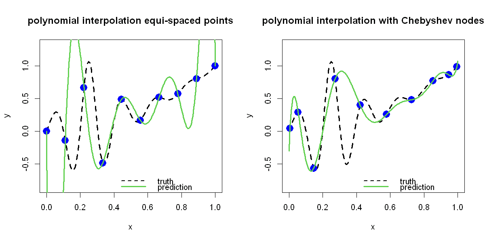

$$
\bigstar\;\diamond\;\bigstar\quad\boxed{\sigma_{\omega}\sigma}\quad\bigstar\;\diamond\;\bigstar
$$

# 图 2.1



## 背景信息

插值曲线在图 2.1 中以绿色实线绘制.可以看到,符合插值函数的特性,曲线经过全部 10 个样本点;但不足之处在于,除区间中间区域外,该曲线对真实函数的近似效果很差.插值曲线在区间两端剧烈振荡,这是高次多项式插值中一种熟知的问题,称作 Runge 现象.右侧子图绘制了 10 个 Chebyshev 节点试验设计点及其对应的函数观测值.可以看出,相较于等距设计点,该组节点会更多地向区间两端靠拢.图中同样以绿色实线给出插值曲线,该曲线能够很好地近似真实函数,相比左侧子图中等距节点的插值结果有大幅改善.这个例子充分体现了试验设计的重要性!

$$
\bigstar\;\diamond\;\bigstar\quad\boxed{\sigma_{\omega}\sigma}\quad\bigstar\;\diamond\;\bigstar
$$

## 指令

创建宽 10 英寸,高 5 英寸的画布,将画布分为 1x2:

```r
options(repr.plot.width=10, repr.plot.height=5)
par(mfrow=c(1,2))
```

令函数

$$f(x):=\frac{\sin(10\pi x)}{1+64(x-.25)^{2}}+x^{2}:$$

```r
f=function(x) sin(10*pi*x)/(1+64*(x-.25)^2)+x^2
```

在 $[0,1]$ 中创建 301 个点,并计算真实函数值:

```r
test=seq(0,1,length=301)
true=f(test)
```

1. 等距节点:做真实函数的图像,其中:

- 线条类型为平滑曲线;
- $x$ 轴标注为 `x`,$y$ 轴标注为 `y`;
- 线宽为 3;
- 线条类型为虚线;
- $y$ 轴显示范围为 $[\min(y)-.25,\max(y)+.25]$;
- 主标题为"polynomial interpolation equi-spaced points":

```r
plot(test,true,type="l",xlab="x",ylab="y",lwd=3,lty=2,ylim=c(min(true)-.25,max(true)+.25),main="polynomial interpolation equi-spaced points")
```

在真实函数图像上水平间距均匀地取 10 个点,叠加在画布里,其中:

- 点的类型为实心圆点;
- 缩放倍数为 2;
- 颜色为蓝色:

```r
n=10
D=((1:n)-1)/(n-1)
y=f(D)
points(cbind(D,y),pch=16,cex=2,col="blue")
```

将 `D` 投影到 Chebyshev 多项式的定义域 $[-1,1]$ 上;创建空矩阵,利用公式 $R_{i}(x)=\cos(i\cos^{-1}(x))$,$i=0,\dots,n-1$ 按列拼接成矩阵 $\boldsymbol{R}$:

```r
d=2*D-1
X=NULL
for(i in 0:(n-1)) X=cbind(X,cos((i)*acos(d)))
```

利用公式 $\widehat{\boldsymbol{\beta}}=\boldsymbol{R}^{-1}\boldsymbol{y}$ 求解 $\widehat{\boldsymbol{\beta}}$,将定义域放缩至 $[-1,1]$,创建空矩阵,利用公式 $R_{i}(x)=\cos(i\cos^{-1}(x))$,$i=0,\dots,n-1$ 按列拼接成矩阵 $\boldsymbol{r}(x)'$:利用公式 $\widehat{y}(x)=\boldsymbol{r}(x)'\widehat{\boldsymbol{\beta}}$ 求解插值函数:

```r
a=solve(X,y)
us=2*test-1
X_pred=NULL
for(i in 0:(n-1)) X_pred=cbind(X_pred,cos((i)*acos(us)))
yhat=X_pred%*%a
```

叠加插值函数,其中:

- 颜色为绿色;
- 线宽为 3:

```r
lines(test,yhat,col=3,lwd=3)
```

叠加图例,其中:

- 位置在右下角;
- 图例名为 `truth` 与 `prediction`;
- 线型,颜色,线宽与二者分别对应;
- 不画图例边框:

```r
legend("bottomright",legend=c("truth","prediction"),lty=c(2,1),col=c(1,3),lwd=c(2,3),bty="n")
```

2. Chebyshev 节点:做真实函数的图像,其中:

- 线条类型为平滑曲线;
- $x$ 轴标注为 `x`,$y$ 轴标注为 `y`;
- 线宽为 3;
- 线条类型为虚线;
- $y$ 轴显示范围为 $[\min(y)-.25,\max(y)+.25]$;
- 主标题为"polynomial interpolation with Chebyshev nodes":

```r
plot(test,true,type="l",xlab="x",ylab="y",lwd=3,lty=2,col=1,ylim=c(min(true)-.25,max(true)+.25),main="polynomial interpolation with Chebyshev nodes")
```

依据公式 $x_{i}=\cos(\pi(i-.5)/n)$,$r=1,\dots,n$ 计算出 Chebyshev 节点,放缩为 $[0,1]$ 上的点作为选取的节点,叠加在画布里,其中:

- 点的类型为实心圆点;
- 缩放倍数为 2;
- 颜色为蓝色:

```r
d=cos(pi*((1:n)-.5)/n)
D=(d+1)/2
y=f(D)
points(cbind(D,y),pch=16,cex=2,col="blue")
```

创建空矩阵,利用公式 $R_{i}(x)=\cos(i\cos^{-1}(x))$,$i=0,\dots,n-1$ 按列拼接成矩阵 $\boldsymbol{R}$:

```r
X=NULL
for(i in 0:(n-1)) X=cbind(X,cos((i)*acos(d)))
```

利用公式 $\widehat{\boldsymbol{\beta}}=\boldsymbol{R}^{-1}\boldsymbol{y}$ 求解 $\widehat{\boldsymbol{\beta}}$,将定义域放缩至 $[-1,1]$,创建空矩阵,利用公式 $R_{i}(x)=\cos(i\cos^{-1}(x))$,$i=0,\dots,n-1$ 按列拼接成矩阵 $\boldsymbol{r}(x)'$:利用公式 $\widehat{y}(x)=\boldsymbol{r}(x)'\widehat{\boldsymbol{\beta}}$ 求解插值函数:

```r
a=solve(X,y)
us=2*test-1
X_pred=NULL
for(i in 0:(n-1)) X_pred=cbind(X_pred,cos((i)*acos(us)))
yhat=X_pred%*%a
```

叠加插值函数,其中:

- 颜色为绿色;
- 线宽为 3:

```r
lines(test,yhat,col=3,lwd=3)
```

叠加图例,其中:

- 位置在右下角;
- 图例名为 `truth` 与 `prediction`;
- 线型,颜色,线宽与二者分别对应;
- 不画图例边框:

```r
legend("bottomright",legend=c("truth","prediction"),lty=c(2,1),col=c(1,3),lwd=c(2,3),bty="n")
```

将画布还原回 1x1:

```r
par(mfrow=c(1,1))
```

$$
\bigstar\;\diamond\;\bigstar\quad\boxed{\sigma_{\omega}\sigma}\quad\bigstar\;\diamond\;\bigstar
$$

## 最终效果

```r
# 图 2.1

options(repr.plot.width=10, repr.plot.height=5)
par(mfrow=c(1,2))
f=function(x) sin(10*pi*x)/(1+64*(x-.25)^2)+x^2
test=seq(0,1,length=301)
true=f(test)

## 等距点
plot(test,true,type="l",xlab="x",ylab="y",lwd=3,lty=2,ylim=c(min(true)-.25,max(true)+.25),main="polynomial interpolation equi-spaced points")
n=10
D=((1:n)-1)/(n-1)
y=f(D)
points(cbind(D,y),pch=16,cex=2,col="blue")
d=2*D-1
X=NULL
for(i in 0:(n-1)) X=cbind(X,cos((i)*acos(d)))
a=solve(X,y)
us=2*test-1
X_pred=NULL
for(i in 0:(n-1)) X_pred=cbind(X_pred,cos((i)*acos(us)))
yhat=X_pred%*%a
lines(test,yhat,col=3,lwd=3)
legend("bottomright",legend=c("truth","prediction"),lty=c(2,1),col=c(1,3),lwd=c(2,3),bty="n")

# Chebyshev 节点
plot(test,true,type="l",xlab="x",ylab="y",lwd=3,lty=2,col=1,ylim=c(min(true)-.25,max(true)+.25),main="polynomial interpolation with Chebyshev nodes")
d=cos(pi*((1:n)-.5)/n)
D=(d+1)/2
y=f(D)
points(cbind(D,y),pch=16,cex=2,col="blue")
X=NULL
for(i in 0:(n-1)) X=cbind(X,cos((i)*acos(d)))
a=solve(X,y)
us=2*test-1
X_pred=NULL
for(i in 0:(n-1)) X_pred=cbind(X_pred,cos((i)*acos(us)))
yhat=X_pred%*%a
lines(test,yhat,col=3,lwd=3)
legend("bottomright",legend=c("truth","prediction"),lty=c(2,1),col=c(1,3),lwd=c(2,3),bty="n")

par(mfrow=c(1,1))
```


$$
\bigstar\;\diamond\;\bigstar\quad\boxed{\sigma_{\omega}\sigma}\quad\bigstar\;\diamond\;\bigstar
$$