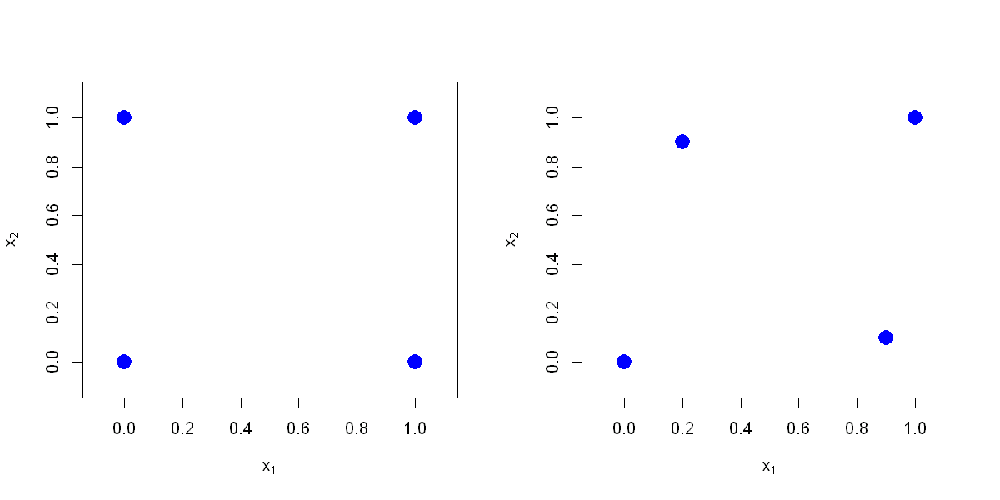

$$
\bigstar\;\diamond\;\bigstar\quad\boxed{\sigma_{\omega}\sigma}\quad\bigstar\;\diamond\;\bigstar
$$

# 图 2.2



$$
\bigstar\;\diamond\;\bigstar\quad\boxed{\sigma_{\omega}\sigma}\quad\bigstar\;\diamond\;\bigstar
$$

## 背景信息

尽管在一维问题中采用 Chebyshev 节点作为多项式插值的试验设计效果尚可,但当输入变量存在多个时,多项式插值就会出现问题.以图 2.2 左侧展示的 $2^2$ 全因子设计为例,该 $2^2$ 设计可由各变量的两点设计 $(0,1)$ 直积得到,即 $(0,1)\otimes(0,1)$.该多项式中的各项同样可通过类似直积形式构造:$(1,x_{1})\otimes(1,x_{2})=(1,x_{1},x_{2},x_{1}x_{2})$.再看同一张图右侧,若对其中两个采样点做轻微扰动,此时构造能够插值这四个点的多项式便不再直观.实际上,这类情形下的插值多项式可能不唯一,需要借助专用算法才能求解.

$$
\bigstar\;\diamond\;\bigstar\quad\boxed{\sigma_{\omega}\sigma}\quad\bigstar\;\diamond\;\bigstar
$$

## 指令

将画布设为宽 10 英寸,高 5 英寸,将画布分为 1x2:

```r
options(repr.plot.width=10,repr.plot.width=5)
par(mfrow=c(1,2))
```

1. 左图:定义点矩阵 $\begin{bmatrix} (0,0)&(0,1)\\(1,0)&(1,1) \end{bmatrix}$,并作图,其中:

- 点的样式为实心圆;
- 点的放缩系数为 2;
- 点的颜色为蓝色;
- $x$ 与 $y$ 轴的显示范围均为 $[-.1,1.1]$;
- $x$ 轴的标签为 $x_{1}$,$y$ 轴的标签为 $y_{1}$:

```r
D=matrix(c(0,0,0,1,1,0,1,1),nrow=4,ncol=2,byrow=TRUE)
plot(D,pch=16,cex=2,col="blue",xlim=c(-.1,1.1),ylim=c(-.1,1.1),xlab=expression(x[1]), ylab=expression(x[2]))
```

2. 右图:定义点矩阵 $\begin{bmatrix} (0,0)&(.2,.9)\\(.9,.1)&(1,1) \end{bmatrix}$,并作图,其中:

- 点的样式为实心圆;
- 点的放缩系数为 2;
- 点的颜色为蓝色;
- $x$ 与 $y$ 轴的显示范围均为 $[-.1,1.1]$;
- $x$ 轴的标签为 $x_{1}$,$y$ 轴的标签为 $y_{1}$:

```r
D=matrix(c(0,0,.2,.9,.9,.1,1,1),nrow=4,ncol=2,byrow=TRUE)
plot(D,pch=16,cex=2,col="blue",xlim=c(-.1,1.1),ylim=c(-.1,1.1),xlab=expression(x[1]), ylab=expression(x[2]))
```

$$
\bigstar\;\diamond\;\bigstar\quad\boxed{\sigma_{\omega}\sigma}\quad\bigstar\;\diamond\;\bigstar
$$

## 最终效果

```r
# 图 2.2

options(repr.plot.width=10, repr.plot.height=5)
par(mfrow=c(1,2))

## 左侧

D=matrix(c(0,0,0,1,1,0,1,1),nrow=4,ncol=2,byrow=TRUE)
plot(D,pch=16,cex=2,col="blue",xlim=c(-.1,1.1),ylim=c(-.1,1.1),xlab=expression(x[1]), ylab=expression(x[2]))

## 右侧

D=matrix(c(0,0,.2,.9,.9,.1,1,1),nrow=4,ncol=2,byrow=TRUE)
plot(D,pch=16,cex=2,col="blue",xlim=c(-.1,1.1),ylim=c(-.1,1.1),xlab=expression(x[1]), ylab=expression(x[2]))
par(mfrow=c(1,1))
```


$$
\bigstar\;\diamond\;\bigstar\quad\boxed{\sigma_{\omega}\sigma}\quad\bigstar\;\diamond\;\bigstar
$$