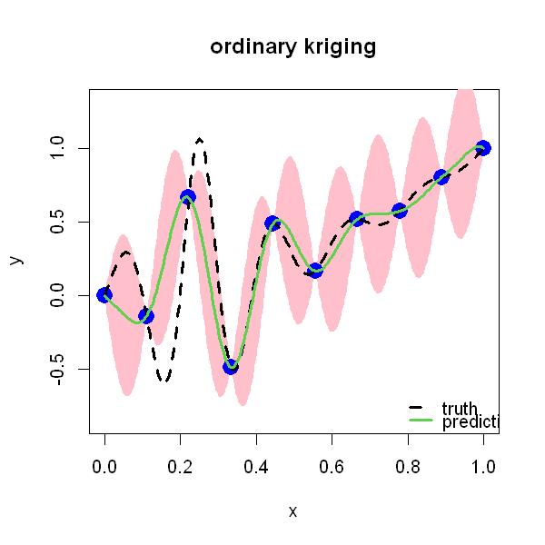

$$
\bigstar\;\diamond\;\bigstar\quad\boxed{\sigma_{\omega}\sigma}\quad\bigstar\;\diamond\;\bigstar
$$

# 图 2.4



$$
\bigstar\;\diamond\;\bigstar\quad\boxed{\sigma_{\omega}\sigma}\quad\bigstar\;\diamond\;\bigstar
$$

## 背景信息

再次回顾 $h(x)=\frac{\sin(10\pi x)}{1+64(x-.25)}+x^{2},x\in[0,1]$,设计点集 $D=\{(i-1)/(n-1)\}_{i=1}^{n}$,取 $n=10$.进行预测前仍需给定相关参数 $\theta$,可沿用 2.1.2 节介绍的交叉验证方法;若对随机过程的分布做出假设,也可采用极大似然估计方法,下一节将详细介绍该思路.本节暂取此前通过最小化均方交叉验证误差得到的参数估计值 $\widehat{\theta}=0.08$.图 2.4 给出普通 Kriging 预测曲线,同时附带 $\pm2\sqrt{\mathrm{MSE}(x)}$ 构成的 95% 预测区间(系数 $2$ 基于正态分布假设推导,下一节会进一步说明).该预测结果与径向基插值的输出相近,但普通 Kriging 能够额外给出预测不确定性.符合预期的是:预测点越靠近观测点,不确定性越小;预测点离观测点越远,不确定性越高.

$$
\bigstar\;\diamond\;\bigstar\quad\boxed{\sigma_{\omega}\sigma}\quad\bigstar\;\diamond\;\bigstar
$$

## 指令

设置画布宽 5 英寸,高 5 英寸:

```r
options(repr.plot.width=5,repr.plot.height=5)
```

定义函数 $f(x)=\frac{\sin(10\pi x)}{1+64(x-.25)}+x^{2}$,在 $[0,1]$ 中等间距取 301 个点,计算其对应的真实函数值;在 $[0,1]$ 中等间距取 10 个点作为观测点,计算其对应的观测值:

```r
f=function(x) sin(10*pi*x)/(1+64*(x-.25)^2)+x^2
test=seq(0,1,length=301)
true=f(test)
n=10
D=((1:n)-1)/(n-1)
y=f(D)
```

令参数 $\theta=0.08$,计算 $\boldsymbol{R}$,$\boldsymbol{R}^{-1}$,$\boldsymbol{r}(\boldsymbol{x})'$ 与 $\boldsymbol{r}(\boldsymbol{x})'\boldsymbol{R}^{-1}$:

```r
theta=.08
R=exp(-(outer(D,D,"-")/theta)^2)
Rinv=solve(R)
R_pred=exp(-(outer(test,D,"-")/theta)^2)
rRinv=R_pred%*%Rinv
```

依据 $\widehat{\mu}=\frac{\boldsymbol{1}'\boldsymbol{R}^{-1}\boldsymbol{y}}{\boldsymbol{1}'\boldsymbol{R}^{-1}\boldsymbol{1}}$(广义一阶矩,广义最小二乘)计算 $\widehat{\mu}$,依据 $\widehat{y}(\boldsymbol{x})=\widehat{\mu}+\boldsymbol{r}(\boldsymbol{x})'\boldsymbol{R}^{-1}(\boldsymbol{y}-\widehat{\mu}\boldsymbol{1})$ 计算 $\widehat{y}(\boldsymbol{x})$:

```r
one=rep(1,n)
mu_hat=as.numeric((t(one)%*%Rinv%*%y)/(t(one)%*%Rinv%*%one))
pred=as.numeric(mu_hat+rRinv%*%(y-mu_hat))
```

依据 $\tau^{2}=\frac{1}{n-1}\cdot(\boldsymbol{y}-\widehat{\mu}\boldsymbol{1})'\boldsymbol{R}^{-1}(\boldsymbol{y}-\widehat{\mu}\boldsymbol{1})$ 计算 $\tau^{2}$,依据 $\mathrm{MSE}(\boldsymbol{x})=\tau^{2}\left(1-\boldsymbol{r}(\boldsymbol{x})'\boldsymbol{R}^{-1}\boldsymbol{r}(\boldsymbol{x})+\frac{(\boldsymbol{r}(\boldsymbol{x})'\boldsymbol{R}^{-1}\boldsymbol{1}-1)^{2}}{\boldsymbol{1}'\boldsymbol{R}^{-1}\boldsymbol{1}}\right)$ 计算 MSE:

```r
tau2_hat=as.numeric(t(y-mu_hat)%*%Rinv%*%(y-mu_hat)/(n-1))
MSE=tau2_hat*(1-rowSums(rRinv*R_pred)+(rRinv%*%one-1)^2/as.numeric(t(one)%*%Rinv%*%one))
```

依据 3-$\sigma$ 原则选取 $[\mu-2\sigma,\mu+2\sigma]$ 作为 95% 预测区间:

```r
low=as.numeric(pred-2*sqrt(pmax(MSE,0)))
up=as.numeric(pred+2*sqrt(pmax(MSE,0)))
```

开始作图:创建空画布,其中 $x$ 轴标注 `x`,$y$ 轴标注 `y`,$y$ 轴的显示范围为 $[\min(f)-.25,\max(f)+.25]$,主标题为"ordinary kriging";叠加预测区间多边形,其中颜色为粉色,不显示边框;叠加观测点,其中点的类型为实心圆点,放缩系数为 2,点的颜色为蓝色;叠加真实函数曲线,其中曲线类型为虚线,放缩系数为 3;叠加预测函数曲线,其中曲线颜色为绿色,放缩系数为 3;添加图例,图例内容为"truth"与"prediction",曲线类型,曲线颜色,放缩系数分别对应,不显示图例边框:

```r
plot(test,true,type="n",xlab="x",ylab="y",ylim=c(min(true)-.25,max(true)+.25),main="ordinary kriging")
polygon(c(test,rev(test)),c(low,rev(up)),col="pink",border=NA)
points(cbind(D,y),pch=16,cex=2,col="blue")
lines(test,true,lty=2,lwd=3)
lines(test,pred,col=3,lwd=3)
legend("bottomright",legend=c("truth","prediction"),lty=c(2,1),col=c(1,3),lwd=c(3,3),bty="n")
```

$$
\bigstar\;\diamond\;\bigstar\quad\boxed{\sigma_{\omega}\sigma}\quad\bigstar\;\diamond\;\bigstar
$$

## 最终效果

```r

# 图 2.4

options(repr.plot.width=5,repr.plot.height=5)
f=function(x) sin(10*pi*x)/(1+64*(x-.25)^2)+x^2
test=seq(0,1,length=301)
true=f(test)
n=10
D=((1:n)-1)/(n-1)
y=f(D)
theta=.08
R=exp(-(outer(D,D,"-")/theta)^2)
Rinv=solve(R)
R_pred=exp(-(outer(test,D,"-")/theta)^2)
rRinv=R_pred%*%Rinv
one=rep(1,n)
mu_hat=as.numeric((t(one)%*%Rinv%*%y)/(t(one)%*%Rinv%*%one))
pred=as.numeric(mu_hat+rRinv%*%(y-mu_hat))
tau2_hat=as.numeric(t(y-mu_hat)%*%Rinv%*%(y-mu_hat)/(n-1))
MSE=tau2_hat*(1-rowSums(rRinv*R_pred)+(rRinv%*%one-1)^2/as.numeric(t(one)%*%Rinv%*%one))
low=as.numeric(pred-2*sqrt(pmax(MSE,0)))
up=as.numeric(pred+2*sqrt(pmax(MSE,0)))
plot(test,true,type="n",xlab="x",ylab="y",ylim=c(min(true)-.25,max(true)+.25),main="ordinary kriging")
polygon(c(test,rev(test)),c(low,rev(up)),col="pink",border=NA)
points(cbind(D,y),pch=16,cex=2,col="blue")
lines(test,true,lty=2,lwd=3)
lines(test,pred,col=3,lwd=3)
legend("bottomright",legend=c("truth","prediction"),lty=c(2,1),col=c(1,3),lwd=c(3,3),bty="n")

```


$$
\bigstar\;\diamond\;\bigstar\quad\boxed{\sigma_{\omega}\sigma}\quad\bigstar\;\diamond\;\bigstar
$$