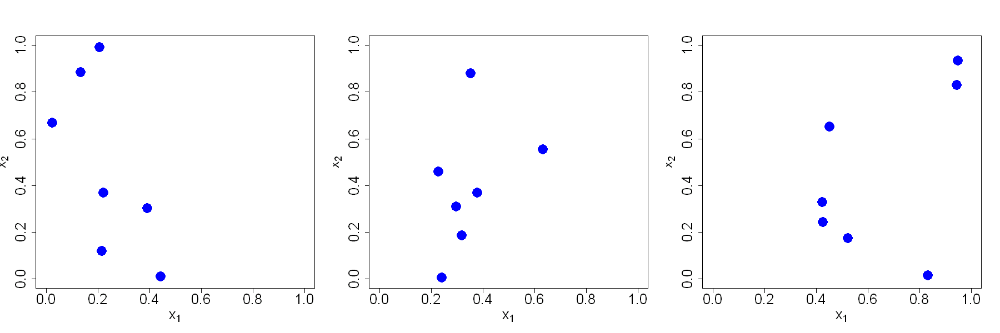

$$
\bigstar\;\diamond\;\bigstar\quad\boxed{\sigma_{\omega}\sigma}\quad\bigstar\;\diamond\;\bigstar
$$

# 图 3.1



$$
\bigstar\;\diamond\;\bigstar\quad\boxed{\sigma_{\omega}\sigma}\quad\bigstar\;\diamond\;\bigstar
$$

## 背景信息

假设存在两个输入变量($x_{1}$ 和 $x_{2}$),试验预算仅允许开展 7 次试验,记 $\mathcal{X}$ 为待从中选取 7 个试验点的试验区域.若无特殊说明,均假定试验区域可标准化为超立方体,因此本例中 $\mathcal{X}=[0,1]^{2}$.若不借助任何试验设计理论,我们可直接在 $[0,1]^{2}$ 内随机抽取 7 个样本点,图 3.1 展示了三组此类随机设计方案.不难发现第一组设计的样本点大多集中在 $\mathcal{X}$ 左侧,第二组集中在中部,第三组集中在右侧.显然这类设计难以完整刻画区域 $\mathcal{X}$ 内输入与输出的对应关系.当然也存在特殊情形:若目标函数左侧变化剧烈,右侧近似恒定,则第一组随机设计或许能较好拟合该函数.但在试验设计阶段我们对目标函数一无所知,因此试验方案需满足可精准拟合任意潜在函数的要求.这就需要划定一类函数集合,并寻找平均拟合效果最优或最差情形误差最小的设计方案.

$$
\bigstar\;\diamond\;\bigstar\quad\boxed{\sigma_{\omega}\sigma}\quad\bigstar\;\diamond\;\bigstar
$$

## 指令

创建画布宽 15 英寸,高 5 英寸.将画布分为 1x3.分别设置种子为 `9`,`45`,`31`,从 $[0,1]$ 的均匀分布中随机抽取 14 个数据作为观测点,按列(默认)分别排成 7 行 2 列的 3 个矩阵.绘制观测点,其中 $x$,$y$ 的范围均为 $[0,1]$,$x$ 轴标注为 $x_{1}$,$y$ 轴标注为 $x_{2}$,坐标轴,轴标注的放缩系数均为 2,点的类型为实心圆点,颜色为蓝色,放缩系数为 3.

```r

options(repr.plot.width=15, repr.plot.height=5)
par(mfrow=c(1,3))
for(i in c(9,45,31)){
  set.seed(i)
  D=matrix(runif(7*2),nrow=7,ncol=2)
  plot(D,xlim=c(0,1),ylim=c(0,1),xlab=expression(x[1]),ylab=expression(x[2]),cex.lab=2,cex.axis=2,pch=16,col="blue",cex=3)
}

```

$$
\bigstar\;\diamond\;\bigstar\quad\boxed{\sigma_{\omega}\sigma}\quad\bigstar\;\diamond\;\bigstar
$$

## 最终效果

```r

options(repr.plot.width=15, repr.plot.height=5)
par(mfrow=c(1,3))
for(i in c(9,45,31)){
  set.seed(i)
  D=matrix(runif(7*2),nrow=7,ncol=2)
  plot(D,xlim=c(0,1),ylim=c(0,1),xlab=expression(x[1]),ylab=expression(x[2]),cex.lab=2,cex.axis=2,pch=16,col="blue",cex=3)
}

```


$$
\bigstar\;\diamond\;\bigstar\quad\boxed{\sigma_{\omega}\sigma}\quad\bigstar\;\diamond\;\bigstar
$$