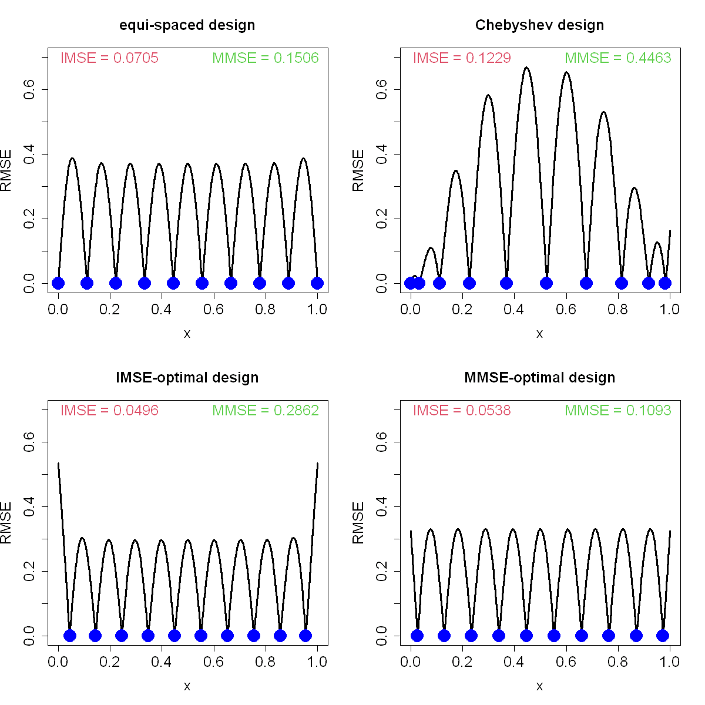

$$
\bigstar\;\diamond\;\bigstar\quad\boxed{\sigma_{\omega}\sigma}\quad\bigstar\;\diamond\;\bigstar
$$

# 图 3.2



$$
\bigstar\;\diamond\;\bigstar\quad\boxed{\sigma_{\omega}\sigma}\quad\bigstar\;\diamond\;\bigstar
$$

## 背景信息

我们考虑一维算例,便于直观理解该设计准则.积分均方误差准则需先指定相关函数及其参数方可计算,取相关函数 $R(x)=\exp(-x^{2}/\theta^{2})$,令相关参数 $\theta=0.1$.图 3.2 左上子图展示两种含 10 次试验的设计对应的均方根误差 RMSE(等价于标准化后验标准差 $s(\boldsymbol{x})/\tau$):等距设计 $$D_{1}=\left\{\frac{i-1}{n-1}\right\}_{i=1}^{n}$$ 与切比雪夫设计 $$D_{2}=\left\{0.5+0.5\cos\left(\pi\frac{i-0.5}{n}\right)\right\}_{i=1}^{n},$$ 其中试验次数 $n=10$.可以看到,在试验点处 RMSE 取值为 0,且随预测点远离试验点逐步增大;切比雪夫设计在边界附近分配更多样本点,因此边界区域 RMSE 更小,但区间中部的 RMSE 会有所升高.我们可通过计算式(3.2)中的 IMSE 对比两种设计优劣,借助数值积分求得 $\mathrm{IMSE}(D_{1};0.1)=0.0705$,$\mathrm{IMSE}(D_{2};0.1)=0.1227$,说明等距设计表现更优.我们可通过优化 IMSE 准则求解最优设计,但该优化问题求解难度较大:目标函数包含矩阵逆 $\boldsymbol{R}^{-1}$,依赖数值积分且存在多极值.本文采用 R 语言内置 `optim` 函数中的无导数有限内存 BFGS(L-BFGS)优化算法,以等距设计作为初始迭代点求解最优设计.最优设计 $D_{3}$ 绘制于同一张图的左下子图,对应指标 $\mathrm{IMSE}(D_{3};0.1)=0.0496$;可见该最优设计将样本点向区间中部聚拢,致使边界位置 RMSE 变大,但整体积分均方误差更小.通过最小化最大均方误差(MMSE)得到的最优设计 $D_{4}$ 展示在图 3.2 的右下子图.可以看到该设计能够抑制全局最大预测不确定性;相较于积分均方误差(IMSE)最优设计,它将样本点适度向区间边界偏移.图 3.2 同时标注了全部四类设计对应的 MMSE 指标数值.

$$
\bigstar\;\diamond\;\bigstar\quad\boxed{\sigma_{\omega}\sigma}\quad\bigstar\;\diamond\;\bigstar
$$

## 指令

定义高斯核函数 `r(x,D)`.利用公式 $$s(\boldsymbol{x})=\sqrt{1-\boldsymbol{r}(\boldsymbol{x})'\boldsymbol{R}^{-1}\boldsymbol{r}(\boldsymbol{x})}$$ 定义 RMSE 函数 `s(x)`.利用公式 $$\mathrm{IMSE}(D;\boldsymbol{\theta})=\int_{\mathcal{X}}(1-\boldsymbol{r}(\boldsymbol{x})'\boldsymbol{R}^{-1}\boldsymbol{r}(\boldsymbol{x}))\mathrm{d}\boldsymbol{x}$$ 定义 IMSE 函数 `imse(D)`.利用公式 $$\mathrm{MMSE}(D;\boldsymbol{\theta})=\max_{\boldsymbol{x}\in\mathcal{X}}(1-\boldsymbol{r}(\boldsymbol{x})'\boldsymbol{R}^{-1}\boldsymbol{r}(\boldsymbol{x}))$$ 定义 MMSE 函数 `mmse(D)`.

```r
r=function(x,D) exp(-(outer(x,D,"-")/theta)^2)
s=function(x){
  Z=solve(R+10^(-6)*diag(n),t(r(x,D)))
  sqrt(1-colSums(t(r(x,D))*Z))
}
imse=function(D){
  R=r(D,D)
  s=function(x){
    Z=solve(R+10^(-6)*diag(n),t(r(x,D)))
    1-colSums(t(r(x,D))*Z)
  }
  integrate(s,0,1)$val
}
mmse=function(D){
  R=r(D,D)
  s=function(x){
    Z=solve(R+10^(-6)*diag(n),t(r(x,D)))
    1-colSums(t(r(x,D))*Z)
  }
  test=seq(0,1,length=301)
  max(s(test))
}
```

创建画布宽 10 英寸,高 10 英寸.将画布分为 2x2.依据背景信息定义 $\theta=.1$.等距取 $[0,1]$ 中 301 个点作为绘图点,令其为 `test`.对于等距情形,使用公式 $$D_{1}=\left\{\frac{i-1}{n-1}\right\}_{i=1}^{n}$$ 选取 10 个点作为观测点,令其为 `D`.代入 RMSE 函数,令其为 `sa`.绘制 RMSE 图像,其中 $x$ 轴标注 `x`,$y$ 轴标注 `RMSE`.$y$ 轴显示范围为 $[0,.7]$.主标题为 `equi-spaced design`.主标题放缩系数,轴标注放缩系数,轴放缩系数均为 `1.5`.曲线线宽为 3.叠加观测点,其中点的类型为实心圆点,颜色为蓝色,放缩系数为 3.计算 IMSE 与 MMSE 的值.将文本叠加在图像上,其中位置分别在 $[.2,.7]$ 与 $[.8,.7]$,文本内容为 `IMSE = ...` 与 `MMSE = ...`,数据保留 4 位小数,放缩系数为 1.5,颜色分别为红色与绿色.

```r
options(repr.plot.width=10,repr.plot.height=10)
par(mfrow=c(2,2))
theta=.1
n=10
test=seq(0,1,length=301)
D=((1:n)-1)/(n-1)
R=r(D,D)
sa=s(test)
plot(test,sa,"l",xlab="x",ylab="RMSE",ylim=c(0,.7),main="equi-spaced design",cex.main=1.5,cex.lab=1.5,cex.axis=1.5,lwd=3)
points(cbind(D,0),pch=16,col="blue",cex=3)
text(.2,.7,paste("IMSE =",round(imse(D),4)),cex=1.5,col=2)
text(.8,.7,paste("MMSE =",round(mmse(D),4)),cex=1.5,col=3)
```

对于切比雪夫情形,使用公式 $$D_{2}=\left\{0.5+0.5\cos\left(\pi\frac{i-0.5}{n}\right)\right\}_{i=1}^{n}$$ 选取 10 观测点并放缩至 $[0,1]$ 区间中,令其为 `D`.余同上,只是绘图主标题改为 `Chebyshev design`.

```r
D=.5+.5*cos((pi*(1:n)-.5)/n)
R=r(D,D)
sa=s(test)
plot(test,sa,"l",xlab="x",ylab="RMSE",ylim=c(0,.7),main="Chebyshev design",cex.main=1.5,cex.lab=1.5,cex.axis=1.5,lwd=3)
points(cbind(D,0),pch=16,col="blue",cex=3)
text(.2,.7,paste("IMSE =",round(imse(D),4)),cex=1.5,col=2)
text(.8,.7,paste("MMSE =",round(mmse(D),4)),cex=1.5,col=3)
```

对于 IMSE 情形,首先选取优化的初始值,从等距猜测开始(不包含两端点进而最大化自由度),令其为 `D0`.使用优化函数 `optim` 进行优化,其中优化边界为 $[0,1]$,使用带边界约束的拟牛顿优化算法 `L-BFGS-B` 优化,返回列表令其为 `a`.其中的 `par` 组为最优解,令其为 `D`.余同上,只是绘图主标题改为 `IMSE-optimal design`.

```r
D0=((1:n)-.5)/n
a=optim(D0,imse,lower=rep(0,n),upper=rep(1,n),method="L-BFGS-B")
D=a$par
R=r(D,D)
sa=s(test)
plot(test,sa,"l",xlab="x",ylab="RMSE",ylim=c(0,.7), main="IMSE-optimal design",cex.main=1.5,cex.lab=1.5,cex.axis=1.5,lwd=3)
points(cbind(D,0),pch=16,col="blue",cex=3)
text(.2,.7,paste("IMSE =",round(imse(D),4)),cex=1.5,col=2)
text(.8,.7,paste("MMSE =",round(mmse(D),4)),cex=1.5,col=3)
```

对于 MMSE 情形,使用优化函数 `optim` 进行优化,余同上,只是绘图主标题改为 `MMSE-optimal design`.

```r
a=optim(D0,mmse,lower=rep(0,n),upper=rep(1,n),method="L-BFGS-B")
D=a$par
R=r(D,D)
sa=s(test)
plot(test,sa,"l",xlab="x",ylab="RMSE",ylim=c(0,.7), main="MMSE-optimal design",cex.main=1.5,cex.lab=1.5,cex.axis=1.5,lwd=3)
points(cbind(D,0),pch=16,col="blue",cex=3)
text(.2,.7,paste("IMSE =",round(imse(D),4)),cex=1.5,col=2)
text(.8,.7,paste("MMSE =",round(mmse(D),4)),cex=1.5,col=3)
par(mfrow=c(1,1))
```

$$
\bigstar\;\diamond\;\bigstar\quad\boxed{\sigma_{\omega}\sigma}\quad\bigstar\;\diamond\;\bigstar
$$

## 最终效果

```r

# 图 3.2

r=function(x,D) exp(-(outer(x,D,"-")/theta)^2)
s=function(x){
  Z=solve(R+10^(-6)*diag(n),t(r(x,D)))
  sqrt(1-colSums(t(r(x,D))*Z))
}
imse=function(D){
  R=r(D,D)
  s=function(x){
    Z=solve(R+10^(-6)*diag(n),t(r(x,D)))
    1-colSums(t(r(x,D))*Z)
  }
  integrate(s,0,1)$val
}
mmse=function(D){
  R=r(D,D)
  s=function(x){
    Z=solve(R+10^(-6)*diag(n),t(r(x,D)))
    1-colSums(t(r(x,D))*Z)
  }
  test=seq(0,1,length=301)
  max(s(test))
}

## 等距

options(repr.plot.width=10,repr.plot.height=10)
par(mfrow=c(2,2))
theta=.1
n=10
test=seq(0,1,length=301)
D=((1:n)-1)/(n-1)
R=r(D,D)
sa=s(test)
plot(test,sa,"l",xlab="x",ylab="RMSE",ylim=c(0,.7),main="equi-spaced design",cex.main=1.5,cex.lab=1.5,cex.axis=1.5,lwd=3)
points(cbind(D,0),pch=16,col="blue",cex=3)
text(.2,.7,paste("IMSE =",round(imse(D),4)),cex=1.5,col=2)
text(.8,.7,paste("MMSE =",round(mmse(D),4)),cex=1.5,col=3)

## 切比雪夫

D=.5+.5*cos((pi*(1:n)-.5)/n)
R=r(D,D)
sa=s(test)
plot(test,sa,"l",xlab="x",ylab="RMSE",ylim=c(0,.7),main="Chebyshev design",cex.main=1.5,cex.lab=1.5,cex.axis=1.5,lwd=3)
points(cbind(D,0),pch=16,col="blue",cex=3)
text(.2,.7,paste("IMSE =",round(imse(D),4)),cex=1.5,col=2)
text(.8,.7,paste("MMSE =",round(mmse(D),4)),cex=1.5,col=3)

## IMSE

D0=((1:n)-.5)/n
a=optim(D0,imse,lower=rep(0,n),upper=rep(1,n),method="L-BFGS-B")
D=a$par
R=r(D,D)
sa=s(test)
plot(test,sa,"l",xlab="x",ylab="RMSE",ylim=c(0,.7), main="IMSE-optimal design",cex.main=1.5,cex.lab=1.5,cex.axis=1.5,lwd=3)
points(cbind(D,0),pch=16,col="blue",cex=3)
text(.2,.7,paste("IMSE =",round(imse(D),4)),cex=1.5,col=2)
text(.8,.7,paste("MMSE =",round(mmse(D),4)),cex=1.5,col=3)

## MMSE

a=optim(D0,mmse,lower=rep(0,n),upper=rep(1,n),method="L-BFGS-B")
D=a$par
R=r(D,D)
sa=s(test)
plot(test,sa,"l",xlab="x",ylab="RMSE",ylim=c(0,.7), main="MMSE-optimal design",cex.main=1.5,cex.lab=1.5,cex.axis=1.5,lwd=3)
points(cbind(D,0),pch=16,col="blue",cex=3)
text(.2,.7,paste("IMSE =",round(imse(D),4)),cex=1.5,col=2)
text(.8,.7,paste("MMSE =",round(mmse(D),4)),cex=1.5,col=3)
par(mfrow=c(1,1))

```

$$
\bigstar\;\diamond\;\bigstar\quad\boxed{\sigma_{\omega}\sigma}\quad\bigstar\;\diamond\;\bigstar
$$