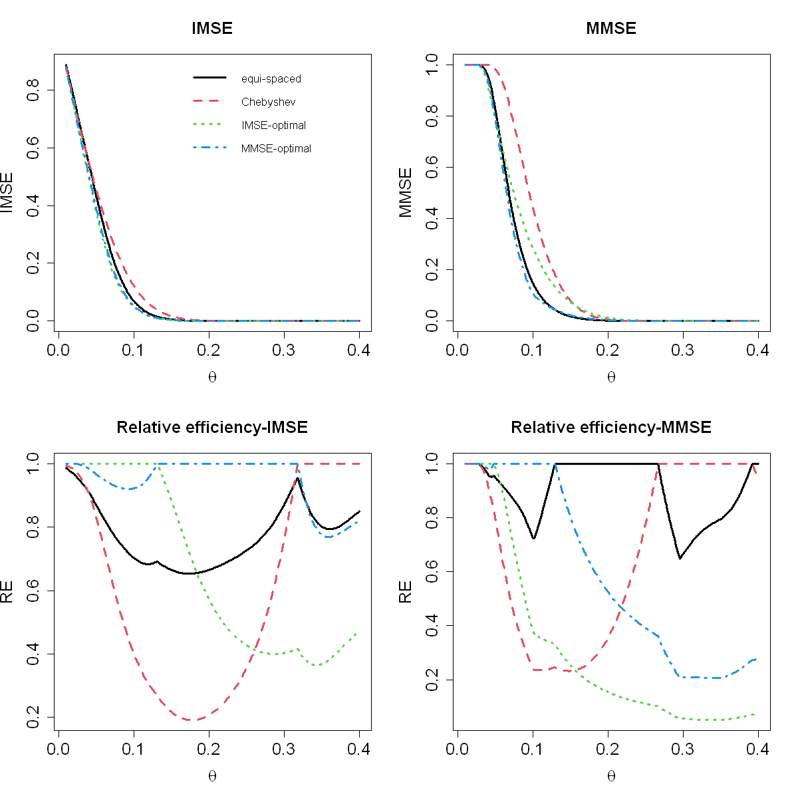

$$
\bigstar\;\diamond\;\bigstar\quad\boxed{\sigma_{\omega}\sigma}\quad\bigstar\;\diamond\;\bigstar
$$

# 图 3.3



$$
\bigstar\;\diamond\;\bigstar\quad\boxed{\sigma_{\omega}\sigma}\quad\bigstar\;\diamond\;\bigstar
$$

## 背景信息

前文全部数值计算均基于高斯相关函数,且设定尺度参数 $\theta=0.1$ 完成.在实际场景中,开展试验前我们无法预先获知尺度参数取值,因此有必要探究该参数是否会对最优设计产生影响.图 3.3 上方两幅子图绘制了积分均方误差(IMSE)与最大均方误差(MMSE)随 $\theta$ 的变化曲线,可见两项指标均会随 $\theta$ 发生显著变动;当 $\theta$ 取值极小或极大时,四类设计的表现趋于相近,该现象具备合理解释:$\theta$ 较小时代表响应曲面起伏剧烈,所有含 10 次试验的设计对曲面的拟合效果都较差;反之 $\theta$ 较大时对应光滑响应曲面,各类设计均能实现较好拟合;仅当 $\theta$ 处于中间区间时,不同设计的性能才会出现明显分化.四类设计分别基于积分均方误差(IMSE)与最大均方误差(MMSE)计算得到的相对效率曲线绘制于图 3.3 下方两幅子图,可见最优设计会随尺度参数 $\theta$ 的取值发生改变.

$$
\bigstar\;\diamond\;\bigstar\quad\boxed{\sigma_{\omega}\sigma}\quad\bigstar\;\diamond\;\bigstar
$$

## 指令

定义高斯核函数 `r(x,D)`.利用公式 $$s(\boldsymbol{x})=\sqrt{1-\boldsymbol{r}(\boldsymbol{x})'\boldsymbol{R}^{-1}\boldsymbol{r}(\boldsymbol{x})}$$ 定义 RMSE 函数 `s(x)`.利用公式 $$\mathrm{IMSE}(D;\boldsymbol{\theta})=\int_{\mathcal{X}}(1-\boldsymbol{r}(\boldsymbol{x})'\boldsymbol{R}^{-1}\boldsymbol{r}(\boldsymbol{x}))\mathrm{d}\boldsymbol{x}$$ 定义 IMSE 函数 `imse(D)`.利用公式 $$\mathrm{MMSE}(D;\boldsymbol{\theta})=\max_{\boldsymbol{x}\in\mathcal{X}}(1-\boldsymbol{r}(\boldsymbol{x})'\boldsymbol{R}^{-1}\boldsymbol{r}(\boldsymbol{x}))$$ 定义 MMSE 函数 `mmse(D)`.创建画布宽 10 英寸,高 10 英寸.将画布分为 2x2.依据背景信息定义 $\theta=.1$.等距取 $[0,1]$ 中 301 个点作为绘图点,令其为 `test`.对于等距情形,使用公式 $$D_{1}=\left\{\frac{i-1}{n-1}\right\}_{i=1}^{n}$$ 选取 10 个点作为观测点,令其为 `D1`.对于切比雪夫情形,使用公式 $$D_{2}=\left\{0.5+0.5\cos\left(\pi\frac{i-0.5}{n}\right)\right\}_{i=1}^{n}$$ 选取 10 观测点并放缩至 $[0,1]$ 区间中,令其为 `D2`.对于 IMSE 情形,首先选取优化的初始值,从等距猜测开始(不包含两端点进而最大化自由度),令其为 `D0`.使用优化函数 `optim` 进行优化,其中优化边界为 $[0,1]$,使用带边界约束的拟牛顿优化算法 `L-BFGS-B` 优化,返回列表令其为 `a`.其中的 `par` 组为最优解,令其为 `D3`.对于 MMSE 情形,使用优化函数 `optim` 进行优化,其中优化边界为 $[0,1]$,使用带边界约束的拟牛顿优化算法 `L-BFGS-B` 优化,返回列表令其为 `a`.其中的 `par` 组为最优解,令其为 `D4`.

```r
r=function(x,D) exp(-(outer(x,D,"-")/theta)^2)
s=function(x){
  Z=solve(R+10^(-6)*diag(n),t(r(x,D)))
  sqrt(1-colSums(t(r(x,D))*Z))
}
imse=function(D){
  R=r(D,D)
  s=function(x){
    Z=solve(R+10^(-6)*diag(n),t(r(x,D)))
    1-colSums(t(r(x,D))*Z)
  }
  integrate(s,0,1)$val
}
mmse=function(D){
  R=r(D,D)
  s=function(x){
    Z=solve(R+10^(-6)*diag(n),t(r(x,D)))
    1-colSums(t(r(x,D))*Z)
  }
  test=seq(0,1,length=301)
  max(s(test))
}
n=10
theta=.1
D1=((1:n)-1)/(n-1)
D2=.5+.5*cos((pi*(1:n)-.5)/n)
D0=((1:n)-.5)/n
D3=optim(D0,imse,lower=rep(0,n),upper=rep(1,n),method="L-BFGS-B")$par
D4=optim(D0,mmse,lower=rep(0,n),upper=rep(1,n),method="L-BFGS-B")$par
```

创建画布宽 10 英寸,高 10 英寸.将画布分为 2x2.从 $[.01,.4]$ 创建 301 项等差数列作为绘图点,令其为 `eq`.创建 301 行,4 列的空矩阵 `IR` 与 `MR` 分别准备放置 IMSE 与 MMSE 的绘图点矩阵.逐次向内填充绘图点.

```r
options(repr.plot.width=10,repr.plot.height=10)
par(mfrow=c(2,2))
ev=seq(.01,.4,length=301)
IR=MR=matrix(0,nrow=301,ncol=4)
for(i in 1:301){
  theta=ev[i]
  IR[i,]=c(imse(D1),imse(D2),imse(D3),imse(D4))
  MR[i,]=c(mmse(D1),mmse(D2),mmse(D3),mmse(D4))
}
```

绘制 IMSE 图像,其中曲线类型为光滑曲线,$x$ 轴标注为 $\theta$,$y$ 轴标注为 `IMSE`,线宽为 3,主标题为 `IMSE`,主标题,坐标轴,轴标注缩放均为 1.5.添加图例,其中位置位于右上角,图例内容为 `equi-spaced`, `Chebyshev`, `IMSE-optimal`, `MMSE-optimal` 及其对应的曲线类型,颜色,线宽,不显示图例边框.对于 MMSE,只是改变 $y$ 轴标注与主标题为 `MMSE`,余同上.

```r
matplot(ev,IR,type="l",xlab=expression(theta),ylab="IMSE",lwd=3,main="IMSE",cex.main=1.5,cex.lab=1.5,cex.axis=1.5)
legend("topright",legend=c("equi-spaced","Chebyshev","IMSE-optimal","MMSE-optimal"),lty=1:4,col=1:4,lwd=3,bty="n")
matplot(ev,MR,type="l",xlab=expression(theta),ylab="MMSE",lwd=3,main="MMSE",cex.main=1.5,cex.lab=1.5,cex.axis=1.5)
```

利用公式 $$\mathrm{RE}_{\mathrm{I}}(D_{i};\boldsymbol{\theta})=\frac{\min_{i}\mathrm{IMSE}(D_{i};\boldsymbol{\theta})}{\mathrm{IMSE}(D_{i};\boldsymbol{\theta})},$$ $$\mathrm{RE}_{\mathrm{M}}(D_{i};\boldsymbol{\theta})=\frac{\min_{i}\mathrm{MMSE}(D_{i};\boldsymbol{\theta})}{\mathrm{MMSE}(D_{i};\boldsymbol{\theta})}$$ 计算相对效率.使用 `apply` 函数,按行操作,对每个 $\theta$ 取 `IR` 与 `MR` 的最小值.逐元素除以矩阵得到相对效率.作图细节同上,只是 $y$ 轴标均注换为 `RE`,主标题换为 `Relative efficiency-IMSE` 与 `Relative efficiency-MMSE`.画布还原回 1x1.

```r
IRR=apply(IR,1,min)/IR
matplot(ev,IRR,type="l",xlab=expression(theta),ylab="RE",lwd=3,main="Relative efficiency-IMSE",cex.main=1.5,cex.lab=1.5,cex.axis=1.5)
MRR=apply(MR,1,min)/MR
matplot(ev,MRR,type="l",xlab=expression(theta),ylab="RE",lwd=3,main="Relative efficiency-MMSE",cex.main=1.5,cex.lab=1.5,cex.axis=1.5)
par(mfrow=c(1,1))
```

$$
\bigstar\;\diamond\;\bigstar\quad\boxed{\sigma_{\omega}\sigma}\quad\bigstar\;\diamond\;\bigstar
$$

## 最终效果

```r

# 图 3.3

r=function(x,D) exp(-(outer(x,D,"-")/theta)^2)
s=function(x){
  Z=solve(R+10^(-6)*diag(n),t(r(x,D)))
  sqrt(1-colSums(t(r(x,D))*Z))
}
imse=function(D){
  R=r(D,D)
  s=function(x){
    Z=solve(R+10^(-6)*diag(n),t(r(x,D)))
    1-colSums(t(r(x,D))*Z)
  }
  integrate(s,0,1)$val
}
mmse=function(D){
  R=r(D,D)
  s=function(x){
    Z=solve(R+10^(-6)*diag(n),t(r(x,D)))
    1-colSums(t(r(x,D))*Z)
  }
  test=seq(0,1,length=301)
  max(s(test))
}
n=10
theta=.1
D1=((1:n)-1)/(n-1)
D2=.5+.5*cos((pi*(1:n)-.5)/n)
D0=((1:n)-.5)/n
D3=optim(D0,imse,lower=rep(0,n),upper=rep(1,n),method="L-BFGS-B")$par
D4=optim(D0,mmse,lower=rep(0,n),upper=rep(1,n),method="L-BFGS-B")$par

options(repr.plot.width=10,repr.plot.height=10)
par(mfrow=c(2,2))
ev=seq(.01,.4,length=301)
IR=MR=matrix(0,nrow=301,ncol=4)
for(i in 1:301){
  theta=ev[i]
  IR[i,]=c(imse(D1),imse(D2),imse(D3),imse(D4))
  MR[i,]=c(mmse(D1),mmse(D2),mmse(D3),mmse(D4))
}

matplot(ev,IR,type="l",xlab=expression(theta),ylab="IMSE",lwd=3,main="IMSE",cex.main=1.5,cex.lab=1.5,cex.axis=1.5)
legend("topright",legend=c("equi-spaced","Chebyshev","IMSE-optimal","MMSE-optimal"),lty=1:4,col=1:4,lwd=3,bty="n")
matplot(ev,MR,type="l",xlab=expression(theta),ylab="MMSE",lwd=3,main="MMSE",cex.main=1.5,cex.lab=1.5,cex.axis=1.5)

IRR=apply(IR,1,min)/IR
matplot(ev,IRR,type="l",xlab=expression(theta),ylab="RE",lwd=3,main="Relative efficiency-IMSE",cex.main=1.5,cex.lab=1.5,cex.axis=1.5)
MRR=apply(MR,1,min)/MR
matplot(ev,MRR,type="l",xlab=expression(theta),ylab="RE",lwd=3,main="Relative efficiency-MMSE",cex.main=1.5,cex.lab=1.5,cex.axis=1.5)
par(mfrow=c(1,1))

```


$$
\bigstar\;\diamond\;\bigstar\quad\boxed{\sigma_{\omega}\sigma}\quad\bigstar\;\diamond\;\bigstar
$$