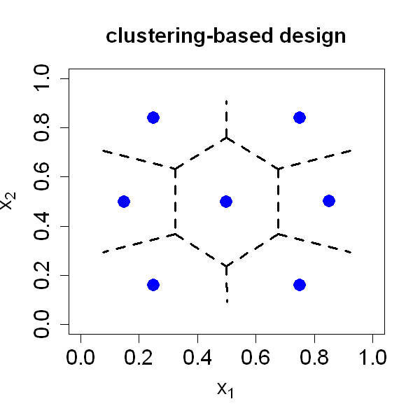

$$
\bigstar\;\diamond\;\bigstar\quad\boxed{\sigma_{\omega}\sigma}\quad\bigstar\;\diamond\;\bigstar
$$

# 图 4.1



$$
\bigstar\;\diamond\;\bigstar\quad\boxed{\sigma_{\omega}\sigma}\quad\bigstar\;\diamond\;\bigstar
$$

## 背景信息

假设我们需要在二维试验区域 $\mathcal{X}=[0,1]^{2}$ 内布置 $n=7$ 个试验点,可借助自研 R 语言程序包 `SFDesign` 求解基于聚类的最优设计.依据式(4.4)求得的设计绘制于图 4.1,可见样本点能够较好铺满整个区域,但点位会明显向区域中心聚拢,该特性在预测问题中存在弊端.原因在于绝大多数统计模型与机器学习模型对内插预测(在7个点凸包内部做预测)精度较高,而外插预测(在凸包外部做预测)结果可信度较低.

$$
\bigstar\;\diamond\;\bigstar\quad\boxed{\sigma_{\omega}\sigma}\quad\bigstar\;\diamond\;\bigstar
$$

## 指令

设置画布宽,高均为 `5` 英寸,随机种子为 `5`.使用 `mined` 包中的 `Lattice` 函数在 `2` 维空间内生成 `10000` 个均匀分布的点,令其为 `X`.使用 `kmeans` 函数将这些点划分为 `7` 个簇,提取列表中的 `centers` 列作为聚类中心,作为初始设计点,令其为 `D2`.调用 `deldir` 包中的 `clustering.design` 函数,使用 `D2` 进行优化,提取列表中的 `design` 列得到最终的设计点集,令其为 `D`.绘制 `D`,设置横纵坐标范围均为 `[0,1]`,标题为 `"clustering-based design"`,横纵坐标标签分别为 `expression(x[1])` 和 `expression(x[2])`,标题,标签和坐标轴字体大小均为 `1.5`,点形状为实心圆,颜色为蓝色,点大小为 `2`.使用 `deldir` 包中的 `deldir` 函数计算 `D` 的沃罗诺伊图,返回的 S3 对象命名为 `vor`.使用 `plot.deldir` 函数绘制沃罗诺伊图,叠加到当前图上,绘制分区线,线宽为 `3`,不再绘制 `deldir` 内部的点避免与 `D` 的点重叠.

```r
options(repr.plot.width=5,repr.plot.height=5)
p=2;n=7
set.seed(5)
library(mined)
X=Lattice(10000,p)
D2=kmeans(X,centers=n)$centers
library(SFDesign)
D=clustering.design(n,p,D.ini=D2)$design
plot(D,xlim=c(0,1),ylim=c(0,1),main="clustering-based design",xlab=expression(x[1]),ylab=expression(x[2]),cex.main=1.5,cex.lab=1.5,cex.axis=1.5,pch=16,col="blue",cex=2)
library(deldir)
vor=deldir(D[,1],D[,2])
plot.deldir(vor,add=TRUE,wlines="tess",lwd=3,showpoints=FALSE)
```

$$
\bigstar\;\diamond\;\bigstar\quad\boxed{\sigma_{\omega}\sigma}\quad\bigstar\;\diamond\;\bigstar
$$

## 最终效果

```r

options(repr.plot.width=5,repr.plot.height=5)
p=2;n=7
set.seed(5)
library(mined)
X=Lattice(10000,p)
D2=kmeans(X,centers=n)$centers
library(SFDesign)
D=clustering.design(n,p,D.ini=D2)$design
plot(D,xlim=c(0,1),ylim=c(0,1),main="clustering-based design",xlab=expression(x[1]),ylab=expression(x[2]),cex.main=1.5,cex.lab=1.5,cex.axis=1.5,pch=16,col="blue",cex=2)
library(deldir)
vor=deldir(D[,1],D[,2])
plot.deldir(vor,add=TRUE,wlines="tess",lwd=3,showpoints=FALSE)

```

$$
\bigstar\;\diamond\;\bigstar\quad\boxed{\sigma_{\omega}\sigma}\quad\bigstar\;\diamond\;\bigstar
$$