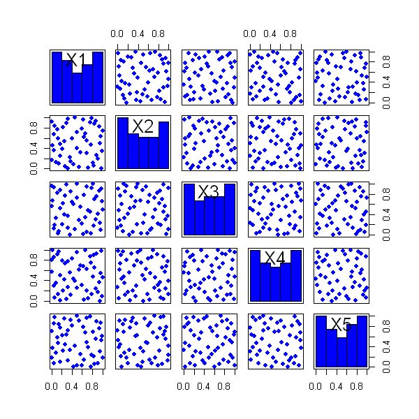

$$
\bigstar\;\diamond\;\bigstar\quad\boxed{\sigma_{\omega}\sigma}\quad\bigstar\;\diamond\;\bigstar
$$

# 图 4.11



$$
\bigstar\;\diamond\;\bigstar\quad\boxed{\sigma_{\omega}\sigma}\quad\bigstar\;\diamond\;\bigstar
$$

## 背景信息

高维设计难以直接可视化.为此,图 4.11 以散点图矩阵形式展示一个 5 维,$n=50$ 的最大投影设计各采样点的二维投影.能够看出,采样点在各类二维投影中分布均匀舒展.

$$
\bigstar\;\diamond\;\bigstar\quad\boxed{\sigma_{\omega}\sigma}\quad\bigstar\;\diamond\;\bigstar
$$

## 指令

创建画布宽 5 英寸,高 5 英寸.设置种子为 `2`.使用 `SFDesign` 包中的 `maxproLHD` 函数生成一个随机的 `2` 维 `7` 点拉丁超立方设计,取出其中的 `design` 列,再使用 `SFDesign` 包中的 `maxpro.optim` 函数执行完整的 MaxPro 优化流程,取出其中的 `design` 列作为最终的设计点,令其为 `D`.使用 `car` 包中的 `scatterplotMatrix` 函数绘制散点图矩阵,设置对角线为直方图,关闭平滑曲线和回归线,点的形状为实心圆.

```r
options(repr.plot.width=5,repr.plot.height=5)
p=5;n=50
set.seed(2)
library(SFDesign)
D=maxpro.optim(maxproLHD(n,p)$design)$design
library(car)
scatterplotMatrix(D,diagonal=list(method="histogram"),smooth=FALSE,regLine=FALSE,pch=16)
```

$$
\bigstar\;\diamond\;\bigstar\quad\boxed{\sigma_{\omega}\sigma}\quad\bigstar\;\diamond\;\bigstar
$$

## 最终效果

```r

# 图 4.11

options(repr.plot.width=5,repr.plot.height=5)
p=5;n=50
set.seed(2)
library(SFDesign)
D=maxpro.optim(maxproLHD(n,p)$design)$design
library(car)
scatterplotMatrix(D,diagonal=list(method="histogram"),smooth=FALSE,regLine=FALSE,pch=16)

```

$$
\bigstar\;\diamond\;\bigstar\quad\boxed{\sigma_{\omega}\sigma}\quad\bigstar\;\diamond\;\bigstar
$$