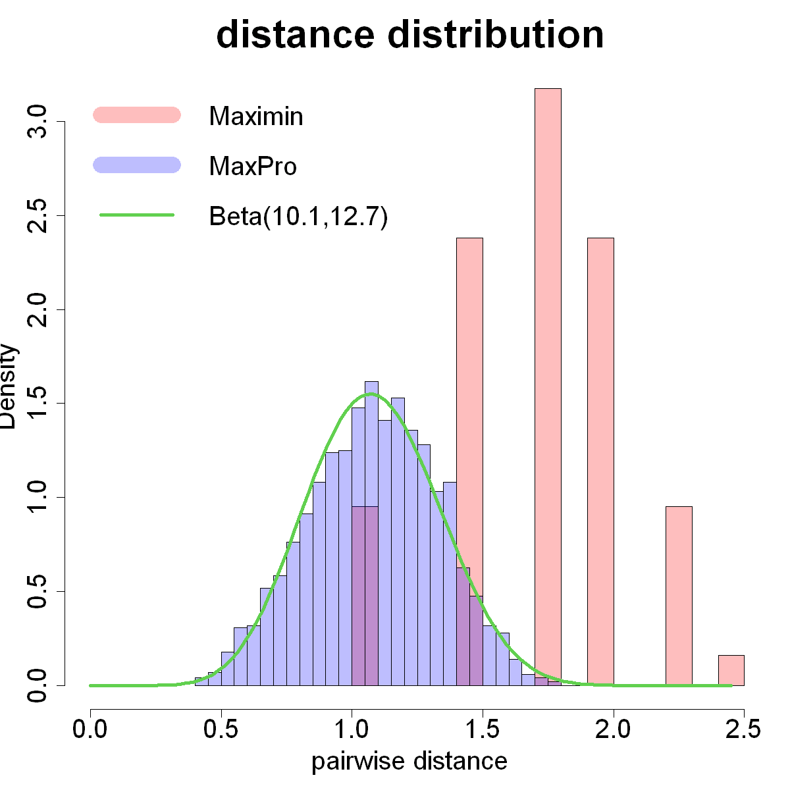

$$
\bigstar\;\diamond\;\bigstar\quad\boxed{\sigma_{\omega}\sigma}\quad\bigstar\;\diamond\;\bigstar
$$

# 图 4.13



$$
\bigstar\;\diamond\;\bigstar\quad\boxed{\sigma_{\omega}\sigma}\quad\bigstar\;\diamond\;\bigstar
$$

## 背景信息

张等人(2021)发现小规模极大极小设计(较小的 $n^{1/p}$)不利于估计相关参数,该现象源于极大极小设计投影特性较差.图 4.13 展示 6 维,64 次试验的极大极小设计采样点两两距离的直方图.由于 $64<2^{6}$,所有采样点被推向超立方体 $[0,1]^6$ 的顶点,仅存在少数几种互不相同的两两距离.图中同时给出 64 次试验的最大投影设计对应的两两距离分布,可以观察到距离取值近似连续,能够通过形状参数为 10.1 与 12.7 的缩放贝塔分布良好拟合.张等人(2021)通过数值试验发现,若设计的两两距离近似服从贝塔分布,则在相关参数估计方面表现优异.为此他们提出优化算法,用以生成两两距离分布贴近贝塔分布的设计,贝塔分布的形状参数根据 $n$ 和 $p$ 选取.尽管最大投影设计最初以预测性能为目标构建,但这类设计恰好具备两两距离服从贝塔分布的特性,因此可以预期其在相关参数估计任务中同样拥有良好表现.

$$
\bigstar\;\diamond\;\bigstar\quad\boxed{\sigma_{\omega}\sigma}\quad\bigstar\;\diamond\;\bigstar
$$

## 指令

设置画布宽 10 英寸,高 10 英寸.设置种子为 `1`.使用 `SFDesign` 包中的 `maximinLHD` 函数生成 6 维,64 次试验的极大极小设计,并使用 `maximin.optim` 函数进行优化.使用 `maxproLHD` 函数初步生成最大投影设计,取出 `design` 列,使用 `maxpro.optim` 函数进行优化,其中,生成多个不同的随机初始设计并寻找最佳初始解,取出 `design` 列令其为 `D1`.使用 `SFDesign` 包中的 `maxproLHD` 函数生成 6 维,64 次试验的最大投影设计,并使用 `maxpro.optim` 函数进行优化.使用 `maxproLHD` 函数初步生成最大投影设计,取出 `design` 列,使用 `maxpro.optim` 函数进行优化,取出 `design` 列令其为 `D2`.计算两种设计的两两距离,分别令其为 `d1`,`d2`.对于 `d2`,使用 `fitdistrplus` 包中的 `fitdist` 函数拟合贝塔分布,其中要把 `d2` 的范围放缩至 `[0,1]`,将返回的拟合列表令为 `a`,其中的 `estimate` 列即是贝塔分布的两个参数.绘制 `d1` 的直方图,其中纵坐标显示密度,$x$ 轴范围为 $[0,\sqrt{p}]$,颜色为红色,透明度为 `1/4`,横坐标标签为 `pairwise distance`,标题为 `distance distribution`,坐标轴,轴标签大小均为 `2`,标题大小为 `3`.叠加 `d2` 的直方图,其中纵坐标显示密度,颜色为蓝色,透明度为 `1/4`,直方图的条数为 `30`,并将其叠加在前一个直方图上.叠加贝塔分布的概率密度函数曲线,其中横坐标范围为 $[0,\sqrt{p}]$,颜色为绿色,线宽为 3.添加图例,其中包含 `Maximin`,`MaxPro`,`Beta(10.1,12.7)` 三个标签,颜色,线型,线宽分别与前文对应,不显示边框.

```r
options(repr.plot.width=10,repr.plot.height=10)
p=6;n=64
set.seed(1)
library(SFDesign)
D1=maximin.optim(maximinLHD(n,p)$design,find.best.ini=TRUE)$design
D2=maxpro.optim(maxproLHD(n,p)$design)$design
d1=c(dist(D1))
d2=c(dist(D2))
library(fitdistrplus)
a=fitdist(d2/sqrt(p),"beta")
a$estimate
hist(d1,prob=TRUE,xlim=c(0,sqrt(p)),col=rgb(1,0,0,1/4),xlab="pairwise distance",main="distance distribution",cex.lab=2,cex.axis=2,cex.main=3)
hist(d2,prob=TRUE,col=rgb(0,0,1,1/4),breaks=30,add=TRUE)
curve(dbeta(x/sqrt(p),a$estimate[1],a$estimate[2])/sqrt(p),from=0,to=sqrt(p),add=TRUE,col=3,lwd=4)
legend("topleft",legend=c("Maximin","MaxPro","Beta(10.1,12.7)"),col=c(rgb(1,0,0,1/4),rgb(0,0,1,1/4),3),lty=c(1,1,1),lwd=c(20,20,4),bty="n",cex=2)
```

$$
\bigstar\;\diamond\;\bigstar\quad\boxed{\sigma_{\omega}\sigma}\quad\bigstar\;\diamond\;\bigstar
$$

## 最终效果

```r

# 图 4.13

options(repr.plot.width=10,repr.plot.height=10)
p=6;n=64
set.seed(1)
library(SFDesign)
D1=maximin.optim(maximinLHD(n,p)$design,find.best.ini=TRUE)$design
D2=maxpro.optim(maxproLHD(n,p)$design)$design
d1=c(dist(D1))
d2=c(dist(D2))
library(fitdistrplus)
a=fitdist(d2/sqrt(p),"beta")
a$estimate
hist(d1,prob=TRUE,xlim=c(0,sqrt(p)),col=rgb(1,0,0,1/4),xlab="pairwise distance",main="distance distribution",cex.lab=2,cex.axis=2,cex.main=3)
hist(d2,prob=TRUE,col=rgb(0,0,1,1/4),breaks=30,add=TRUE)
curve(dbeta(x/sqrt(p),a$estimate[1],a$estimate[2])/sqrt(p),from=0,to=sqrt(p),add=TRUE,col=3,lwd=4)
legend("topleft",legend=c("Maximin","MaxPro","Beta(10.1,12.7)"),col=c(rgb(1,0,0,1/4),rgb(0,0,1,1/4),3),lty=c(1,1,1),lwd=c(20,20,4),bty="n",cex=2)

```

$$
\bigstar\;\diamond\;\bigstar\quad\boxed{\sigma_{\omega}\sigma}\quad\bigstar\;\diamond\;\bigstar
$$