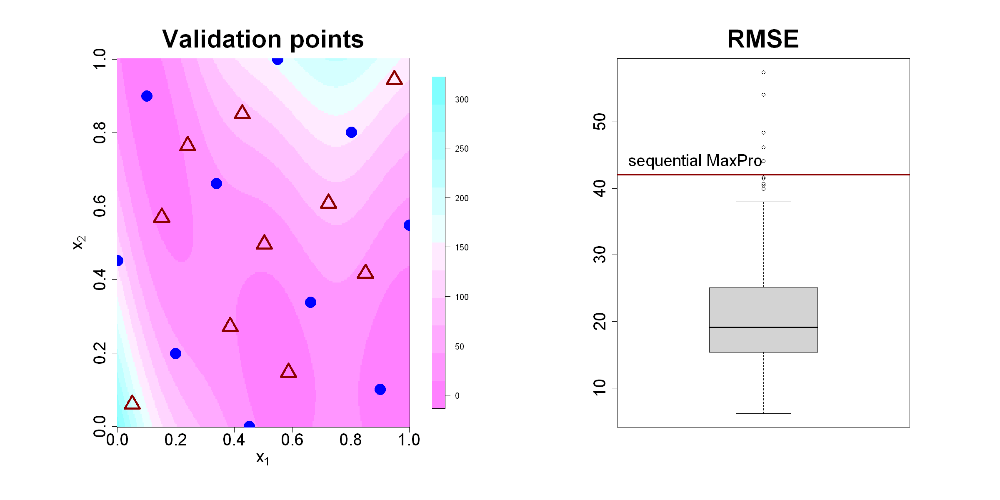

$$
\bigstar\;\diamond\;\bigstar\quad\boxed{\sigma_{\omega}\sigma}\quad\bigstar\;\diamond\;\bigstar
$$

# 图 4.14



$$
\bigstar\;\diamond\;\bigstar\quad\boxed{\sigma_{\omega}\sigma}\quad\bigstar\;\diamond\;\bigstar
$$

## 背景信息

式 (4.27) 序贯构造最大投影设计的一类应用场景,是生成验证集以检验拟合模型的优劣.举例来说,选取仿真试验虚拟库中的二维布兰宁函数(苏尔亚诺维奇,宾厄姆,2013):$$f(\boldsymbol{x})=\left(x_{2}-\frac{5.1}{4\pi^{2}}x_{1}^{2}+\frac{5}{\pi}x_{1}-6\right)^{2}+10\left(1-\frac{1}{8\pi}\right)\cos(x_{1})+10,\;x_{1}\in[-5,10],\;x_{2}\in[0,15].\tag{4.28}$$ 将定义域缩放至 $[0,1]^2$ 后的函数图像如图 4.14 左图所示,图中蓝色圆点为一组 10 个样本点构成的最大投影设计.接下来利用式 (4.27) 额外生成 10 个点作为验证集,对应图中的红色三角标记.本文借助 R 语言`rkriging`程序包拟合普通克里金预测模型(黄,约瑟夫,2024),并在验证集上计算预测均方根误差(RMSE).作为对比,随机生成 100 组规模为 10 的验证集并分别计算 RMSE,结果由图 4.14 右图的箱线图展示.可以发现,序贯最大投影验证集对应的 RMSE 高于箱线图上须.原因在于随机验证集容易包含靠近原始设计点的样本,这类位置易于预测,因此得到偏小的 RMSE;而序贯最大投影生成的验证点在全部子空间上均远离原始设计点,由此构成一套更难预测的验证集.

$$
\bigstar\;\diamond\;\bigstar\quad\boxed{\sigma_{\omega}\sigma}\quad\bigstar\;\diamond\;\bigstar
$$

## 指令

创建画布宽 20 英寸,高 10 英寸.将画布分为 `1x2`.依据公式 $$f(\boldsymbol{x})=\left(x_{2}-\frac{5.1}{4\pi^{2}}x_{1}^{2}+\frac{5}{\pi}x_{1}-6\right)^{2}+10\left(1-\frac{1}{8\pi}\right)\cos(x_{1})+10,\;x_{1}\in[-5,10],\;x_{2}\in[0,15]$$ 创建布兰宁函数 `branin(x)`,其中 `x=c(x1,x2)`.设置种子为 `123`.使用 `MaxPro` 包中的 `MaxProLHD` 函数生成一个随机的 `2` 维 `7` 点拉丁超立方设计,取出其中的 `design` 列,再使用 `MaxPro` 包中的 `MaxPro` 函数执行完整的 MaxPro 优化流程,取出其中的 `design` 列作为最终的设计点,令其为 `D`.对 `D` 中的每个点计算其对应的布兰宁函数值,令其为 `y`.使用 `MaxPro` 包中的 `MaxProAugment` 函数进行序贯设计,其中基础点集为 `D`,候选点集为使用 `MaxPro` 包中的 `CandPoints` 函数在 `2` 维空间里生成的 `10000` 个候选点,设置新增点数为 `10`.取出返回列表中 `Design` 列中的新增点的列作为新增点集,令其为 `A`.对 `A` 中的每个点计算其对应的布兰宁函数值,令其为 `true`.使用 `rkriging` 包中的 `Fit.Kriging` 函数拟合普通克里金预测模型,其中基础点集为 `D`,响应值为 `y`,核函数类型为高斯核将结果列表令为 `a`.使用 `rkriging` 包中的 `Predict.Kriging` 函数,利用拟合模型 `a`,针对检验集 `A` 求出预测值,取出返回列表中的 `mean` 列,令其为 `pred`.利用公式 $$\mathrm{RMSE}=\sqrt{\mathbb{E}[(\widehat{y}_{i}-y_{i})^{2}]}$$ 计算预测均方根误差,令其为 `rmse0`.

```r
options(repr.plot.width=20,repr.plot.height=10)
par(mfrow=c(1,2))
branin=function(x)
{
    x1=x[1]*15-5
    x2=x[2]*15
    (x2-5.1/(4*pi^2)*(x1^2)+5/pi*x1-6)^2+10*(1-1/(8*pi))*cos(x1)+10
}
p=2;n=10
set.seed(123)
library(MaxPro)
D=MaxPro(MaxProLHD(n,p)$Design)$Design
y=apply(D,1,branin)
A=MaxProAugment(ExistDesign=D,CandDesign=CandPoints(N=10000,2),nNew=10)$Design[(n+1):20,]
true=apply(A,1,branin)
library(rkriging)
a=Fit.Kriging(D,y,kernel.parameters=list(type="Gaussian"))
pred=Predict.Kriging(a,A)$mean
rmse0=sqrt(mean((pred-true)^2))
```

创建 `p1=250` x `p2=250` 的网格点集 `fc`,并计算每个网格点对应的布兰宁函数值,存入其中.使用 `fields` 包中的 `image.plot` 函数绘制布兰宁函数的等高线图,其中 $x$ 轴标注为 `expression(x[1])`,$y$ 轴标注为 `expression(x[2])`,标题为 `Validation points`,标题大小为 `3`,坐标轴,轴标签的大小均为 `2`.叠加初始点集 `D`,其中点的形状为实心圆点,颜色为蓝色,大小为 `3`.叠加新增点集 `A`,其中点的形状为空心三角,颜色为深红色,线宽为 `4`,大小为 `3`.

```r
library(fields)
imagePlot(p1,p2,fc,xlab=expression(x[1]),ylab=expression(x[2]),col=cm.colors(12,rev=TRUE),main="Validation points",cex.main=3,cex.lab=2,cex.axis=2)
points(D,pch=16,col="blue",cex=3)
points(A,pch=2,col="darkred",lwd=4,cex=3)
```

创建 `100` 个元素的向量 `rmse` 用于存储每组随机验证集的 RMSE.对于每个 `i` 从 `1` 到 `100`,使用 `rkriging` 包中的 `Predict.Kriging` 函数,利用拟合模型 `a`,针对随机均匀分布的 `2` x `10` 矩阵 `u` 求出预测值,取出返回列表中的 `mean` 列,令其为 `pred`.对 `u` 中的每个点计算其对应的布兰宁函数值,令其为 `true`.利用公式 $$\mathrm{RMSE}=\sqrt{\mathbb{E}[(\widehat{y}_{i}-y_{i})^{2}]}$$ 计算预测均方根误差,令其为 `rmse` 向量的第 `i` 个元素.绘制 `rume` 的箱线图,其中标题为 `RMSE`,标题大小为 `3`,轴标签的大小为 `2`.叠加序贯设计检验集的 RMSE 直线,其中颜色为暗红色,线宽为 `3`.添加文本,位置在 `(.75,rmse0+2)`,文本为 `sequential MaxPro`,大小为 `2`.将画布还原回 `1x1`.

```r
rmse=rep(0,100)
for(i in 1:100)
{
  u=matrix(runif(p*10),nrow=10,ncol=p)
  pred=Predict.Kriging(a,u)$mean
  true=apply(u,1,branin)
  rmse[i]=sqrt(mean((pred-true)^2))
}
boxplot(rmse,main="RMSE",cex.main=3,cex.axis=2)
abline(h=rmse0,col="darkred",lwd=3)
text(.75,rmse0+2,"sequential MaxPro",cex=2)
par(mfrow=c(1,1))
```

$$
\bigstar\;\diamond\;\bigstar\quad\boxed{\sigma_{\omega}\sigma}\quad\bigstar\;\diamond\;\bigstar
$$

## 最终效果

```r

# 图 4.14

options(repr.plot.width=20,repr.plot.height=10)
par(mfrow=c(1,2))
branin=function(x)
{
    x1=x[1]*15-5
    x2=x[2]*15
    (x2-5.1/(4*pi^2)*(x1^2)+5/pi*x1-6)^2+10*(1-1/(8*pi))*cos(x1)+10
}
p=2;n=10
set.seed(123)
library(MaxPro)
D=MaxPro(MaxProLHD(n,p)$Design)$Design
y=apply(D,1,branin)
A=MaxProAugment(ExistDesign=D,CandDesign=CandPoints(N=10000,2),nNew=10)$Design[(n+1):20,]
true=apply(A,1,branin)
library(rkriging)
a=Fit.Kriging(D,y,kernel.parameters=list(type="Gaussian"))
pred=Predict.Kriging(a,A)$mean
rmse0=sqrt(mean((pred-true)^2))

N.plot=250
p1=seq(0,1,length=N.plot)
p2=seq(0,1,length=N.plot)
fc=matrix(0,N.plot,N.plot)
for(i in 1:N.plot)
{
  for(j in 1:N.plot)
    fc[i,j]=branin(c(p1[i],p2[j]))
}

library(fields)
imagePlot(p1,p2,fc,xlab=expression(x[1]),ylab=expression(x[2]),col=cm.colors(12,rev=TRUE),main="Validation points",cex.main=3,cex.lab=2,cex.axis=2)
points(D,pch=16,col="blue",cex=3)
points(A,pch=2,col="darkred",lwd=4,cex=3)

rmse=rep(0,100)
for(i in 1:100)
{
  u=matrix(runif(p*10),nrow=10,ncol=p)
  pred=Predict.Kriging(a,u)$mean
  true=apply(u,1,branin)
  rmse[i]=sqrt(mean((pred-true)^2))
}
boxplot(rmse,main="RMSE",cex.main=3,cex.axis=2)
abline(h=rmse0,col="darkred",lwd=3)
text(.75,rmse0+2,"sequential MaxPro",cex=2)
par(mfrow=c(1,1))

```

$$
\bigstar\;\diamond\;\bigstar\quad\boxed{\sigma_{\omega}\sigma}\quad\bigstar\;\diamond\;\bigstar
$$