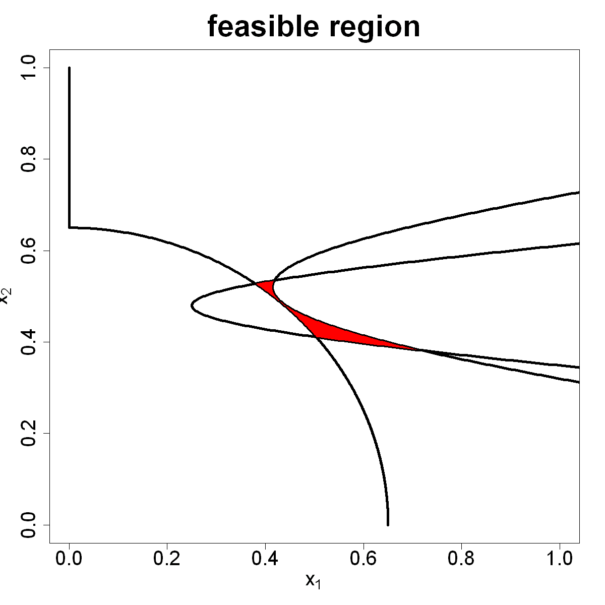

$$
\bigstar\;\diamond\;\bigstar\quad\boxed{\sigma_{\omega}\sigma}\quad\bigstar\;\diamond\;\bigstar
$$

# 图 4.15



$$
\bigstar\;\diamond\;\bigstar\quad\boxed{\sigma_{\omega}\sigma}\quad\bigstar\;\diamond\;\bigstar
$$

## 背景信息

前文讨论的试验区域均为超立方体,但实际场景中部分因子组合不可行.例如,高压与高温同时出现会引发系统故障,这类组合便无需开展试验.设输入可行域由一组约束定义:$$\mathcal{X} = \{\boldsymbol{x}\in[0,1]^p:g_{k}(\boldsymbol{x})\le0,\;\forall k\},\tag{4.29}$$ 其中 $\{g_{k}(\boldsymbol{x})\le0\}_{k=1}^{K}$ 为 $K$ 个任意不等式约束.约束函数可以是黑箱函数,且评估成本较高.下面给出黄等人(2021)的简易算例:$$\begin{align*}&g_{1}(x)=x_{1}-\sqrt{50(x_{2}-0.52)^2+2}+1\le0,\\&g_{2}(x)=\sqrt{120\left((x_{2}-0.48)^2+1\right)}-0.75-x_{1}\le0,\\&g_{3}(x)=0.65^{2}-x_{1}^2-x_{2}^2\le0,\\&\text{其中}\;0\le x_{1},x_{2}\le1.\end{align*}\tag{4.30}$$ 可行域如图 4.15 阴影区域所示.假定试验预算允许开展 20 次试验.

$$
\bigstar\;\diamond\;\bigstar\quad\boxed{\sigma_{\omega}\sigma}\quad\bigstar\;\diamond\;\bigstar
$$

## 指令

设置画布宽,高均 10 英寸.依据公式 $$\begin{align*}&g_{1}(x)=x_{1}-\sqrt{50(x_{2}-0.52)^2+2}+1\le0,\\&g_{2}(x)=\sqrt{120\left((x_{2}-0.48)^2+1\right)}-0.75-x_{1}\le0,\\&g_{3}(x)=0.65^{2}-x_{1}^2-x_{2}^2\le0,\\&\text{其中}\;0\le x_{1},x_{2}\le1.\end{align*}$$ 定义约束函数 `constraint(x)`.创建 `3` 行 `1001` 列矩阵 `x1`,`x2`,其中第 `i` 行对应 $g_{i}(x)$ 的边界,`x1` 储存 $x_{1}$,`x2` 储存 $x_{2}$.创建空图像,其中 $x$,$y$ 轴的范围均为 `[0,1]`,大小为 `2`,$x$ 轴标题为 `expression(x[1])`,$y$ 轴标题为 `expression(x[2])`,大小为 `2`,图像标题为 `"feasible region"`,大小为 `3`.叠加三条边界线,线宽为 `4`.绘制可行域,颜色为红色.

```r
options(repr.plot.width=10,repr.plot.height=10)
constraint=function(x)
{
    c1=(x[1]-sqrt(50*(x[2]-0.52)^2+2)+1)
    c2=(sqrt(120*(x[2]-0.48)^2+1)-0.75-x[1])
    c3=(0.65^2-x[1]^2-x[2]^2)
    return(c(c1,c2,c3))
}
x1=x2=matrix(0,nrow=3,ncol=1001)
x2.seq=seq(0,1,length=1001)
x2[1,]=x2.seq;x2[2,]=x2.seq;x2[3,]=x2.seq
x1[1,]=sqrt(50*(x2.seq-0.52)^2+2)-1
x1[2,]=sqrt(120*(x2.seq-0.48)^2+1)-0.75
x1[3,]=sqrt(pmax(0,0.65^2-x2.seq^2))
plot(NULL,type="n",xlim=c(0,1),ylim=c(0,1),cex.axis=2,xlab=expression(x[1]),ylab=expression(x[2]),cex.lab=2,main="feasible region",cex.main=3)
contour=list(x1=x1,x2=x2)
for(i in 1:3)lines(contour$x1[i,],contour$x2[i,],lwd=4)
ix12=which(diff(sign(contour$x1[1,]-contour$x1[2,]))!=0)
ix23=which(diff(sign(contour$x1[2,]-contour$x1[3,]))!=0)
polygon(x=c(contour$x1[1,ix12[1]:ix12[2]],contour$x1[2,ix12[2]:ix23[2]],contour$x1[3,ix23[2]:ix23[1]],contour$x1[2,ix23[1]:ix12[1]]),y=c(contour$x2[1,ix12[1]:ix12[2]],contour$x2[2,ix12[2]:ix23[2]],contour$x2[3,ix23[2]:ix23[1]],contour$x2[2,ix23[1]:ix12[1]]),col="red")
```

$$
\bigstar\;\diamond\;\bigstar\quad\boxed{\sigma_{\omega}\sigma}\quad\bigstar\;\diamond\;\bigstar
$$

## 最终效果

```r

# 图 4.15

options(repr.plot.width=10,repr.plot.height=10)
constraint=function(x)
{
    c1=(x[1]-sqrt(50*(x[2]-0.52)^2+2)+1)
    c2=(sqrt(120*(x[2]-0.48)^2+1)-0.75-x[1])
    c3=(0.65^2-x[1]^2-x[2]^2)
    return(c(c1,c2,c3))
}
x1=x2=matrix(0,nrow=3,ncol=1001)
x2.seq=seq(0,1,length=1001)
x2[1,]=x2.seq;x2[2,]=x2.seq;x2[3,]=x2.seq
x1[1,]=sqrt(50*(x2.seq-0.52)^2+2)-1
x1[2,]=sqrt(120*(x2.seq-0.48)^2+1)-0.75
x1[3,]=sqrt(pmax(0,0.65^2-x2.seq^2))
plot(NULL,type="n",xlim=c(0,1),ylim=c(0,1),cex.axis=2,xlab=expression(x[1]),ylab=expression(x[2]),cex.lab=2,main="feasible region",cex.main=3)
contour=list(x1=x1,x2=x2)
for(i in 1:3)lines(contour$x1[i,],contour$x2[i,],lwd=4)
ix12=which(diff(sign(contour$x1[1,]-contour$x1[2,]))!=0)
ix23=which(diff(sign(contour$x1[2,]-contour$x1[3,]))!=0)
polygon(x=c(contour$x1[1,ix12[1]:ix12[2]],contour$x1[2,ix12[2]:ix23[2]],contour$x1[3,ix23[2]:ix23[1]],contour$x1[2,ix23[1]:ix12[1]]),y=c(contour$x2[1,ix12[1]:ix12[2]],contour$x2[2,ix12[2]:ix23[2]],contour$x2[3,ix23[2]:ix23[1]],contour$x2[2,ix23[1]:ix12[1]]),col="red")

```

$$
\bigstar\;\diamond\;\bigstar\quad\boxed{\sigma_{\omega}\sigma}\quad\bigstar\;\diamond\;\bigstar
$$