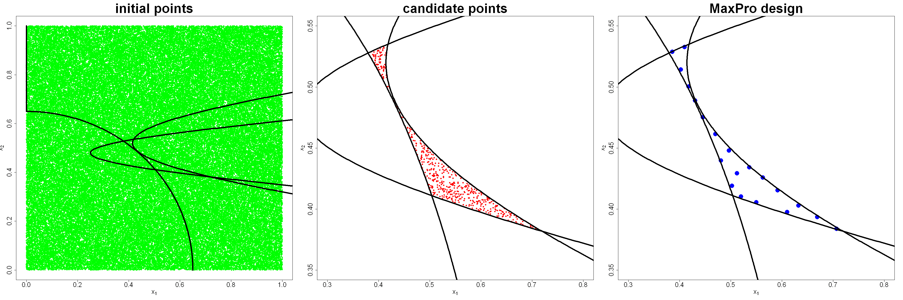

$$
\bigstar\;\diamond\;\bigstar\quad\boxed{\sigma_{\omega}\sigma}\quad\bigstar\;\diamond\;\bigstar
$$

# 图 4.16



$$
\bigstar\;\diamond\;\bigstar\quad\boxed{\sigma_{\omega}\sigma}\quad\bigstar\;\diamond\;\bigstar
$$

## 背景信息

下面给出一种在约束区域内生成试验设计的通用流程:(i) 首先在包围可行域的超立方体内生成大量均匀样本;(ii) 剔除不满足约束条件的样本;(iii) 在剩余样本(候选集)中选取试验设计点.针对式 (4.30) 对应的试验区域构造 20 个设计点:首先生成 10000 个随机拉丁超立方样本,如图 4.16 左图所示.剔除不满足式 (4.30) 的点后剩余 538 个点,构成候选集,见图 4.16 中图.随后可采用式 (4.27) 的序贯最大投影方法得到最大投影设计,结果如图 4.16 右图.后文 4.6.2 节将介绍一种更优的候选集生成方法,以此进一步提升最大投影设计的质量.

$$
\bigstar\;\diamond\;\bigstar\quad\boxed{\sigma_{\omega}\sigma}\quad\bigstar\;\diamond\;\bigstar
$$

## 指令

创建画布宽 30 英寸,高 10 英寸.将画布分为 `1x3`.依据公式 $$\begin{align*}&g_{1}(x)=x_{1}-\sqrt{50(x_{2}-0.52)^2+2}+1\le0,\\&g_{2}(x)=\sqrt{120\left((x_{2}-0.48)^2+1\right)}-0.75-x_{1}\le0,\\&g_{3}(x)=0.65^{2}-x_{1}^2-x_{2}^2\le0,\\&\text{其中}\;0\le x_{1},x_{2}\le1.\end{align*}$$ 定义约束函数 `constraint(x)`.创建 `3` 行 `1001` 列矩阵 `x1`,`x2`,其中第 `i` 行对应 $g_{i}(x)$ 的边界,`x1` 储存 $x_{1}$,`x2` 储存 $x_{2}$.

```r
options(repr.plot.width=30,repr.plot.height=10)
par(mfrow=c(1,3))
constraint=function(x)
{
    c1=(x[1]-sqrt(50*(x[2]-0.52)^2+2)+1)
    c2=(sqrt(120*(x[2]-0.48)^2+1)-0.75-x[1])
    c3=(0.65^2-x[1]^2-x[2]^2)
    return(c(c1,c2,c3))
}
x1=x2=matrix(0,nrow=3,ncol=1001)
x2.seq=seq(0,1,length=1001)
x2[1,]=x2.seq;x2[2,]=x2.seq;x2[3,]=x2.seq
x1[1,]=sqrt(50*(x2.seq-0.52)^2+2)-1
x1[2,]=sqrt(120*(x2.seq-0.48)^2+1)-0.75
x1[3,]=sqrt(pmax(0,0.65^2-x2.seq^2))
contour=list(x1=x1,x2=x2)
```

设置种子为 `1`.使用 `lhs` 包中的 `randomLHS` 函数生成 `10000` 个 `2` 维拉丁超立方样本,令其为 `lhs.all`.作 `lhs.all` 的散点图,其中点的颜色为绿色,形状为实心圆,`x` 轴范围为 `[0,1]`,`y` 轴范围为 `[0,1]`,`x` 轴标签为 `expression(x[1])`,`y` 轴标签为 `expression(x[2])`,标题为 `initial points`,`x` 轴标签字号为 `2`,标题字号为 `4`,坐标轴字号为 `2`.叠加三条边界线,线宽为 `4`.

```r
N=1e5
set.seed(1)
library(lhs)
lhs.all=randomLHS(N,2)
plot(lhs.all,col="green",pch=16,xlim=c(0,1),ylim=c(0,1),xlab=expression(x[1]),ylab=expression(x[2]),main="initial points",cex.lab=2,cex.main=4,cex.axis=2)
for(i in 1:3)lines(contour$x1[i,],contour$x2[i,],lwd=4)
```

对 `lhs.all` 应用 `constraint` 函数,得到每个点的约束值,储存为 `lhs.gval`.剔除不满足约束条件的点,得到候选集 `lhs.feasible`.作 `lhs.feasible` 的散点图,其中点的颜色为红色,形状为实心圆,`x` 轴范围为 `[.3,.8]`,`y` 轴范围为 `[.35,.55]`,`x` 轴标签为 `expression(x[1])`,`y` 轴标签为 `expression(x[2])`,标题为 `candidate points`, `x` 轴标签字号为 `2`, 标题字号为 `4`, 坐标轴字号为 `2`.叠加三条边界线,线宽为 `4`.

```r
lhs.gval=t(apply(lhs.all,1,constraint))
lhs.out.idx=apply(lhs.gval,1,function(x)return(any(x>0)))
lhs.feasible=lhs.all[!lhs.out.idx,]
plot(lhs.feasible,col="red",pch=16,xlim=c(.3,.8),ylim=c(.35,.55),xlab=expression(x[1]),ylab=expression(x[2]),main="candidate points",cex.lab=2,cex.main=4,cex.axis=2)
for(i in 1:3)lines(contour$x1[i,],contour$x2[i,],lwd=4)
```

使用 `MaxPro` 包中的 `MaxProAugment` 函数在候选集 `lhs.feasible` 中利用贯通设计选取 `20` 个设计点,得到最大投影设计,其中基础点集为第一个点,候选点集为剩余点集,取其 `Design` 列作为最终点集,令其为 `lhs.maxpro`.作 `lhs.maxpro` 的散点图,其中点的颜色为蓝色,形状为实心圆,点大小为 `3`,`x` 轴范围为 `[.3,.8]`,`y` 轴范围为 `[.35,.55]`,`x` 轴标签为 `expression(x[1])`,`y` 轴标签为 `expression(x[2])`,标题为 `MaxPro design`, `x` 轴标签字号为 `2`, 标题字号为 `4`, 坐标轴字号为 `2`.叠加三条边界线,线宽为 `4`.将画布还原回 `1x1`.

```r
n=20
library(MaxPro)
lhs.maxpro=MaxProAugment(ExistDesign=lhs.feasible[1,],CandDesign=lhs.feasible[-1,],nNew=n-1)$Design
plot(lhs.maxpro,col="blue",pch=16,cex=3,xlim=c(.3,.8),ylim=c(.35,.55),xlab=expression(x[1]),ylab=expression(x[2]),main="MaxPro design",cex.lab=2,cex.main=4,cex.axis=2)
for(i in 1:3)lines(contour$x1[i,],contour$x2[i,],lwd=4)
par(mfrow=c(1,1))
```

$$
\bigstar\;\diamond\;\bigstar\quad\boxed{\sigma_{\omega}\sigma}\quad\bigstar\;\diamond\;\bigstar
$$

## 最终效果

```r

# 图 4.16

options(repr.plot.width=30,repr.plot.height=10)
par(mfrow=c(1,3))
constraint=function(x)
{
    c1=(x[1]-sqrt(50*(x[2]-0.52)^2+2)+1)
    c2=(sqrt(120*(x[2]-0.48)^2+1)-0.75-x[1])
    c3=(0.65^2-x[1]^2-x[2]^2)
    return(c(c1,c2,c3))
}
x1=x2=matrix(0,nrow=3,ncol=1001)
x2.seq=seq(0,1,length=1001)
x2[1,]=x2.seq;x2[2,]=x2.seq;x2[3,]=x2.seq
x1[1,]=sqrt(50*(x2.seq-0.52)^2+2)-1
x1[2,]=sqrt(120*(x2.seq-0.48)^2+1)-0.75
x1[3,]=sqrt(pmax(0,0.65^2-x2.seq^2))
contour=list(x1=x1,x2=x2)

N=1e5
set.seed(1)
library(lhs)
lhs.all=randomLHS(N,2)
plot(lhs.all,col="green",pch=16,xlim=c(0,1),ylim=c(0,1),xlab=expression(x[1]),ylab=expression(x[2]),main="initial points",cex.lab=2,cex.main=4,cex.axis=2)
for(i in 1:3)lines(contour$x1[i,],contour$x2[i,],lwd=4)

lhs.gval=t(apply(lhs.all,1,constraint))
lhs.out.idx=apply(lhs.gval,1,function(x)return(any(x>0)))
lhs.feasible=lhs.all[!lhs.out.idx,]
plot(lhs.feasible,col="red",pch=16,xlim=c(.3,.8),ylim=c(.35,.55),xlab=expression(x[1]),ylab=expression(x[2]),main="candidate points",cex.lab=2,cex.main=4,cex.axis=2)
for(i in 1:3)lines(contour$x1[i,],contour$x2[i,],lwd=4)

n=20
library(MaxPro)
lhs.maxpro=MaxProAugment(ExistDesign=lhs.feasible[1,],CandDesign=lhs.feasible[-1,],nNew=n-1)$Design
plot(lhs.maxpro,col="blue",pch=16,cex=3,xlim=c(.3,.8),ylim=c(.35,.55),xlab=expression(x[1]),ylab=expression(x[2]),main="MaxPro design",cex.lab=2,cex.main=4,cex.axis=2)
for(i in 1:3)lines(contour$x1[i,],contour$x2[i,],lwd=4)
par(mfrow=c(1,1))

```

$$
\bigstar\;\diamond\;\bigstar\quad\boxed{\sigma_{\omega}\sigma}\quad\bigstar\;\diamond\;\bigstar
$$