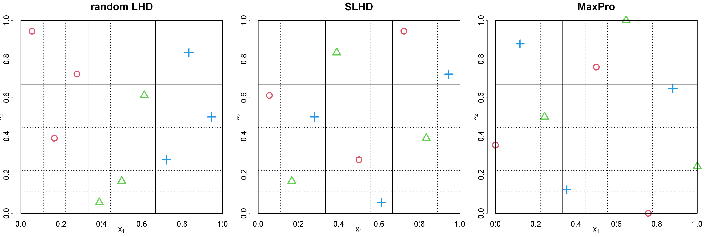

$$
\bigstar\;\diamond\;\bigstar\quad\boxed{\sigma_{\omega}\sigma}\quad\bigstar\;\diamond\;\bigstar
$$

# 图 4.17



$$
\bigstar\;\diamond\;\bigstar\quad\boxed{\sigma_{\omega}\sigma}\quad\bigstar\;\diamond\;\bigstar
$$

## 背景信息

如何构造能够容纳定性因子的空间填充设计?现有文献中的一种思路是:将拉丁超立方设计(LHD)切分为若干分片,把每一分片分配给定性因子的一个水平.钱(2012)提出分片拉丁超立方设计(SLHD),该设计保证每一个分片本身也构成拉丁超立方设计.举例说明:设有两个连续因子 $x_{1},x_{2}$,以及一个包含 3 个水平的名义定性因子 $x_{3}$,试验预算共计 9 次.图 4.17 左图展示一组随机拉丁超立方设计,定性因子的三个水平分别用黑色圆圈(水平 1),红色三角(水平 2),绿色加号(水平 3)标记.不难看出该设计效果不佳:定性因子取水平 1 时 $x_1\in[0,1/3]$,取水平 2 时 $x_1\in[1/3,2/3]$,取水平 3 时 $x_1\in[2/3,1]$.也就是说,在定性因子的每个水平内部,$x_{1}$ 无法遍历完整取值区间.反观图 4.17 中图的分片拉丁超立方设计,性能更优:在定性因子的每一个水平下,$x_{1}$ 和 $x_{2}$ 均可遍历全部取值范围.如图所示,若不考虑定性因子,整体构成一个 $9\times9$ 的拉丁超立方设计(虚线划分);同时,定性因子每个水平内部各自形成 $3\times3$ 的拉丁超立方设计(实线划分).若存在 $p$ 个定性因子,水平数依次为 $L_{1},\dots,L_{p}$,则可先构造一个"新"定性因子,其水平总数为 $t=\prod_{i=1}^{p}L_{i}$,随后生成拥有 $t$ 个分片的分片拉丁超立方设计(SLHD).杨等人(2013)与尹等人(2014)给出了分片拉丁超立方设计的高效构造方法.巴等人(2015)提出极大极小分片拉丁超立方设计,保证整体设计与各个分片均具备优良的极大极小特性.图 4.17 右图中的分片拉丁超立方设计正是借助 R 语言 `SLHD` 包生成的极大极小分片拉丁超立方设计(巴,2015).

$$
\bigstar\;\diamond\;\bigstar\quad\boxed{\sigma_{\omega}\sigma}\quad\bigstar\;\diamond\;\bigstar
$$

## 指令

设置画布宽 30 英寸,高 10 英寸.将画布分为 `1x3`.设置种子为 `1`.创建随机混合设计矩阵 `D0`,其中第一列为名义因子水平 `c(1,1,1,2,2,2,3,3,3)`,第二列为顺序索引 `1:9`,第三列为随机索引 `1:9`.将 `2`,`3` 列放缩至 `c(0,1)` 区间.绘制 `D0` 图像,其中无边框,点形状为 `c(2,2,2,3,3,3,4,4,4)`,点颜色为 `c(2,2,2,3,3,3,4,4,4)`,点线宽为 `5`,横纵坐标标签分别为 `expression(x[1])`,`expression(x[2])`,标题为 `random LHD`,点大小为 `5`,横纵坐标标签大小为 `3`,标题大小为 `4`,横纵坐标刻度大小为 `3`.绘制虚线网格.绘制实线网格.

```r
options(repr.plot.width=30,repr.plot.height=10)
par(mfrow=c(1,3))
p=2;n=9
set.seed(1)
D0=cbind(rep(1:3,c(3,3,3)),1:9,sample(1:9))
D0[,2:3]=(D0[,2:3]-.5)/9
plot(D0[,2:3],bty="n",pch=D0[,1],col=D0[,1]+1,lwd=5,xlab=expression(x[1]),ylab=expression(x[2]),main="random LHD",cex=5,cex.lab=3,cex.main=4,cex.axis=3,xlim=c(0,1),ylim=c(0,1))
for(i in 1:n)
{
  segments(i/n,0,i/n,1,lty=3,lwd=2)
  segments(0,i/n,1,i/n,lty=3,lwd=2)
}
for(i in 0:(n/3)){
  segments(3*i/n,0,3*i/n,1,lwd=3)
  segments(0,3*i/n,1,3*i/n,lwd=3)
}
```

使用 `SLHD` 包中的 `maximinSLHD` 函数生成极大极小分片拉丁超立方设计,其中网格数为 `3x3`,分片数为 `3`,维数为 `2`,取出其中的 `StandDesign` 列作为标准化后的设计矩阵,令其为 `D1`.绘制 `D1` 图像,只是标题变为 `SLHD`,余同上.

```r
library(SLHD)
D1=maximinSLHD(3,3,2)$StandDesign
plot(D1[,2:3],bty="n",pch=D1[,1],col=D1[,1]+1,lwd=5,xlab=expression(x[1]),ylab=expression(x[2]),main="SLHD",cex=5,cex.lab=3,cex.main=4,cex.axis=3,xlim=c(0,1),ylim=c(0,1))
for(i in 1:n)
{
  segments(i/n,0,i/n,1,lty=3,lwd=2)
  segments(0,i/n,1,i/n,lty=3,lwd=2)
}
for(i in 0:(n/3)){
  segments(3*i/n,0,3*i/n,1,lwd=3)
  segments(0,3*i/n,1,3*i/n,lwd=3)
}
```

设置种子为 `3`,使用 `MaxPro` 包中的 `MaxProLHD` 函数生成极大极小拉丁超立方初始设计,取出其中的 `Design` 列,再使用 `MaxPro` 包中的 `MaxPro` 函数进行极大极小优化,取出其中的 `Design` 列,令其为 `D2`.构造初始设计矩阵 `ini`,其中前面列为 `D2`,最后一列拼接上名义因子水平 `c(1,1,1,2,2,2,3,3,3)`.使用 `MaxPro` 包中的  `MaxProQQ` 函数进行步骤分解,其中初始矩阵为 `ini`,名义因子列为最后 `1` 列,取出其中的 `Design` 列作为最终设计矩阵,令其为 `D`.绘制 `D` 图像,只是标题变为 `MaxPro`,余同上.

```r
set.seed(3)
library(MaxPro)
D2=MaxPro(MaxProLHD(n,p)$Design)$Design
ini=cbind(D2,rep(1:3,c(3,3,3)))
D=MaxProQQ(InitialDesign=ini,p_nom=1)$Design
plot(D[,1:2],bty="n",pch=D[,3],col=D[,3]+1,lwd=5,xlab=expression(x[1]),ylab=expression(x[2]),main="MaxPro",cex=5,cex.lab=3,cex.main=4,cex.axis=3)
for(i in 0:n)
{
  segments(i/n,0,i/n,1,lty=3,lwd=2)
  segments(0,i/n,1,i/n,lty=3,lwd=2)
}
for(i in 0:(n/3)){
  segments(3*i/n,0,3*i/n,1,lwd=3)
  segments(0,3*i/n,1,3*i/n,lwd=3)
}
par(mfrow=c(1,1))
```

$$
\bigstar\;\diamond\;\bigstar\quad\boxed{\sigma_{\omega}\sigma}\quad\bigstar\;\diamond\;\bigstar
$$

## 最终效果

```r

# 图 4.17

options(repr.plot.width=30,repr.plot.height=10)
par(mfrow=c(1,3))
p=2;n=9
set.seed(1)
D0=cbind(rep(1:3,c(3,3,3)),1:9,sample(1:9))
D0[,2:3]=(D0[,2:3]-.5)/9
plot(D0[,2:3],bty="n",pch=D0[,1],col=D0[,1]+1,lwd=5,xlab=expression(x[1]),ylab=expression(x[2]),main="random LHD",cex=5,cex.lab=3,cex.main=4,cex.axis=3,xlim=c(0,1),ylim=c(0,1))
for(i in 1:n)
{
  segments(i/n,0,i/n,1,lty=3,lwd=2)
  segments(0,i/n,1,i/n,lty=3,lwd=2)
}
for(i in 0:(n/3)){
  segments(3*i/n,0,3*i/n,1,lwd=3)
  segments(0,3*i/n,1,3*i/n,lwd=3)
}

library(SLHD)
D1=maximinSLHD(3,3,2)$StandDesign
plot(D1[,2:3],bty="n",pch=D1[,1],col=D1[,1]+1,lwd=5,xlab=expression(x[1]),ylab=expression(x[2]),main="SLHD",cex=5,cex.lab=3,cex.main=4,cex.axis=3,xlim=c(0,1),ylim=c(0,1))
for(i in 1:n)
{
  segments(i/n,0,i/n,1,lty=3,lwd=2)
  segments(0,i/n,1,i/n,lty=3,lwd=2)
}
for(i in 0:(n/3)){
  segments(3*i/n,0,3*i/n,1,lwd=3)
  segments(0,3*i/n,1,3*i/n,lwd=3)
}

set.seed(3)
library(MaxPro)
D2=MaxPro(MaxProLHD(n,p)$Design)$Design
ini=cbind(D2,rep(1:3,c(3,3,3)))
D=MaxProQQ(InitialDesign=ini,p_nom=1)$Design
plot(D[,1:2],bty="n",pch=D[,3],col=D[,3]+1,lwd=5,xlab=expression(x[1]),ylab=expression(x[2]),main="MaxPro",cex=5,cex.lab=3,cex.main=4,cex.axis=3)
for(i in 0:n)
{
  segments(i/n,0,i/n,1,lty=3,lwd=2)
  segments(0,i/n,1,i/n,lty=3,lwd=2)
}
for(i in 0:(n/3)){
  segments(3*i/n,0,3*i/n,1,lwd=3)
  segments(0,3*i/n,1,3*i/n,lwd=3)
}
par(mfrow=c(1,1))

```

$$
\bigstar\;\diamond\;\bigstar\quad\boxed{\sigma_{\omega}\sigma}\quad\bigstar\;\diamond\;\bigstar
$$