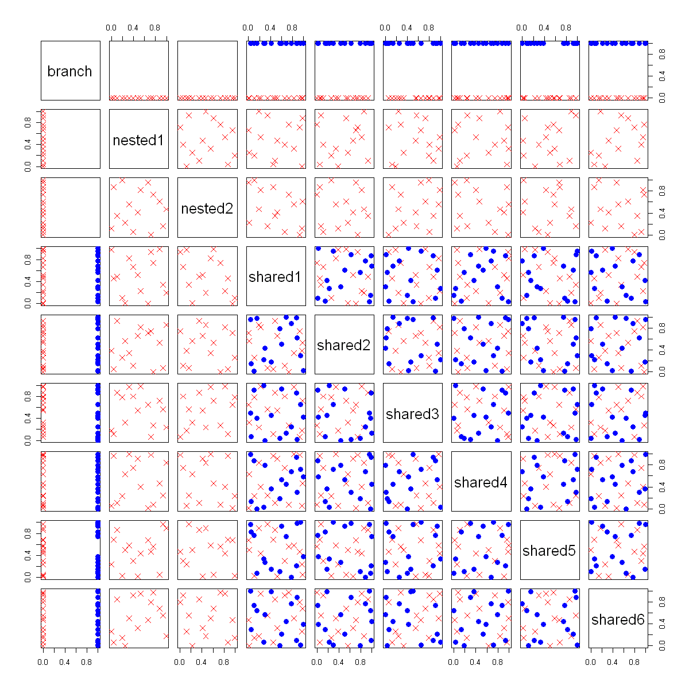

$$
\bigstar\;\diamond\;\bigstar\quad\boxed{\sigma_{\omega}\sigma}\quad\bigstar\;\diamond\;\bigstar
$$

# 图 4.19



$$
\bigstar\;\diamond\;\bigstar\quad\boxed{\sigma_{\omega}\sigma}\quad\bigstar\;\diamond\;\bigstar
$$

## 背景信息

洪等人(2009)开展了一项计算机试验,旨在优化采用立方氮化硼(cBN)刀具加工淬硬轴承钢的车削工艺,该工艺通常称为硬车削.由于被加工材料硬度极高(洛氏硬度 C 超过 60),切削过程中刀具将承受巨大切削力,应力与高温.实际应用中,刀具切削刃会设计特定轮廓以耐受极端工况.两种常用切削刃形式——刃口圆角与负倒棱.负倒棱刀具可通过两个参数调整:倒棱长度与倒棱角度;而刃口圆角刀具结构固定.也就是说,长度与角度这两个因子嵌套在负倒棱刃型之下,刃口圆角刃型不存在嵌套因子.参照田口(1987)与帕德克(1995,第168页),本文将这类刀具刃型称为分支因子.当分支因子取负倒棱水平时,试验额外包含两个因子;取刃口圆角水平时,则无附加因子.还有若干因子对两种刃型均适用,例如切削刃半径,刀尖半径,前角.切削速度,进给量,切削深度等加工参数同样与刃型无关.为区分于分支因子与嵌套因子,这类变量称为共享因子.本次试验涉及的全部因子及其可行取值范围如表 4.1 所示.试验依托商用有限元软件 AdvantEdge 完成.由于分支因子取不同水平时对应的嵌套因子存在差异,在分支因子各个水平内部进行投影分析显得尤为关键.洪等人(2009)提出分支拉丁超立方设计,该设计同时兼顾共享因子空间内的距离,以及分支因子每个水平之下嵌套因子与共享因子张成空间内的距离.分支因子一般属于定性因子,因此也可采用上一节介绍的 MaxProQQ 设计.但若要适配嵌套因子,还需要对该设计方法进行相应改进.下面以硬车削试验为例说明该构造思路,试验预算共计 30 次.首先借助 `MaxProQQ` 生成一组 MaxPro (30,9) 设计:将切削刃形式视作名义因子,其余八个因子作为连续因子.随后选取两列变量,剔除刃口圆角刀具对应的样本,再对负倒棱刀具对应的样本重新缩放并优化.分别计算共享因子设计,分支因子两个水平之下嵌套‐共享组合设计对应的最大投影准则值,基于两列变量的选取完成优化.最终设计的优劣同样依赖初始 MaxPro (30,9) 设计.因此整套流程可重复执行多次,依据最大投影准则从中筛选最优设计.按上述方式得到的最优设计对应的散点图矩阵如图 4.19 所示.

$$
\bigstar\;\diamond\;\bigstar\quad\boxed{\sigma_{\omega}\sigma}\quad\bigstar\;\diamond\;\bigstar
$$

## 指令

设置画布宽,高均 `10` 英寸.经过试验后得知设置种子为 `12` 的设计点分布较为均匀.使用 `SFDesign` 包中的 `maxproLHD` 函数生成一组 `30x8` 的设计,取其 `design` 列再用 `SFDesign` 包中的 `maxpro.optim` 函数进行优化,取其 `design` 列作为共享因子设计的初始值,令其为 `shared_nested.ini`.定义名义分支因子 `branch`,其中 `15` 个 `0`,`15` 个 `1`.将 `shared_nested.ini` 与 `branch` 按列拼接成一个矩阵 `ini`.使用 `MaxPro` 包中的 `MaxProQQ` 函数对 `ini` 进行优化,其中名义列数为 `1`,取其 `Design` 列作为最终设计 `D0`.取 `D0` 的前 `15` 行,去掉第 `9` 列的矩阵作为分支 `0` 的无名义因子列的矩阵,令其为 `D1`.取 `D0` 的后 `15` 行,去掉第 `9` 列的矩阵作为分支 `1` 的无名义因子列的矩阵,令其为 `D2`.

```r
options(repr.plot.width=10,repr.plot.height=10)
set.seed(12)
library(SFDesign)
shared_nested.ini=maxpro.optim(maxproLHD(30,8)$design)$design
branch=rep(c(0,1),c(15,15))
ini=cbind(shared_nested.ini,branch)
library(MaxPro)
D0=MaxProQQ(ini,p_nom=1)$Design
na_nested=matrix(NA,nrow=15,ncol=2)
val=matrix(Inf,nrow=8,ncol=8)
D1=D0[1:15,-9]
D2=D0[16:30,-9]
```

对于 `D1` 的每一列不同对,分别均替换成 `NA`.把 `D2` 的相同列对按列秩序缩放到 `[0,1]` 区间.对此时的 `D2` 中的那一列对,再次使用 `SFDesign` 包中的 `maxpro.optim` 函数进行优化,取其 `design` 列作为最终设计.再与 `branch` 拼回得到最终设计 `D`.使用 `MaxPro` 包中的 `MaxProMeasure` 函数对每一列对计算最大投影准则值,为分支 `0` 的无名义因子列的矩阵与分支 `1` 的无名义因子列,再减去列对的矩阵的和.

```r
for(i in 1:7)
{
  for(j in (i+1):8)
  {
    B=D2
    B[,c(i,j)]=na_nested
    A=D1
    A[,c(i,j)]=(apply(D1[,c(i,j)],2,rank)-.5)/15
    A[,c(i,j)]=maxpro.optim(A[,c(i,j)])$design
    D=cbind(rbind(A,B),branch)
    val[i,j]=MaxProMeasure(D[1:15,-9])+MaxProMeasure(D[16:30,-c(9,i,j)])
  }
}
```

选择最小的投影值作为最优设计,将其对应的 `D` 作为最终设计.调换 `D` 的列的顺序,其中第 `1` 列放 `branch`,第 `2`,`3` 列放选出来的两列 `ind`,剩余列按原顺序放在后面.使用 `pairs` 函数绘制散点图矩阵,其中分支 `0` 的点用红色叉点表示,分支 `1` 的点用蓝色圆点表示.

```r
ind=c(which(val==min(val),arr.ind=TRUE))
B=D2
B[,ind]=na_nested
A=D1
A[,ind]=(apply(D1[,ind],2,rank)-.5)/15
A[,ind]=maxpro.optim(A[,ind])$design
D=cbind(rbind(A,B),branch)
temp=D;temp[,1]=D[,9];temp[,2:3]=D[,ind];temp[,4:9]=D[,-c(9,ind)];D=temp
colnames(D)=c("branch","nested1","nested2",paste("shared",sep="",1:6))
pairs(D,pch=ifelse(D[,"branch"]==0,4,16),col=ifelse(D[,"branch"]==0,"red","blue"),cex.labels=2,cex=1.5)
```

$$
\bigstar\;\diamond\;\bigstar\quad\boxed{\sigma_{\omega}\sigma}\quad\bigstar\;\diamond\;\bigstar
$$

## 最终效果

```r

# 图 4.19

options(repr.plot.width=10,repr.plot.height=10)
set.seed(12)
library(SFDesign)
shared_nested.ini=maxpro.optim(maxproLHD(30,8)$design)$design
branch=rep(c(0,1),c(15,15))
ini=cbind(shared_nested.ini,branch)
library(MaxPro)
D0=MaxProQQ(ini,p_nom=1)$Design
na_nested=matrix(NA,nrow=15,ncol=2)
val=matrix(Inf,nrow=8,ncol=8)
D1=D0[1:15,-9]
D2=D0[16:30,-9]

for(i in 1:7)
{
  for(j in (i+1):8)
  {
    B=D2
    B[,c(i,j)]=na_nested
    A=D1
    A[,c(i,j)]=(apply(D1[,c(i,j)],2,rank)-.5)/15
    A[,c(i,j)]=maxpro.optim(A[,c(i,j)])$design
    D=cbind(rbind(A,B),branch)
    val[i,j]=MaxProMeasure(D[1:15,-9])+MaxProMeasure(D[16:30,-c(9,i,j)])
  }
}

ind=c(which(val==min(val),arr.ind=TRUE))
B=D2
B[,ind]=na_nested
A=D1
A[,ind]=(apply(D1[,ind],2,rank)-.5)/15
A[,ind]=maxpro.optim(A[,ind])$design
D=cbind(rbind(A,B),branch)
temp=D;temp[,1]=D[,9];temp[,2:3]=D[,ind];temp[,4:9]=D[,-c(9,ind)];D=temp
colnames(D)=c("branch","nested1","nested2",paste("shared",sep="",1:6))
pairs(D,pch=ifelse(D[,"branch"]==0,4,16),col=ifelse(D[,"branch"]==0,"red","blue"),cex.labels=2,cex=1.5)

```

$$
\bigstar\;\diamond\;\bigstar\quad\boxed{\sigma_{\omega}\sigma}\quad\bigstar\;\diamond\;\bigstar
$$