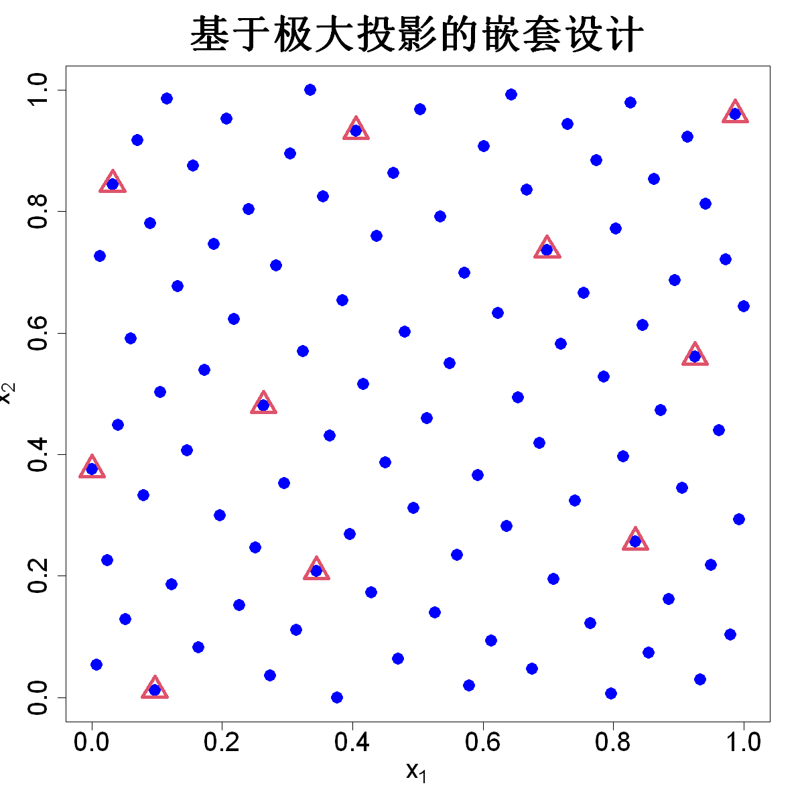

$$
\bigstar\;\diamond\;\bigstar\quad\boxed{\sigma_{\omega}\sigma}\quad\bigstar\;\diamond\;\bigstar
$$

# 图 4.21



$$
\bigstar\;\diamond\;\bigstar\quad\boxed{\sigma_{\omega}\sigma}\quad\bigstar\;\diamond\;\bigstar
$$

## 背景信息

上述构造嵌套设计的算法相比前面提到的代数构造方法更加通用,灵活,并且可以轻易拓展至任意多个保真度层级.举一个二维输入($p=2$)两层保真度的简单例子:低保真度取$n_{1}=100$次仿真,高保真度取$n_{2}=10$次仿真.图4.21展示:蓝色圆点为最大投影设计生成的100个点构成$D_{1}$;红色三角为利用`maxpro.remove`函数从$D_{1}$选出的10个点构成$D_{2}$.

R包`SFDesign`中的`maxpro.remove`函数实现了该准则;此时取$\beta_{l}=1/n_{1}^{2},\;l=1,\dots,p$.

$$
\bigstar\;\diamond\;\bigstar\quad\boxed{\sigma_{\omega}\sigma}\quad\bigstar\;\diamond\;\bigstar
$$

## 指令

创建画布,设置其宽,高均为10英寸.设置种子为`1`,使用`SFDesign`包中的`maxproLHD`函数生成`100x2`拉丁超立方设计,取出`design`列再使用`SFDesign`包中的`maxpro.optim`函数进行最大投影优化,取出`design`列得到`D1`.使用`SFDesign`包中的`maxpro.remove`函数从`D1`中移除`90`个点,剩余的`10`个点作为`D2`,其中参数`delta`依据背景信息取`1/n1^2`.绘制`D1`图像,其中$x$,$y$的范围均为`c(0,1)`,点的形状为`16`,颜色为`blue`,线宽为`4`,点大小为`2`,标题为`基于极大投影的嵌套设计`,横轴标签为`expression(x[1])`,纵轴标签为`expression(x[2])`,横纵轴标签字体,坐标轴刻度字体大小均为`2`,标题字体大小为`3`.在图像上叠加`D2`,其中点的形状为`2`,颜色为`2`,线宽为`4`,点大小为`3`.

```r
#图4.21

options(repr.plot.width=10,repr.plot.height=10)
n1=100;n2=10;p=2
set.seed(1)
library(SFDesign)
D1=maxpro.optim(maxproLHD(n1,p)$design)$design
D2=maxpro.remove(D1,n.remove=n1-n2,delta=1/n1^2)
plot(D1,xlim=c(0,1),ylim=c(0,1),pch=16,col="blue",lwd=4,cex=2,main="基于极大投影的嵌套设计",xlab=expression(x[1]),ylab=expression(x[2]),cex.lab=2,cex.axis=2,cex.main=3)
points(D2,pch=2,col=2,lwd=4,cex=3)
```

$$
\bigstar\;\diamond\;\bigstar\quad\boxed{\sigma_{\omega}\sigma}\quad\bigstar\;\diamond\;\bigstar
$$

## 最终效果

```r

#图4.21

options(repr.plot.width=10,repr.plot.height=10)
n1=100;n2=10;p=2
set.seed(1)
library(SFDesign)
D1=maxpro.optim(maxproLHD(n1,p)$design)$design
D2=maxpro.remove(D1,n.remove=n1-n2,delta=1/n1^2)
plot(D1,xlim=c(0,1),ylim=c(0,1),pch=16,col="blue",lwd=4,cex=2,main="基于极大投影的嵌套设计",xlab=expression(x[1]),ylab=expression(x[2]),cex.lab=2,cex.axis=2,cex.main=3)
points(D2,pch=2,col=2,lwd=4,cex=3)

```

$$
\bigstar\;\diamond\;\bigstar\quad\boxed{\sigma_{\omega}\sigma}\quad\bigstar\;\diamond\;\bigstar
$$