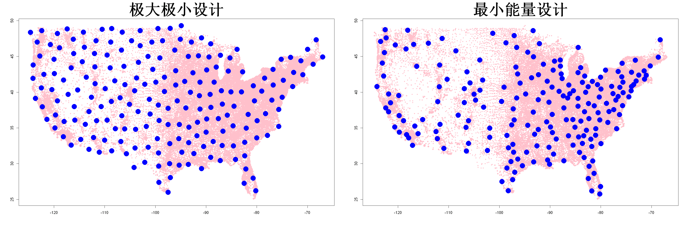

$$
\bigstar\;\diamond\;\bigstar\quad\boxed{\sigma_{\omega}\sigma}\quad\bigstar\;\diamond\;\bigstar
$$

# 图 4.22



$$
\bigstar\;\diamond\;\bigstar\quad\boxed{\sigma_{\omega}\sigma}\quad\bigstar\;\diamond\;\bigstar
$$

## 背景信息

图4.22展示了美国本土(不含阿拉斯加,夏威夷)各邮政编码区域的人口密度(罗齐,2022).图中粉色点代表各个区域,点的大小与人口密度的对数值成正比.假设我们需要布设200个传感器来测量全美污染水平;获取传感器观测数据后,可以利用克里金法或高斯过程预测美国任意地点的污染浓度.应当如何布设传感器,才能保证预测精度?利用R软件包`maximin`生成的200点极大极小设计如图4.22左图所示,这种布设方案并不合理:我们知道人口稠密区域的污染水平通常更高.理想情况下,应当在人口高密度区域布设更多传感器,低密度区域布设更少传感器.因此,我们需要一类加权空间填充设计(鲍曼,伍兹,2013),权重与人口密度成正比.约瑟夫等人(2015)提出的最小能量设计(MED)正是这类方案之一.式 $$\boldsymbol{x}_{k+1}=\argmax_{\boldsymbol{x}\in\mathcal{X}}\min_{i=1:k}f(\boldsymbol{x})f(\boldsymbol{x}_i)\|\boldsymbol{x}-\boldsymbol{x}_i\|_\alpha^{2p},\;k=2,\dots,n$$ 中的序贯算法在R包`mined`中实现.取$\alpha=1$,通过最小能量设计选出的200个点位如图4.22右图所示.可以看到:人口聚居的邮政编码区域分配了更多传感器,有助于构建精度更高的全美污染水平预测模型.

$$
\bigstar\;\diamond\;\bigstar\quad\boxed{\sigma_{\omega}\sigma}\quad\bigstar\;\diamond\;\bigstar
$$

## 指令

创建画布宽`30`英寸,高`10`英寸.将画布分为`1x2`.使用`zipcodeR`包中的`zip_code_db`数据集提取美国邮政编码数据库,选取其中的`9`,`8`,`14`列分别对应经度,维度,人口,再使用`zipcodeR`包中的`na.omit`函数删除其中的缺失值,命名为`dat`.筛选维度介于`25`和`52`之间的行.取`dat`的经度,维度,命名为`CAND`.取`dat`的人口数,命名为`y`.对人口数`+1`,取对数,归一化,`+.5`保证其与人口数成正比且数据不大,最小值不为`0`避免颜色过淡,令其为`sizacode`.

```r
options(repr.plot.width=30,repr.plot.height=10)
par(mfrow=c(1,2))
library(zipcodeR)
dat=na.omit(zip_code_db[,c(9,8,14)])
dat=dat[(dat[,2]>25&dat[,2]<52),]
CAND=as.matrix(dat[,1:2])
y=dat[,3]
sizecode=.5+log(y+1)/max(log(y+1))
```

作人口图像,其中数据集为`CAND`,点的大小为`sizacode`,颜色为粉色,`x`,`y`轴无标签,标题为`极大极小设计`,标题大小为`4`.接下来使用极大极小设计选取观测点.随机选取一个初始点,其中行号随机,列号跟随行号故留空,保留矩阵形式,命名为初始点矩阵`D0`.使用`maximin`包中的`maximin.cand`函数进行极大极小设计,其中增加`199`个点,候选点集为`CAND`,初始点为`D0`,提取返回列表中的`inds`列为坐标矩阵,令其为`D2`.再与初始点按行拼接得到最终`D2`.叠加`D2`点集,其中形状为`16`,颜色为蓝色,大小为`3`.

```r
plot(CAND,cex=sizecode,pch=16,col="pink",xlab="",ylab="",main="极大极小设计",cex.main=4)
D0=CAND[sample(nrow(CAND),1),,drop=FALSE]
library(maximin)
D2=CAND[maximin.cand(199,Xcand=CAND,Xorig=D0)$inds,]
D2=rbind(D0,D2)
points(D2,pch=16,col="blue",cex=3)
```

作人口图像,其中数据集为`CAND`,点的大小为`sizacode`,颜色为粉色,`x`,`y`轴无标签,标题为`极大极小设计`,标题大小为`4`.接下来使用最小能量设计选取观测点.使用`mined`包中的`SelectMinED`函数进行最小能量设计,其中候选点集为`CAND`,权重为人口数的对数`log(y)`,点总数为`200`,$\alpha=1$意味着`s=1`,提取返回列表中的`points`作为最终观测点矩阵,令其为`D`.叠加`D`点集,其中`形状为`16`,颜色为蓝色,大小为`3`.将画布还原回`1x1`.

```r
plot(CAND,cex=sizecode,pch=16,col="pink",xlab="",ylab="",main="最小能量设计",cex.main=4)
library(mined)
D=SelectMinED(candidates=CAND,candlf=log(y),n=200,s=1)$points
points(D,pch=16,col="blue",cex=3)
par(mfrow=c(1,1))
```

$$
\bigstar\;\diamond\;\bigstar\quad\boxed{\sigma_{\omega}\sigma}\quad\bigstar\;\diamond\;\bigstar
$$

## 最终效果

```r

#图4.22

options(repr.plot.width=30,repr.plot.height=10)
par(mfrow=c(1,2))
library(zipcodeR)
dat=na.omit(zip_code_db[,c(9,8,14)])
dat=dat[(dat[,2]>25&dat[,2]<52),]
CAND=as.matrix(dat[,1:2])
y=dat[,3]
sizecode=.5+log(y+1)/max(log(y+1))

plot(CAND,cex=sizecode,pch=16,col="pink",xlab="",ylab="",main="极大极小设计",cex.main=4)
D0=CAND[sample(nrow(CAND),1),,drop=FALSE]
library(maximin)
D2=CAND[maximin.cand(199,Xcand=CAND,Xorig=D0)$inds,]
D2=rbind(D0,D2)
points(D2,pch=16,col="blue",cex=3)

plot(CAND,cex=sizecode,pch=16,col="pink",xlab="",ylab="",main="最小能量设计",cex.main=4)
library(mined)
D=SelectMinED(candidates=CAND,candlf=log(y),n=200,s=1)$points
points(D,pch=16,col="blue",cex=3)
par(mfrow=c(1,1))

```

$$
\bigstar\;\diamond\;\bigstar\quad\boxed{\sigma_{\omega}\sigma}\quad\bigstar\;\diamond\;\bigstar
$$