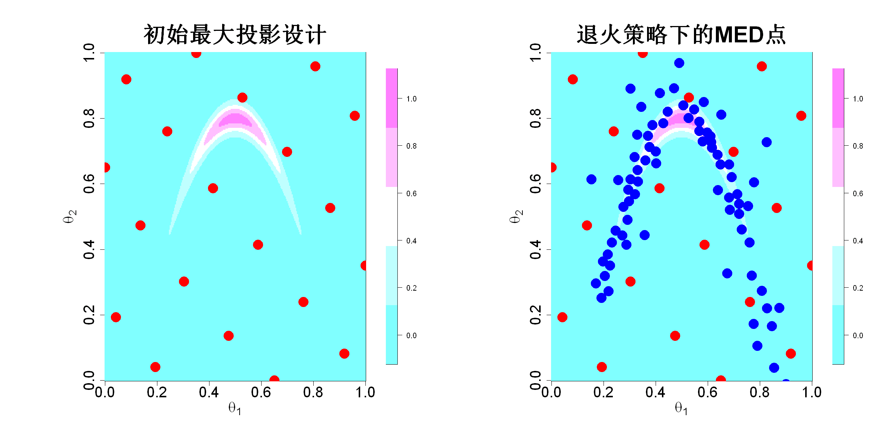

$$
\bigstar\;\diamond\;\bigstar\quad\boxed{\sigma_{\omega}\sigma}\quad\bigstar\;\diamond\;\bigstar
$$

# 图 4.24



$$
\bigstar\;\diamond\;\bigstar\quad\boxed{\sigma_{\omega}\sigma}\quad\bigstar\;\diamond\;\bigstar
$$

## 背景信息

举个例子,哈尔里奥等人(1999)给出了形如香蕉状的密度函数:

$$f(\boldsymbol{\theta})\propto\exp\left(-\frac{1}{2}\frac{\theta_1^2}{100}-\frac{1}{2}(\theta_2+0.03\theta_1^2-3)^2\right),\;\boldsymbol{\theta}\in\mathbb{R}^2\tag{4.49}$$

该后验本身计算成本不高,此处仅作演示.假定已知后验高密度区域落在区间$[-40,40]\times[-25,10]$内,我们将该矩形区域缩放至单位正方形$[0,1]^2$.首先在正方形内构造包含20个样本点的最大投影设计.图4.24左图展示了这20个样本点,可以看到最大投影设计完全没有覆盖后验的高密度区域.接下来,我们基于式(4.46)的序贯算法,令$\gamma=1/4$,同时用局部近似$\widehat{h}(\cdot)$替换原函数$h(\cdot)$,新增20个最小能量设计采样点.随后依次将$\gamma$调整为$2/4,3/4$,最终取$\gamma=1$,重复上述过程.该算法在R语言程序包`mined`中实现(王,约瑟夫,2022).最终生成100个最小能量设计采样点,结果如图4.24右图所示.不难看出,采样点集中分布在后验高密度区域,是用于近似后验的优良试验设计.

$$
\bigstar\;\diamond\;\bigstar\quad\boxed{\sigma_{\omega}\sigma}\quad\bigstar\;\diamond\;\bigstar
$$

## 指令

创建画布宽`20`英寸,高`10`英寸.将画布分为`1x2`.定义香蕉函数(取对数)`logf(para)`.创建`p1`和`p2`的网格,并计算网格点的函数值`fc`.使用`fields`包中的`imagePlot`函数绘制`fc`的二维密度着色图,其中`x`轴标注为`expression(theta[1])`,`y`轴标注为`expression(theta[2])`,颜色为`cm.colors(5)`,标题为`初始最大投影设计`,标题大小为`3`,轴标注,坐标轴大小均为`2`.设置种子为`8`.使用`MaxPro`包中的`MaxProLHD`函数生成`10x2`个初始最大投影设计点,取其`Design`列,再次使用`MaxPro`包中的`MaxPro`函数优化设计,取其`Design`列作为最终最大投影设计点,点集命名为`ini`.在图中叠加`ini`点集,其中形状为`16`,颜色为`red`,大小为`3`.

```r
options(repr.plot.width=20,repr.plot.height=10)
par(mfrow=c(1,2))
logf=function(para){
  l1=-40;u1=40;l2=-25;u2=10
  x1=l1+(u1-l1)*para[1]
  x2=l2+(u2-l2)*para[2]
  -.5*(x1^2/100+(x2+.03*x1^2-3)^2)
}
N.plot=300
p1=seq(0,1,length.out=N.plot)
p2=seq(0,1,length.out=N.plot)
fc=matrix(0,nrow=N.plot,ncol=N.plot)
for(i in 1:N.plot)for(j in 1:N.plot)fc[i,j]=exp(logf(c(p1[i],p2[j])))
library(fields)
imagePlot(p1,p2,fc,xlab=expression(theta[1]),ylab=expression(theta[2]),col=cm.colors(5),main="初始最大投影设计",cex.main=3,cex.lab=2,cex.axis=2)
p=2;n=20
set.seed(8)
library(MaxPro)
ini=MaxPro(MaxProLHD(n,p)$Design)$Design
points(ini,pch=16,col="red",cex=3)
```

绘制`fc`的二维密度着色图,其中`x`轴标注为`expression(theta[1])`,`y`轴标注为`expression(theta[2])`,颜色为`cm.colors(5)`,标题为`初始最大投影设计`,标题大小为`3`,轴标注,坐标轴大小均为`2`.在图中叠加`ini`点集,其中形状为`16`,颜色为`red`,大小为`3`.使用`mined`包中的`mined`函数执行退火算法生成最小能量设计,其中初始点阵是前面的`ini`,对数形式的密度函数是`logf`,迭代次数为`5`($0$,$1/4$,$2/4$,$3/4$,$1$),取`cand`列为最终的最小能量设计点集,令其为`cand`.寻找`ini`点集在`cand`点集中的索引,记为`ind`.在图中叠加抠除`ini`的`cand`点集,其中形状为`16`,颜色为`blue`,大小为`3`.将画布还原为`1x1`.

```r
imagePlot(p1,p2,fc,xlab=expression(theta[1]),ylab=expression(theta[2]),col=cm.colors(5),main="退火策略下的MED点",cex.main=3,cex.lab=2,cex.axis=2)
points(ini,pch=16,col="red",cex=3)
library(mined)
cand=mined(ini,logf,K_iter=5)$cand
ind=match(ini[,1],cand[,1])
points(cand[-ind,],pch=16,col="blue",cex=3)
par(mfrow=c(1,1))
```

$$
\bigstar\;\diamond\;\bigstar\quad\boxed{\sigma_{\omega}\sigma}\quad\bigstar\;\diamond\;\bigstar
$$

## 最终效果

```r

#图4.24

options(repr.plot.width=20,repr.plot.height=10)
par(mfrow=c(1,2))
logf=function(para){
  l1=-40;u1=40;l2=-25;u2=10
  x1=l1+(u1-l1)*para[1]
  x2=l2+(u2-l2)*para[2]
  -.5*(x1^2/100+(x2+.03*x1^2-3)^2)
}
N.plot=300
p1=seq(0,1,length.out=N.plot)
p2=seq(0,1,length.out=N.plot)
fc=matrix(0,nrow=N.plot,ncol=N.plot)
for(i in 1:N.plot)for(j in 1:N.plot)fc[i,j]=exp(logf(c(p1[i],p2[j])))
library(fields)
imagePlot(p1,p2,fc,xlab=expression(theta[1]),ylab=expression(theta[2]),col=cm.colors(5),main="初始最大投影设计",cex.main=3,cex.lab=2,cex.axis=2)
p=2;n=20
set.seed(8)
library(MaxPro)
ini=MaxPro(MaxProLHD(n,p)$Design)$Design
points(ini,pch=16,col="red",cex=3)

imagePlot(p1,p2,fc,xlab=expression(theta[1]),ylab=expression(theta[2]),col=cm.colors(5),main="退火策略下的MED点",cex.main=3,cex.lab=2,cex.axis=2)
points(ini,pch=16,col="red",cex=3)
library(mined)
cand=mined(ini,logf,K_iter=5)$cand
ind=match(ini[,1],cand[,1])
points(cand[-ind,],pch=16,col="blue",cex=3)
par(mfrow=c(1,1))

```

$$
\bigstar\;\diamond\;\bigstar\quad\boxed{\sigma_{\omega}\sigma}\quad\bigstar\;\diamond\;\bigstar
$$