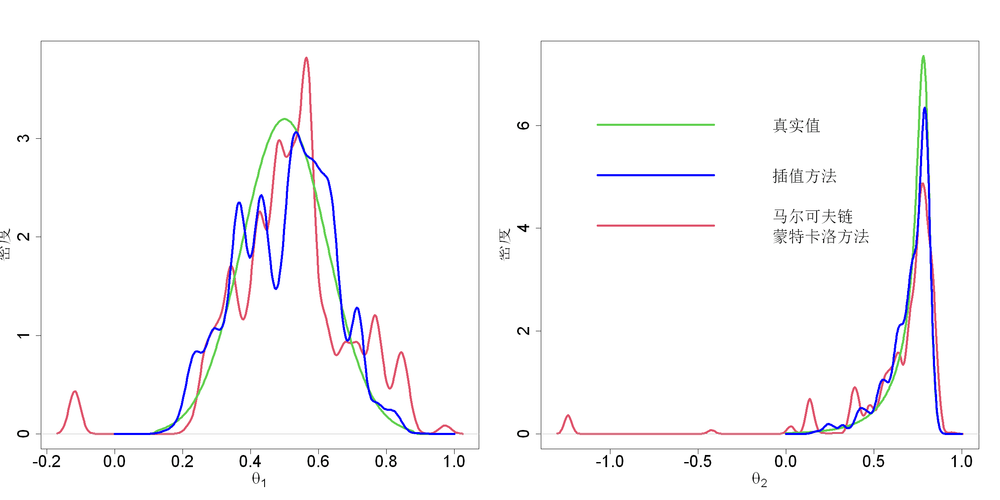

$$
\bigstar\;\diamond\;\bigstar\quad\boxed{\sigma_{\omega}\sigma}\quad\bigstar\;\diamond\;\bigstar
$$

# 图 4.25



$$
\bigstar\;\diamond\;\bigstar\quad\boxed{\sigma_{\omega}\sigma}\quad\bigstar\;\diamond\;\bigstar
$$

## 背景信息

采用插值方法对式 $$f(\boldsymbol{\theta})\propto\exp\left(-\frac{1}{2}\frac{\theta_1^2}{100}-\frac{1}{2}(\theta_2+0.03\theta_1^2-3)^2\right),\;\boldsymbol{\theta}\in\mathbb{R}^2$$ 中香蕉状密度求解得到$\theta_1,\theta_2$的边缘密度,结果见图4.25.本例中真实后验可以通过数值积分算出,对应图中绿色曲线.作为对比,图中红色曲线为借助维霍拉(2012)的自适应梅特罗波利斯算法生成一万条马尔可夫链蒙特卡洛样本得到的密度曲线.不难看出,该插值方法对真实后验的近似效果远优于马尔可夫链蒙特卡洛方法.本例中插值方法仅需要100次函数求值,而马尔可夫链蒙特卡洛方法需要一万次求值.当面对计算成本极高的后验分布时,这一优势将十分突出.

$$
\bigstar\;\diamond\;\bigstar\quad\boxed{\sigma_{\omega}\sigma}\quad\bigstar\;\diamond\;\bigstar
$$

## 指令

对于香蕉函数$$f(\boldsymbol{\theta})\propto\exp\left(-\frac{1}{2}\frac{\theta_1^2}{100}-\frac{1}{2}(\theta_2+0.03\theta_1^2-3)^2\right),\;\boldsymbol{\theta}\in\mathbb{R}^2$$定义对数香蕉函数`logf(para)`.定义香蕉函数`h(para)`为`logf`的指数.创建`300x300`的$[0,1]^{2}$网格,两个维度分别令其为`p1`,`p2`.使用`cubature`包中的`adaptIntegrate`函数求解积分$$\int f(\boldsymbol{y}|\boldsymbol{\theta})f(\boldsymbol{\theta})\mathrm{d}\boldsymbol{\theta}$$,其中两个维度的范围均为`c(0,1)`,取返回值中的`int`列即是归一化常数,令其为`denom`.创建精确边缘积分`300x2`矩阵`exact`.依次固定一个参数,求另一个参数的边缘积分,归一后分别存在`exact`的两列.

```r
logf=function(para){
  x1=-40+80*para[1]
  x2=-25+35*para[2]
  -.5*(x1^2/100+(x2+.03*x1^2-3)^2)
}
h=function(para)exp(logf(para))
N.plot=300
p1=seq(0,1,l=N.plot)
p2=seq(0,1,l=N.plot)
set.seed(8)
p=2;n=20
library(cubature)
denom=adaptIntegrate(h,c(0,0),c(1,1))$int
exact=matrix(0,nrow=N.plot,ncol=p)
for(i in 1:N.plot){
  theta2=p2[i]
  exact[i,2]=integrate(function(t1)apply(cbind(t1,theta2),1,h),0,1)$val/denom
}
for(i in 1:N.plot){
  theta1=p1[i]
  exact[i,1]=integrate(function(t2)apply(cbind(theta1,t2),1,h),0,1)$val/denom
}
```

使用`adaptMCMC`包中的`MCMC`函数对`logf`运行自适应梅特罗波利斯算法,其中样本数为`10000`,初始值为`rep(.5,p)`,尺度矩阵为`(2.4/sqrt(2))^2*diag(p)`,选择自适应,接受率为`0.05`,取`samples`列作为最终的马尔克夫链蒙特卡洛方法样本,令其为`theta`.

```r
library(adaptMCMC)
theta=MCMC(logf,n=10000,init=rep(.5,p),scale=(2.4/sqrt(2))^2*diag(p),adapt=TRUE,acc.rate=.05)$samples
```

设置种子为`8`.使用`MaxPro`包中的`MaxProLHD`创建`20x2`的初始最小能量设计,取其`Design`列再使用`MaxPro`包中的`MaxPro`函数优化最小能量设计,取其`Design`列作为最终的最小能量设计,令其为`ini`.使用`mined`包中的`mined`函数通过退火算法,向`ini`增加观察点,其中的函数为`logf`,$\gamma$依次调整为$0$,$1/4$,$2/4$,$3/4$,$1$,因此次数为`5`,取`cand`列作为最终选取的`20x5`个点,令其为`nu`.

```r
set.seed(8)
library(MaxPro)
ini=MaxPro(MaxProLHD(n,p)$Design)$Design
library(mined)
nu=mined(ini,logf,K_iter=5)$cand
```

依据公式$$g(\boldsymbol{\nu_{i}};\boldsymbol{\nu_{j}},\boldsymbol{\Sigma})=\exp\left(-\frac{1}{2}\sum_{i=1}^p\frac{(\nu_{ik}-\nu_{jk})^2}{\varphi_{k}^{2}}\right)$$计算$g(\boldsymbol{\nu_{i}};\boldsymbol{\nu_{j}},\boldsymbol{\Sigma})$,其中`dist`函数计算欧氏距离,对角线,上三角均显示,令结果为`G.m`.依据公式$$\mathrm{WMSCV}=\frac{1}{n}\sum_{i=1}^{n}g^{ii}\left(\frac{\boldsymbol{e}_{i}'\boldsymbol{G}^{-1}\sqrt{\boldsymbol{h}}}{g^{ii}}\right)^{2}$$计算$\mathrm{WMSCV}$,其中$\sqrt{h}$为`h`函数在`nu`点的值,令其为`hev`,$\boldsymbol{G}$为`G.m(phi)`,求逆时技巧为加上小对角扰动保证其可逆,令其为`Gi`,取`Gi`的对角线为$g^{ii}$,加权函数使用`mean`.为了优化`wmscv`函数,创建经验起点,取设计点之间距离的中位数,再嵌套2-范数,令其为`ini.s`.使用`optim`函数对`wmscv`函数进行优化,其中起点为`ini.s`,重复`2`次,函数为`wmscv`的对数,下界为`ini.s/100`,重复`2`次,上界为`ini.s*100`,重复`2`次,方法为`L-BFGS-B`,取返回值中的`par`列作为最终的最优参数,再平方求得$\sigma_{k}$,令其为`s`.利用公式$$B_{ij}=\sqrt{\sum_{k}(\nu_{ik}-\nu_{jk})^{2}/\sigma^{k}}$$计算标准化距离矩阵$B_{ij}$,令其为`B`.最优带宽重新计算相关矩阵$$G_{ij}=\exp(-B_{ij}^{2}/2)$$令其为`G`.利用公式$$\widehat{\boldsymbol{c}}=\boldsymbol{G}^{-1}\sqrt{\boldsymbol{h}}$$求解$\widehat{\boldsymbol{c}}$,令其为`coef`.利用公式$$d_{ij}=\widehat{c}_i\widehat{c}_jg(\boldsymbol{\nu}_i;\boldsymbol{\nu}_j,2\boldsymbol{\Sigma})$$求解$d_{ij}$,令其为`d`.利用公式$$\boldsymbol{M}=\frac{\nu_{ik}-\nu_{jk}}{2}$$求解均值项$\boldsymbol{M}$,令其为`nxn`的`M`.将`p1`,`p2`按列拼成矩阵`v`.使用公式$$\widehat{p}(\theta_k|\boldsymbol{y})=\frac{\sum_{i=1}^n\sum_{j=1}^nd_{ij}\varphi(\theta_k;\boldsymbol{M},\Sigma_{kk}/2)}{\sum_{i=1}^n\sum_{j=1}^nd_{ij}}$$求解边际后验密度$\widehat{p}(\theta_k|\boldsymbol{y})$,令其为`den`.

```r
G.m=function(phi)exp(-.5*as.matrix(dist(nu%*%diag(sqrt(1/phi)),diag=TRUE,upper=TRUE))^2)
hev=apply(nu,1,h)
wmscv=function(phi){
  Gi=solve(G.m(phi)+.0001*diag(nrow(G.m(phi))))
  mean(diag(Gi)*(c(Gi%*%sqrt(hev))/diag(Gi))^2)
}
ini.s=(median(dist(nu)))^2/2
s=sqrt(optim(rep(ini.s,p),function(x)log(wmscv(x)),lower=rep(ini.s/100,p),upper=rep(100*ini.s,p),method="L-BFGS-B")$par)
B=as.matrix(dist(nu%*%diag(1/s),diag=TRUE,upper=TRUE))
G=exp(-.5*B^2)
coef=solve(G+.0001*diag(nrow(G)))%*%sqrt(hev)
d=outer(c(coef),c(coef),"*")*exp(-.25*B^2)
M=array(0,dim=c(nrow(nu),nrow(nu),p))
for(k in 1:p)M[,,k]=outer(nu[,k],nu[,k],"+")/2
v=cbind(p1,p2)
den=sapply(1:p,function(k)apply(v,1,function(th)sum(d*dnorm(th,M[,,k],s[k]/sqrt(2)))/sum(d)))
```

创建画布宽20英寸,高10英寸.将画布分为`1x2`.定义图像上界`u`为`den`和`exact`的最大值,若是$\theta_{1}$,则`x1.2`倍率;若是$\theta_{2}$则`x1`倍率.绘制马尔克夫链蒙特卡洛方法的密度曲线,颜色为红色,线宽为`4`,纵坐标范围为`c(0,u)`,标题为空,横坐标为`expression(x[1])`与`expression(x[2])`,纵坐标为`密度`,横纵坐标标签字体大小均为`2`,坐标轴字体大小均为`2`.叠加精确边缘积分曲线,颜色为绿色,线宽为`4`.叠加插值方法的密度曲线,颜色为蓝色,线宽为`4`.在第二张图上添加注释,其中标签为`c("真实值","插值方法","马尔可夫链\n蒙特卡洛方法")`及其对应的颜色,线宽,无边框,大小为`2`,位置在`c.4,7`.将画布还原回`1x1`.

```r
options(repr.plot.width=20,repr.plot.height=10)
par(mfrow=c(1,2))
u=max(c(den[,1],exact[,1]))*(1.2-.2*(1-1))
plot(density(theta[,1]),type="l",col=2,lwd=4,ylim=c(0,u),main="",xlab=expression(theta[1]),ylab="密度",cex.lab=2,cex.axis=2)
lines(v[,1],exact[,1],lwd=4,col=3)
lines(v[,1],den[,1],col="blue",lwd=4)
u=max(c(den[,2],exact[,2]))*(1.2-.2*(2-1))
plot(density(theta[,2]),type="l",col=2,lwd=4,ylim=c(0,u),main="",xlab=expression(theta[2]),ylab="密度",cex.lab=2,cex.axis=2)
lines(v[,2],exact[,2],lwd=4,col=3)
lines(v[,2],den[,2],col="blue",lwd=4)
legend(-1.4,7,legend=c("真实值","插值方法","马尔可夫链\n蒙特卡洛方法"),col=c(3,"blue",2),lwd=c(4,4,4),bty="n",cex=2)
par(mfrow=c(1,1))
```

$$
\bigstar\;\diamond\;\bigstar\quad\boxed{\sigma_{\omega}\sigma}\quad\bigstar\;\diamond\;\bigstar
$$

## 最终效果

```r

#图4.25

logf=function(para){
  x1=-40+80*para[1]
  x2=-25+35*para[2]
  -.5*(x1^2/100+(x2+.03*x1^2-3)^2)
}
h=function(para)exp(logf(para))
N.plot=300
p1=seq(0,1,l=N.plot)
p2=seq(0,1,l=N.plot)
p=2;n=20
library(cubature)
denom=adaptIntegrate(h,c(0,0),c(1,1))$int
exact=matrix(0,nrow=N.plot,ncol=p)
for(i in 1:N.plot){
  theta2=p2[i]
  exact[i,2]=integrate(function(t1)apply(cbind(t1,theta2),1,h),0,1)$val/denom
}
for(i in 1:N.plot){
  theta1=p1[i]
  exact[i,1]=integrate(function(t2)apply(cbind(theta1,t2),1,h),0,1)$val/denom
}

library(adaptMCMC)
theta=MCMC(logf,n=10000,init=rep(.5,p),scale=(2.4/sqrt(2))^2*diag(p),adapt=TRUE,acc.rate=.05)$samples

set.seed(8)
library(MaxPro)
ini=MaxPro(MaxProLHD(n,p)$Design)$Design
library(mined)
nu=mined(ini,logf,K_iter=5)$cand

G.m=function(phi)exp(-.5*as.matrix(dist(nu%*%diag(sqrt(1/phi)),diag=TRUE,upper=TRUE))^2)
hev=apply(nu,1,h)
wmscv=function(phi){
  Gi=solve(G.m(phi)+.0001*diag(nrow(G.m(phi))))
  mean(diag(Gi)*(c(Gi%*%sqrt(hev))/diag(Gi))^2)
}
ini.s=(median(dist(nu)))^2/2
s=sqrt(optim(rep(ini.s,p),function(x)log(wmscv(x)),lower=rep(ini.s/100,p),upper=rep(100*ini.s,p),method="L-BFGS-B")$par)
B=as.matrix(dist(nu%*%diag(1/s),diag=TRUE,upper=TRUE))
G=exp(-.5*B^2)
coef=solve(G+.0001*diag(nrow(G)))%*%sqrt(hev)
d=outer(c(coef),c(coef),"*")*exp(-.25*B^2)
M=array(0,dim=c(nrow(nu),nrow(nu),p))
for(k in 1:p)M[,,k]=outer(nu[,k],nu[,k],"+")/2
v=cbind(p1,p2)
den=sapply(1:p,function(k)apply(v,1,function(th)sum(d*dnorm(th,M[,,k],s[k]/sqrt(2)))/sum(d)))

options(repr.plot.width=20,repr.plot.height=10)
par(mfrow=c(1,2))
u=max(c(den[,1],exact[,1]))*(1.2-.2*(1-1))
plot(density(theta[,1]),type="l",col=2,lwd=4,ylim=c(0,u),main="",xlab=expression(theta[1]),ylab="密度",cex.lab=2,cex.axis=2)
lines(v[,1],exact[,1],lwd=4,col=3)
lines(v[,1],den[,1],col="blue",lwd=4)
u=max(c(den[,2],exact[,2]))*(1.2-.2*(2-1))
plot(density(theta[,2]),type="l",col=2,lwd=4,ylim=c(0,u),main="",xlab=expression(theta[2]),ylab="密度",cex.lab=2,cex.axis=2)
lines(v[,2],exact[,2],lwd=4,col=3)
lines(v[,2],den[,2],col="blue",lwd=4)
legend(-1.4,7,legend=c("真实值","插值方法","马尔可夫链\n蒙特卡洛方法"),col=c(3,"blue",2),lwd=c(4,4,4),bty="n",cex=2)
par(mfrow=c(1,1))

```

$$
\bigstar\;\diamond\;\bigstar\quad\boxed{\sigma_{\omega}\sigma}\quad\bigstar\;\diamond\;\bigstar
$$