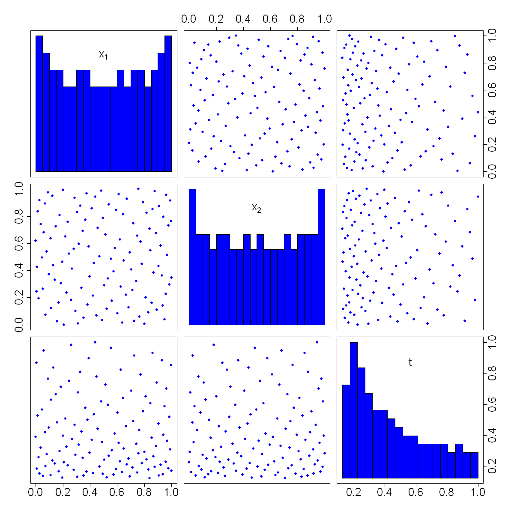

$$
\bigstar\;\diamond\;\bigstar\quad\boxed{\sigma_{\omega}\sigma}\quad\bigstar\;\diamond\;\bigstar
$$

# 图 4.27



$$
\bigstar\;\diamond\;\bigstar\quad\boxed{\sigma_{\omega}\sigma}\quad\bigstar\;\diamond\;\bigstar
$$

## 背景信息

下面采用宋等人(2024)给出的算例进行说明,模型输出依赖两个输入变量$(x_1,x_2)$与调节参数$M$:

$$y=\varphi(\boldsymbol{x})+\frac{16}{M}e^{-1.4x_1}\cos(3.5\pi x_2)$$

其中

$$\varphi(\boldsymbol{x})=\left(1-e^{-5/x_2}\right)\frac{2300x_1^3+1900x_1^2+2092x_1+60}{100x_1^3+500x_1^2+4x_1+20}\tag{4.70}$$

真实输入输出关系为$y=\varphi(\boldsymbol{x})$,但受计算成本限制无法直接求解,计算开销与$M$成正比.参照宋等人(2024),令$M\in[2,16]$.若仅采用$M=16$开展单保真度仿真,预算最多完成$\overline{n}=50$次仿真.而采用多保真度方案,可以在相同总计算成本下,将仿真样本分散布置在区间$[2,16]$内不同$M$水平上.通过式(4.68)求得$n=118$;再结合式(4.66),(4.69)得到$t=1/M$对应的118个水平.构造试验设计时,可以先构造包含3个因子,共118次运行的最大投影(MaxPro)设计,再将第三列对应$t$的数值替换为最优水平.把$t$视作离散数值因子,借助MaxProQQ函数(巴,约瑟夫,2018)得到最终设计,该设计的散点图见图4.27,能够明显观察到$t$呈现非均匀分布特征.按照4.5节介绍的最大投影设计序列扩充方法生成100个测试点;在该算例中,真实输出可直接通过式(4.70)计算得到.100个测试点的均方根误差(RMSE)计算结果为0.054.作为对比,我们同样基于$M=16$,样本量$\overline{n}=50$的最大投影设计拟合单保真度模型,得到均方根误差0.420,远高于多保真度建模方法的误差水平.

$$
\bigstar\;\diamond\;\bigstar\quad\boxed{\sigma_{\omega}\sigma}\quad\bigstar\;\diamond\;\bigstar
$$

## 指令

创建画布宽`10`英寸,高`10`英寸.依据公式$$y=\varphi(\boldsymbol{x})+\frac{16}{M}e^{-1.4x_1}\cos(3.5\pi x_2)$$其中$$\varphi(\boldsymbol{x})=\left(1-e^{-5/x_2}\right)\frac{2300x_1^3+1900x_1^2+2092x_1+60}{100x_1^3+500x_1^2+4x_1+20}\tag{4.70}$$创建函数`f(u)`.依据公式$$\lambda=\overline{M}/\widetilde{M}$$创建`lam`.依据公式$$\nu=\frac{\overline{n}\lambda-1}{\lambda(\overline{n}-1)}$$创建`nu`.依据公式$$n=1+[\frac{\log\lambda}{\log\nu}]$$创建`n`.依据公式$$M_{i}=\widetilde{M}\left(\frac{\overline{M}}{\widetilde{M}}\right)^{(i-1)/(n-1)}$$创建`M`,它生成118个M值,从2到16呈等比数列分布.依据公式$$t_{i}=\frac{1/M_{i}}{\max(1/M_{i})}$$归一化,创建`t_levels`,再将其从小至大排序.

```r
options(repr.plot.width=10,repr.plot.height=10)
f=function(u){
    x=u[1:2];M=1/u[3]
    (1-exp(-1/(2*x[2])))*(2300*x[1]^3+1900*x[1]^2+2092*x[1]+60)/(100*x[1]^3+500*x[1]^2+4*x[1]+20)+16*exp(-1.4*x[1])*cos(3.5*pi*x[2])*u[3]
}
p=2;Mt=2;Mb=16
lam=Mb/Mt
nb=50
nu=(nb*lam-1)/(lam*(nb-1))
n=1+round(log(lam)/log(nu))
M=Mt*(Mb/Mt)^(((1:n)-1)/(n-1))
t_levels=sort(1/M/max(1/M))
```

设置种子为`1`.使用`SFDesign`包中的`maxproLHD`与`maxpro.optim`函数先创建`118x3`维初始最大投影设计再优化,取`Design`列令其为`D`.按照第3列从小到大排序,再将第3列替换为`t_levels`.使用`MaxPro`包中的`MaxProQQ`函数重新设计,将`Design`列令为最终观测点`D`.对`D`的每一行调用测试函数`f`得到响应值`y`.绘制`3`个变量的两两之间的散点图矩阵,其中对角线画直方图,分`15`组,不画平滑曲线,不画回归曲线,点的形状为`16`,变量标签为`c(expression(x[1]),expression(x[2]),"t")`,坐标轴大小为`2`.

```r
set.seed(1)
library(SFDesign)
D=maxpro.optim(maxproLHD(n,p+1)$design)$design
D=D[order(D[,3]),]
D[,3]=t_levels
library(MaxPro)
D=MaxProQQ(D)$Design
y=apply(D,1,f)
library(car)
scatterplotMatrix(D,diagonal=list(method="histogram",breaks=15),smooth=FALSE,regLine=FALSE,pch=16,var.labels=c(expression(x[1]),expression(x[2]),"t"),cex.axis=2)
```

使用`MaxPro`包中的`MaxProAugment`函数在已有118个设计点的基础上增补100个新点,其中原矩阵为`D`的前`2`列,随机生成`118x100,2`个点,选择`100`个点作为增补点,取其`Design`列作为测试`test`.删除前118列,补充最后一列`t=0`后得到100个点的真实响应值,令其为`true`.使用`MFGP`包中的`MFGP_fit`函数使用多保真度高斯过程拟合模型,其中设计矩阵为`D`,响应值为`y`,初始值为`c(1,1,1,1,1,1)`,分别对应参数`2x2`的$\boldsymbol{\theta}$,$\gamma$,$\lambda$.使用`MFGP_predict`函数对测试点`test`并上`t=0`列进行预测,取`mean`列得到预测值`pred`.计算预测值与真实值的均方根误差.

```r
test=MaxProAugment(ExistDesign=D[,1:p],CandDesign=CandPoints(100*n,p),nNew=100)$Design
test=test[-(1:n),]
true=apply(cbind(test,0),1,f)
library(MFGP)
pred=MFGP_predict(MFGP_fit(D,y,ini=rep(1,2*p+2)),cbind(test,0))$mean
sqrt(mean((pred-true)^2))
```

使用`SFDesign`包中的`maxproLHD`创建初始设计,`maxpro.optim`函数优化,来创建`50x2`维最大投影设计,取其`Design`列令其为`D1`.对`D1`的每一行调用测试函数`f`,得到响应值`y1`,其中`M=16`.使用`rkriging`包中的`Fit.Kriging`函数拟合单保真度高斯过程模型,其中设计矩阵为`D1`,响应值为`y1`,使用高斯核.使用`Predict.Kriging`函数对测试点`test`进行预测,取`mean`列得到预测值`pred1`.计算预测值与真实值的均方根误差.

```r
D1=maxpro.optim(maxproLHD(nb,p)$design)$design
y1=apply(cbind(D1,1/Mb),1,f)
library(rkriging)
pred1=Predict.Kriging(Fit.Kriging(D1,y1,kernel.parameters=list(type="Gaussian")),test)$mean
sqrt(mean((pred1-true)^2))
```

$$
\bigstar\;\diamond\;\bigstar\quad\boxed{\sigma_{\omega}\sigma}\quad\bigstar\;\diamond\;\bigstar
$$

## 最终效果

```r

#图4.27

options(repr.plot.width=10,repr.plot.height=10)
f=function(u){
    x=u[1:2];M=1/u[3]
    (1-exp(-1/(2*x[2])))*(2300*x[1]^3+1900*x[1]^2+2092*x[1]+60)/(100*x[1]^3+500*x[1]^2+4*x[1]+20)+16*exp(-1.4*x[1])*cos(3.5*pi*x[2])*u[3]
}
p=2;Mt=2;Mb=16
lam=Mb/Mt
nb=50
nu=(nb*lam-1)/(lam*(nb-1))
n=1+round(log(lam)/log(nu))
M=Mt*(Mb/Mt)^(((1:n)-1)/(n-1))
t_levels=sort(1/M/max(1/M))

set.seed(1)
library(SFDesign)
D=maxpro.optim(maxproLHD(n,p+1)$design)$design
D=D[order(D[,3]),]
D[,3]=t_levels
library(MaxPro)
D=MaxProQQ(D)$Design
y=apply(D,1,f)
library(car)
scatterplotMatrix(D,diagonal=list(method="histogram",breaks=15),smooth=FALSE,regLine=FALSE,pch=16,var.labels=c(expression(x[1]),expression(x[2]),"t"),cex.axis=2)

test=MaxProAugment(ExistDesign=D[,1:p],CandDesign=CandPoints(100*n,p),nNew=100)$Design
test=test[-(1:n),]
true=apply(cbind(test,0),1,f)
library(MFGP)
pred=MFGP_predict(MFGP_fit(D,y,ini=rep(1,2*p+2)),cbind(test,0))$mean
sqrt(mean((pred-true)^2))

D1=maxpro.optim(maxproLHD(nb,p)$design)$design
y1=apply(cbind(D1,1/Mb),1,f)
library(rkriging)
pred1=Predict.Kriging(Fit.Kriging(D1,y1,kernel.parameters=list(type="Gaussian")),test)$mean
sqrt(mean((pred1-true)^2))

```

$$
\bigstar\;\diamond\;\bigstar\quad\boxed{\sigma_{\omega}\sigma}\quad\bigstar\;\diamond\;\bigstar
$$