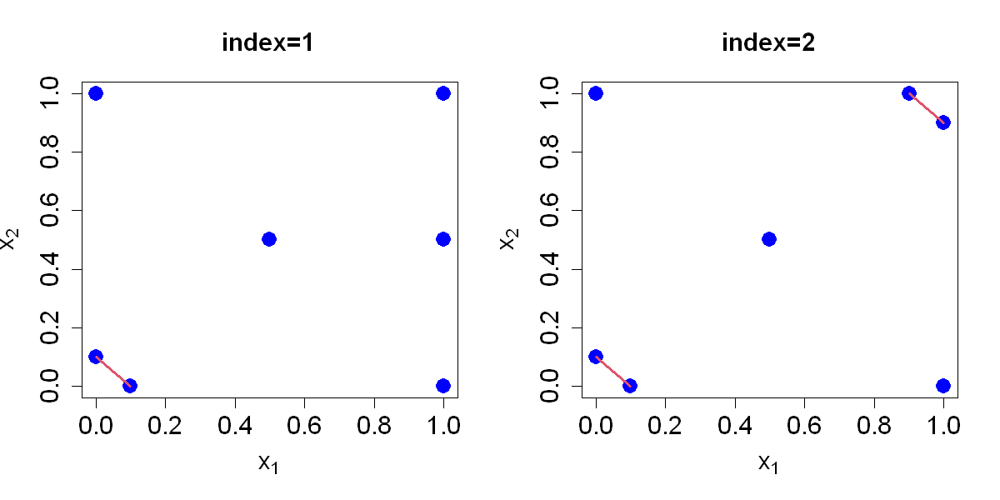

$$
\bigstar\;\diamond\;\bigstar\quad\boxed{\sigma_{\omega}\sigma}\quad\bigstar\;\diamond\;\bigstar
$$

# 图 4.3



$$
\bigstar\;\diamond\;\bigstar\quad\boxed{\sigma_{\omega}\sigma}\quad\bigstar\;\diamond\;\bigstar
$$

## 背景信息

极大极小设计并非唯一.图 4.3 展示了两组分离距离相等的设计,但显然第一种设计更优:该设计中仅有一组点对达到最小距离,而第二种设计存在两组此类点对.我们将间距等于 $2\psi(D)$ 的点对数量定义为该设计的(极大极小)指标.我们期望该指标尽可能小,以避免过多采样点相互靠近.

$$
\bigstar\;\diamond\;\bigstar\quad\boxed{\sigma_{\omega}\sigma}\quad\bigstar\;\diamond\;\bigstar
$$

## 指令

创建画布宽 10 英寸,高 5 英寸.将画布分为 1x2.取点 $$(0,.1),(.1,0),(0,1),(1,0),(1,.5),(1,0),(.5,.5),$$将点矩阵令为 `D1`.绘制点矩阵 `D1`,其中 $x$ 轴和 $y$ 轴范围均为 $[0,1]$,点的颜色为蓝色,点的大小为 `2`,点的形状为实心圆.将 $x$ 轴标签设置为 `expression(x[1])`,$y$ 轴标签设置为 `expression(x[2])`,字体大小为 `1.5`.将图标题设置为 `index=1`,字体大小为 `1.5`.绘制连接点 $(0,.1)$ 和 $(.1,0)$ 的红色线段,线宽为 `3`.

```r
options(repr.plot.width=10,repr.plot.height=5)
par(mfrow=c(1,2))
p=2;n=7
D1=matrix(c(0,.1,.1,0,0,1,1,1,1,.5,1,0,.5,.5),nrow=n,ncol=p,byrow=TRUE)
plot(D1,xlim=c(0,1),ylim=c(0,1),xlab=expression(x[1]),ylab=expression(x[2]),cex.lab=1.5,cex.axis=1.5,pch=16,col="blue",cex=2,main=paste0("index=",1),cex.main=1.5)
segments(0,.1,.1,0,col=2,lwd=3)
```

创建画布宽 10 英寸,高 5 英寸.将画布分为 1x2.取点 $$(0,.1),(.1,0),(0,1),(.9,1),(1,.9),(1,0),(.5,.5),$$将点矩阵令为 `D2`.绘制点矩阵 `D2`,其中 $x$ 轴和 $y$ 轴范围均为 $[0,1]$,点的颜色为蓝色,点的大小为 `2`,点的形状为实心圆.将 $x$ 轴标签设置为 `expression(x[1])`,$y$ 轴标签设置为 `expression(x[2])`,字体大小为 `1.5`.将图标题设置为 `index=2`,字体大小为 `1.5`.绘制连接点 $(0,.1)$ 和 $(.1,0)$,点 $(.9,1)$ 和 $(1,.9)$ 的红色线段,线宽为 `3`.将画布还原回 1x1.

```r
D2=matrix(c(0,.1,.1,0,0,1,.9,1,1,.9,1,0,.5,.5),nrow=n,ncol=p,byrow=TRUE)
plot(D2,xlim=c(0,1),ylim=c(0,1),xlab=expression(x[1]),ylab=expression(x[2]),cex.lab=1.5,cex.axis=1.5,pch=16,col="blue",cex=2,main=paste0("index=",2),cex.main=1.5)
segments(0,.1,.1,0,col=2,lwd=3)
segments(.9,1,1,.9,col=2,lwd=3)
par(mfrow=c(1,1))
```

$$
\bigstar\;\diamond\;\bigstar\quad\boxed{\sigma_{\omega}\sigma}\quad\bigstar\;\diamond\;\bigstar
$$

## 最终效果

```r

# 图 4.3

options(repr.plot.width=10,repr.plot.height=5)
par(mfrow=c(1,2))
p=2;n=7
D1=matrix(c(0,.1,.1,0,0,1,1,1,1,.5,1,0,.5,.5),nrow=n,ncol=p,byrow=TRUE)
plot(D1,xlim=c(0,1),ylim=c(0,1),xlab=expression(x[1]),ylab=expression(x[2]),cex.lab=1.5,cex.axis=1.5,pch=16,col="blue",cex=2,main=paste0("index=",1),cex.main=1.5)
segments(0,.1,.1,0,col=2,lwd=3)
D2=matrix(c(0,.1,.1,0,0,1,.9,1,1,.9,1,0,.5,.5),nrow=n,ncol=p,byrow=TRUE)
plot(D2,xlim=c(0,1),ylim=c(0,1),xlab=expression(x[1]),ylab=expression(x[2]),cex.lab=1.5,cex.axis=1.5,pch=16,col="blue",cex=2,main=paste0("index=",2),cex.main=1.5)
segments(0,.1,.1,0,col=2,lwd=3)
segments(.9,1,1,.9,col=2,lwd=3)
par(mfrow=c(1,1))

```

$$
\bigstar\;\diamond\;\bigstar\quad\boxed{\sigma_{\omega}\sigma}\quad\bigstar\;\diamond\;\bigstar
$$