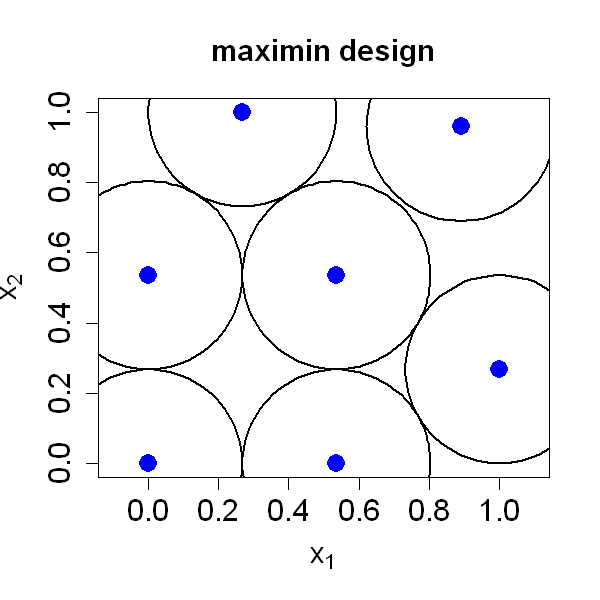

$$
\bigstar\;\diamond\;\bigstar\quad\boxed{\sigma_{\omega}\sigma}\quad\bigstar\;\diamond\;\bigstar
$$

# 图 4.4



$$
\bigstar\;\diamond\;\bigstar\quad\boxed{\sigma_{\omega}\sigma}\quad\bigstar\;\diamond\;\bigstar
$$

## 背景信息

借助 `SFDesign` 得到的 $n=7$,$p=2$ 情形下的极大极小设计如图 4.4 所示,该设计的分离距离为 $\psi(D^{*})=0.26795$.以每个采样点为圆心,$\psi(D^{*})$ 为半径绘制圆形.极大极小设计的本质是最大化可围绕各设计点摆放,互不重叠的等半径球体半径,这使得该问题与数学领域经典的球体填充问题密切相关(康威,斯隆,2013).但绝大多数球体填充理论结论针对全空间 $\mathbb{R}^p$ 内球体排布,而本文研究场景为超立方体区域.边界约束会导致极大极小设计与最优球体填充构型存在差异,已有研究尝试利用球体填充相关结论求解极大极小设计问题(何,2017b).这类问题属于高难度数学问题,仅部分特殊情形存在简单解.正如博罗达乔夫等人(2019,第11页)所言:"三维欧氏空间最优球体填充构型的证明悬而未决近四百年,但但凡堆叠过橙子的人其实早已知晓答案." 网站 `http://www.packomania.com/` 收录了正方形与立方体区域下最优球体填充的相关结果,可查阅其中参考文献.

$$
\bigstar\;\diamond\;\bigstar\quad\boxed{\sigma_{\omega}\sigma}\quad\bigstar\;\diamond\;\bigstar
$$

## 指令

创建画布宽 `5` 英寸,高 `5` 英寸.设置种子为 `1`.使用 `SFDesign` 包中的 `maximinLHD` 函数生成 `n=7`,`p=2` 的初始极大极小设计,提取 `design` 列作为设计点,令其为 `D`.使用 `SFDesign` 包中的 `maximin.optim` 函数进行优化,其中使用模拟退火算法,自动搜索多个最佳初始点,提取 `design` 列作为设计点,令其为 `D`.利用填充半径的公式 $$\psi(D):=\frac{1}{2}\min_{i\ne j}\|\boldsymbol{x}_{i}-\boldsymbol{x}_{j}\|$$ 计算填充半径,令其为 `r`.绘制设计点散点图,横纵坐标标签分别为 `expression(x[1])`,`expression(x[2])`,设置横纵坐标范围为 `[0,1]`,点形状为实心圆,颜色为蓝色,点大小为 `2`,标题为 `maximin design`,纵横比为 `1`.使用 `plotrix` 包中的 `draw.circle` 函数,以每个设计点为圆心,半径为 `r` 绘制圆形,其中线宽为 `2`.

```r
options(repr.plot.width=5,repr.plot.height=5)
p=2;n=7
set.seed(1)
library(SFDesign)
D=maximinLHD(n,p)$design
D=maximin.optim(D,sa=TRUE,find.best.ini=TRUE)$design
r=min(dist(D))/2;r
plot(D[,1],D[,2],xlab=expression(x[1]),ylab=expression(x[2]),xlim=c(0,1),ylim=c(0,1),pch=16,col="blue",cex=2,cex.main=1.5,cex.lab=1.5,cex.axis=1.5,main="maximin design",asp=1)
library(plotrix)
for(i in 1:n) draw.circle(D[i,1],D[i,2],radius=r,lwd=2)
```

$$
\bigstar\;\diamond\;\bigstar\quad\boxed{\sigma_{\omega}\sigma}\quad\bigstar\;\diamond\;\bigstar
$$

## 最终效果

```r

# 图 4.4

options(repr.plot.width=5,repr.plot.height=5)
p=2;n=7
set.seed(1)
library(SFDesign)
D=maximinLHD(n,p)$design
D=maximin.optim(D,sa=TRUE,find.best.ini=TRUE)$design
r=min(dist(D))/2;r
plot(D[,1],D[,2],xlab=expression(x[1]),ylab=expression(x[2]),xlim=c(0,1),ylim=c(0,1),pch=16,col="blue",cex=2,cex.main=1.5,cex.lab=1.5,cex.axis=1.5,main="maximin design",asp=1)
library(plotrix)
for(i in 1:n) draw.circle(D[i,1],D[i,2],radius=r,lwd=2)

```

$$
\bigstar\;\diamond\;\bigstar\quad\boxed{\sigma_{\omega}\sigma}\quad\bigstar\;\diamond\;\bigstar
$$