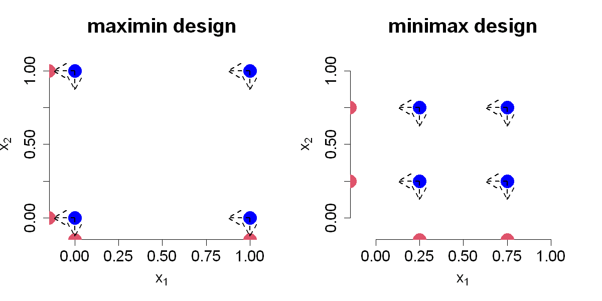

$$
\bigstar\;\diamond\;\bigstar\quad\boxed{\sigma_{\omega}\sigma}\quad\bigstar\;\diamond\;\bigstar
$$

# 图 4.6



$$
\bigstar\;\diamond\;\bigstar\quad\boxed{\sigma_{\omega}\sigma}\quad\bigstar\;\diamond\;\bigstar
$$

## 背景信息

考虑包含两个变量,4 次试验的设计,对应的极大极小设计与极小极大设计如图 4.6 所示.该算例中聚类型设计与极小极大设计完全一致.现假设变量 $x_{2}$ 无实际作用,即其对输出的影响可忽略不计.对于左侧设计,相当于在 $x_{1}=0$ 与 $x_{1}=1$ 处各重复开展两次试验;右侧设计则是在 $x_{1}=0.25$ 与 $x_{1}=0.75$ 处重复试验.由于输出不存在测量误差,重复试验会得到完全相同的输出结果.在开展试验前即可预判该情况,意味着这两组重复试验纯粹浪费试验成本.若变量 $x_{1}$ 无关紧要,仅 $x_{2}$ 起作用,也会出现相同问题.

$$
\bigstar\;\diamond\;\bigstar\quad\boxed{\sigma_{\omega}\sigma}\quad\bigstar\;\diamond\;\bigstar
$$

## 指令

创建宽 10 英寸,高 5 英寸的画布.将画布分为 1x2.创建点矩阵 `D` $$(0,0),(0,1),(1,0),(1,1).$$ 绘制点图像,其中形状为实心圆点,不显示 $x$,$y$ 轴,点大小为 `3`,不显示边框,颜色为蓝色,$x$,$y$ 轴范围为 $[-0.1,1.1]$,$x$,$y$ 轴标签分别为 `expression(x[1])`,`expression(x[2])`,标签大小为 `1.5`,标题为 `maximin design`,标题大小为 `2`.在 $x$,$y$ 轴上叠加刻度线,刻度线位置从 `0` 到 `1`,以 `.25` 为间隔,刻度线标签大小为 `1.5`.叠加轴上点,其中 $x$,$y$ 轴上的坐标为 `-.15`,颜色为红色,形状为实心圆点,大小为 `3`.叠加箭头,其中线宽为 `2`,线型为虚线,箭头分别为 $$(0,0)\to(0,-.125),(1,0)\to(1,-.125),$$ $$(0,1)\to(0,.875),(1,1)\to(1,.875),$$ $$(0,0)\to(-.125,0),(0,1)\to(-.125,1),$$ $$(1,0)\to(.875,0),(1,1)\to(.875,1).$$

```r
options(repr.plot.width=10,repr.plot.height=5)
par(mfrow=c(1,2))
D=matrix(c(0,0,0,1,1,0,1,1),nrow=4,ncol=2,byrow=TRUE)
plot(D,pch=16,xaxt="n",yaxt="n",cex=3,bty="n",col="blue",xlim=c(-.1,1.1),ylim=c(-.1,1.1),xlab=expression(x[1]), ylab=expression(x[2]),cex.lab=1.5, main="maximin design",cex.main=2)
axis(1,at=seq(0,1,by=.25),cex.axis=1.5)
axis(2,at=seq(0,1,by=.25),cex.axis=1.5)
points(cbind(D[,1],-.15),col=2,pch=16,cex=3)
points(cbind(-.15,D[,2]),col=2,pch=16,cex=3)
arrows(0,0,0,-.125,lwd=2,lty=2)
arrows(1,0,1,-.125,lwd=2,lty=2)
arrows(0,1,0,.875,lwd=2,lty=2)
arrows(1,1,1,.875,lwd=2,lty=2)
arrows(0,0,-.125,0,lwd=2,lty=2)
arrows(0,1,-.125,1,lwd=2,lty=2)
arrows(1,0,.875,0,lwd=2,lty=2)
arrows(1,1,.875,1,lwd=2,lty=2)
```

类似地,第二张图只是把矩阵改为 $$(.25,.25),(.25,.75),(.75,.25),(.75,.75).$$ 图像标题改为 `minimax design`.箭头方向改为 $$(.25,.25)\to(.25,.125),(.75,.25)\to(.75,.125),$$ $$(.25,.75)\to(.25,.625),(.75,.75)\to(.75,.625),$$ $$(.25,.25)\to(.125,.25),(.25,.75)\to(.125,.75),$$ $$(.75,.25)\to(.625,.25),(.75,.75)\to(.625,.75).$$

```r
D=matrix(c(0.25,0.25,.25,.75,.75,.25,.75,.75),nrow=4,ncol=2,byrow=TRUE)
plot(D,pch=16,xaxt="n",yaxt="n",cex=3,bty="n",col="blue",xlim=c(-.1,1.1),ylim=c(-.1,1.1),xlab=expression(x[1]), ylab=expression(x[2]),cex.lab=1.5, main="minimax design",cex.main=2)
axis(1,at=seq(0,1,by=.25),cex.axis=1.5)
axis(2,at=seq(0,1,by=.25),cex.axis=1.5)
points(cbind(D[,1],-.15),col=2,pch=16,cex=3)
arrows(.25,.25,.25,.125,lwd=2,lty=2)
arrows(.75,.25,.75,.125,lwd=2,lty=2)
arrows(.25,.75,.25,.625,lwd=2,lty=2)
arrows(.75,.75,.75,.625,lwd=2,lty=2)
points(cbind(-.15,D[,2]),col=2,pch=16,cex=3)
arrows(.25,.25,.125,.25,lwd=2,lty=2)
arrows(.25,.75,.125,.75,lwd=2,lty=2)
arrows(.75,.25,.625,.25,lwd=2,lty=2)
arrows(.75,.75,.625,.75,lwd=2,lty=2)
par(mfrow=c(1,1))
```

$$
\bigstar\;\diamond\;\bigstar\quad\boxed{\sigma_{\omega}\sigma}\quad\bigstar\;\diamond\;\bigstar
$$

## 最终效果

```r

# 图 4.6

options(repr.plot.width=10,repr.plot.height=5)
par(mfrow=c(1,2))
D=matrix(c(0,0,0,1,1,0,1,1),nrow=4,ncol=2,byrow=TRUE)
plot(D,pch=16,xaxt="n",yaxt="n",cex=3,bty="n",col="blue",xlim=c(-.1,1.1),ylim=c(-.1,1.1),xlab=expression(x[1]), ylab=expression(x[2]),cex.lab=1.5, main="maximin design",cex.main=2)
axis(1,at=seq(0,1,by=.25),cex.axis=1.5)
axis(2,at=seq(0,1,by=.25),cex.axis=1.5)
points(cbind(D[,1],-.15),col=2,pch=16,cex=3)
points(cbind(-.15,D[,2]),col=2,pch=16,cex=3)
arrows(0,0,0,-.125,lwd=2,lty=2)
arrows(1,0,1,-.125,lwd=2,lty=2)
arrows(0,1,0,.875,lwd=2,lty=2)
arrows(1,1,1,.875,lwd=2,lty=2)
arrows(0,0,-.125,0,lwd=2,lty=2)
arrows(0,1,-.125,1,lwd=2,lty=2)
arrows(1,0,.875,0,lwd=2,lty=2)
arrows(1,1,.875,1,lwd=2,lty=2)

D=matrix(c(0.25,0.25,.25,.75,.75,.25,.75,.75),nrow=4,ncol=2,byrow=TRUE)
plot(D,pch=16,xaxt="n",yaxt="n",cex=3,bty="n",col="blue",xlim=c(-.1,1.1),ylim=c(-.1,1.1),xlab=expression(x[1]), ylab=expression(x[2]),cex.lab=1.5, main="minimax design",cex.main=2)
axis(1,at=seq(0,1,by=.25),cex.axis=1.5)
axis(2,at=seq(0,1,by=.25),cex.axis=1.5)
points(cbind(D[,1],-.15),col=2,pch=16,cex=3)
arrows(.25,.25,.25,.125,lwd=2,lty=2)
arrows(.75,.25,.75,.125,lwd=2,lty=2)
arrows(.25,.75,.25,.625,lwd=2,lty=2)
arrows(.75,.75,.75,.625,lwd=2,lty=2)
points(cbind(-.15,D[,2]),col=2,pch=16,cex=3)
arrows(.25,.25,.125,.25,lwd=2,lty=2)
arrows(.25,.75,.125,.75,lwd=2,lty=2)
arrows(.75,.25,.625,.25,lwd=2,lty=2)
arrows(.75,.75,.625,.75,lwd=2,lty=2)
par(mfrow=c(1,1))

```

$$
\bigstar\;\diamond\;\bigstar\quad\boxed{\sigma_{\omega}\sigma}\quad\bigstar\;\diamond\;\bigstar
$$