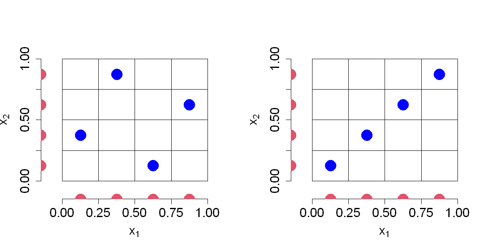

$$
\bigstar\;\diamond\;\bigstar\quad\boxed{\sigma_{\omega}\sigma}\quad\bigstar\;\diamond\;\bigstar
$$

# 图 4.7



$$
\bigstar\;\diamond\;\bigstar\quad\boxed{\sigma_{\omega}\sigma}\quad\bigstar\;\diamond\;\bigstar
$$

## 背景信息

倘若事先已知 $x_{2}$ 无关紧要,则应当针对 $x_{1}$ 采用最优设计安排四次试验;反之同理.该类设计如图 4.7 左图所示,我们对每个输入变量采用极小极大设计 $\{i-0.5\}_{i=1}^{4}$.能够看到,四个设计点在每条坐标轴上的投影,均可为两个变量各自提供四个互不相同的取值.因此,即便试验结束后发现其中某一变量并不重要,该设计依旧能够保持良好效果.构造具备优良一维投影性质的设计较为简便.将每条坐标轴划分为 $n$ 个等间距区间,随后要求每个区间行与区间列内仅包含一个采样点,即可得到满足投影要求的设计,如图 4.7 所示.在更高维情形下,第 $j$ 列可按下式生成 $$\left\{\frac{\pi_{j}(i)-.5}{n}\right\}_{i=1}^{n}.\tag{4.21}$$ 其中 $\{\pi_{j}(1),\dots,\pi_{j}(n)\}$ 是集合 $\{1,\dots,n\}$ 的一组随机置换.这类设计称为拉丁超立方设计(LHD)(麦凯等人,1979).也可以在每个单元格内部对采样点施加随机扰动,对应形式为 $\{(\pi_{j}(i)-u_{ij})/n\}_{i=1}^{n}$,其中 $u_{ij}\stackrel{\mathrm{i.i.d.}}{\sim}\mathcal{U}(0,1)$,$i=1,\dots,n$,$j=1,\dots,p$.从试验设计角度来看,随机扰动并非必要,本文将采用各个单元格的中心点,也就是令 $u_{ij}=0.5$,即式(4.21) 的形式.

$$
\bigstar\;\diamond\;\bigstar\quad\boxed{\sigma_{\omega}\sigma}\quad\bigstar\;\diamond\;\bigstar
$$

## 指令

创建画布宽 10 英寸,高 5 英寸.将画布分为 1x2.设置种子为 `1`.调用 `SFDesign` 包中的 `maximinLHD` 函数,生成一个 4 点,2 维的拉丁超立方设计,将返回列表中的 `design` 元素赋值给变量 `D` 作为设计点矩阵.绘制 `D` 的图像,其中点的形状为实心圆点,不显示 $x$,$y$ 轴,点的大小为 `3`,无边框,颜色为蓝色,$x$,$y$ 轴的范围为 $[-0.1,1.1]$,$x$,$y$ 轴的标签分别为 `expression(x[1])`,`expression(x[2])`,标签字体大小为 `1.5`.叠加坐标轴,其中 $x$ 轴,$y$ 轴的刻度均从 `0` 到 `1`,间隔为 `0.25`,字体大小为 `1.5`.叠加网格,对于每个 $i$ 从 `1` 到 `n+1`,绘制一条从 `(0, (i-1)/n)` 到 `(1, (i-1)/n)` 的水平线,绘制一条从 `((i-1)/n, 0)` 到 `((i-1)/n, 1)` 的垂直线.叠加投影点,贴近坐标轴一侧的坐标均为 `-.15`,另一坐标取 `D` 对应列的值叠加,颜色为红色,形状为实心圆点,大小为 `3`.

```r
options(repr.plot.width=10,repr.plot.height=5)
par(mfrow=c(1,2))
p=2;n=4
set.seed(1)
library(SFDesign)
D=maximinLHD(n,p)$design
plot(D,pch=16,xaxt="n",yaxt="n",cex=3,bty="n",col="blue",xlim=c(-.1,1.1),ylim=c(-.1,1.1),xlab=expression(x[1]), ylab=expression(x[2]),cex.lab=1.5)
axis(1,at=seq(0,1,by=.25),cex.axis=1.5)
axis(2,at=seq(0,1,by=.25),cex.axis=1.5)
for(i in 1:(n+1))
{
  segments((i-1)/n,0,(i-1)/n,1)
  segments(0,(i-1)/n,1,(i-1)/n)
}
points(cbind(D[,1],-.15),col=2,pch=16,cex=3)
points(cbind(-.15,D[,2]),col=2,pch=16,cex=3)
```

右侧图手动定义 `D` 为对角线矩阵点,余同上.将画布还原回 1x1.

```r
D=(cbind(1:n,1:n)-.5)/n
plot(D,pch=16,xaxt="n",yaxt="n",cex=3,bty="n",col="blue",xlim=c(-.1,1.1),ylim=c(-.1,1.1),xlab=expression(x[1]), ylab=expression(x[2]),cex.lab=1.5)
axis(1,at=seq(0,1,by=.25),cex.axis=1.5)
axis(2,at=seq(0,1,by=.25),cex.axis=1.5)
for(i in 1:(n+1))
{
  segments((i-1)/n,0,(i-1)/n,1)
  segments(0,(i-1)/n,1,(i-1)/n)
}
points(cbind(D[,1],-.15),col=2,pch=16,cex=3)
points(cbind(-.15,D[,2]),col=2,pch=16,cex=3)
par(mfrow=c(1,1))
```

$$
\bigstar\;\diamond\;\bigstar\quad\boxed{\sigma_{\omega}\sigma}\quad\bigstar\;\diamond\;\bigstar
$$

## 最终效果

```r

# 图 4.7

options(repr.plot.width=10,repr.plot.height=5)
par(mfrow=c(1,2))
p=2;n=4
set.seed(1)
library(SFDesign)
D=maximinLHD(n,p)$design
plot(D,pch=16,xaxt="n",yaxt="n",cex=3,bty="n",col="blue",xlim=c(-.1,1.1),ylim=c(-.1,1.1),xlab=expression(x[1]), ylab=expression(x[2]),cex.lab=1.5)
axis(1,at=seq(0,1,by=.25),cex.axis=1.5)
axis(2,at=seq(0,1,by=.25),cex.axis=1.5)
for(i in 1:(n+1))
{
  segments((i-1)/n,0,(i-1)/n,1)
  segments(0,(i-1)/n,1,(i-1)/n)
}
points(cbind(D[,1],-.15),col=2,pch=16,cex=3)
points(cbind(-.15,D[,2]),col=2,pch=16,cex=3)

D=(cbind(1:n,1:n)-.5)/n
plot(D,pch=16,xaxt="n",yaxt="n",cex=3,bty="n",col="blue",xlim=c(-.1,1.1),ylim=c(-.1,1.1),xlab=expression(x[1]), ylab=expression(x[2]),cex.lab=1.5)
axis(1,at=seq(0,1,by=.25),cex.axis=1.5)
axis(2,at=seq(0,1,by=.25),cex.axis=1.5)
for(i in 1:(n+1))
{
  segments((i-1)/n,0,(i-1)/n,1)
  segments(0,(i-1)/n,1,(i-1)/n)
}
points(cbind(D[,1],-.15),col=2,pch=16,cex=3)
points(cbind(-.15,D[,2]),col=2,pch=16,cex=3)
par(mfrow=c(1,1))

```

$$
\bigstar\;\diamond\;\bigstar\quad\boxed{\sigma_{\omega}\sigma}\quad\bigstar\;\diamond\;\bigstar
$$