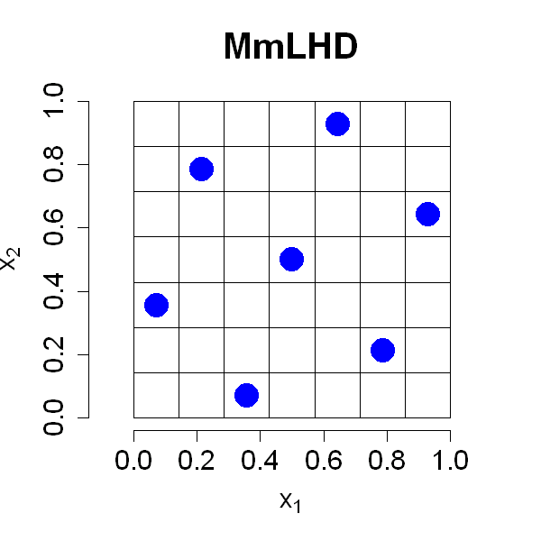

$$
\bigstar\;\diamond\;\bigstar\quad\boxed{\sigma_{\omega}\sigma}\quad\bigstar\;\diamond\;\bigstar
$$

# 图 4.8



$$
\bigstar\;\diamond\;\bigstar\quad\boxed{\sigma_{\omega}\sigma}\quad\bigstar\;\diamond\;\bigstar
$$

## 背景信息

对设计进行行置换不会改变设计本身.因此,固定第一列后,一共可以生成 $(n!)^{p-1}$ 种随机拉丁超立方设计.在数量如此庞大的候选设计中,依据极大极小准则搜寻最优拉丁超立方设计并非易事.莫里斯与米切尔(1995)采用模拟退火算法实现高效全局优化.在模拟退火流程中,每一轮迭代都会基于当前设计生成一个新设计;若新设计能够优化目标函数,则以一定概率接受该设计并继续迭代.为生成候选新设计,莫里斯与米切尔(1995)提出随机选取一列,并交换该列中的两个元素,该操作能够保证拉丁超立方结构不变.金等人(2005)通过在迭代中高效更新距离计算,进一步改进了该算法.R 语言程序包 `SLHD` 实现了这一算法(巴,2015).R 程序包 `LHD` 提供基于遗传算法的优化方案(王等人,2022).`SFDesign` 程序包实现了模拟退火结合确定性优化的算法(王,约瑟夫,2025c).王等人(2018)提出利用数论方法构造极大极小拉丁超立方设计,这类方法运算速度快,但在样本量 $n$ 与维度 $p$ 的选取上,灵活性不如数值优化算法.巴斯克斯与徐(2024)给出针对 $L_{1}$ 距离极大极小拉丁超立方设计的整数规划方法,适用于生成小规模设计.借助 `SFDesign` 程序包生成的 $n=7$,$p=2$ 的极大极小拉丁超立方设计如图 4.8 所示.可以观察到,该设计的采样点具备良好的空间填充效果,性能与图 4.4 中的极大极小设计相当,同时拥有更优良的一维投影性质.

$$
\bigstar\;\diamond\;\bigstar\quad\boxed{\sigma_{\omega}\sigma}\quad\bigstar\;\diamond\;\bigstar
$$

## 指令

创建画布宽与高均 5 英寸.设置种子为 `123`.加载 `SFDesign` 程序包.调用 `maximinLHD()` 函数生成 $n=7$,$p=2$ 的极大极小拉丁超立方设计,并将输出列表中的 `design` 列作为结果存储在变量 `D` 中.绘制设计点,点的形状为实心圆,大小为 `3`,不显示边框,颜色为蓝色,坐标轴范围为 `[0,1]`,坐标轴标签为 `expression(x[1])` 和 `expression(x[2])`,坐标轴标签字体大小为 `1.5`,坐标轴刻度字体大小为 `1.5`,标题为 `MmLHD`,标题字体大小为 `2`,保持纵横比为 `1`.使用 `segments()` 函数叠加网格线,对于每个 $i$ 从 `1` 到 `n+1`,绘制一条从 `(0,(i-1)/n)` 到 `(1,(i-1)/n)` 的水平线,绘制一条从 `((i-1)/n,0)` 到 `((i-1)/n,1)` 的垂直线.

```r
options(repr.plot.width=5,repr.plot.height=5)
p=2;n=7
set.seed(123)
library(SFDesign)
D=maximinLHD(n,p)$design
plot(D,pch=16,cex=3,bty="n",col="blue",xlim=c(0,1),ylim=c(0,1),xlab=expression(x[1]),ylab=expression(x[2]),cex.lab=1.5,cex.axis=1.5,main="MmLHD",cex.main=2,asp=1)
for(i in 1:(n+1))
{
    segments(0,(i-1)/n,1,(i-1)/n)
    segments((i-1)/n,0,(i-1)/n,1)
}
```

$$
\bigstar\;\diamond\;\bigstar\quad\boxed{\sigma_{\omega}\sigma}\quad\bigstar\;\diamond\;\bigstar
$$

## 最终效果

```r

# 图 4.8

options(repr.plot.width=5,repr.plot.height=5)
p=2;n=7
set.seed(123)
library(SFDesign)
D=maximinLHD(n,p)$design
plot(D,pch=16,cex=3,bty="n",col="blue",xlim=c(0,1),ylim=c(0,1),xlab=expression(x[1]),ylab=expression(x[2]),cex.lab=1.5,cex.axis=1.5,main="MmLHD",cex.main=2,asp=1)
for(i in 1:(n+1))
{
    segments(0,(i-1)/n,1,(i-1)/n)
    segments((i-1)/n,0,(i-1)/n,1)
}

```

$$
\bigstar\;\diamond\;\bigstar\quad\boxed{\sigma_{\omega}\sigma}\quad\bigstar\;\diamond\;\bigstar
$$