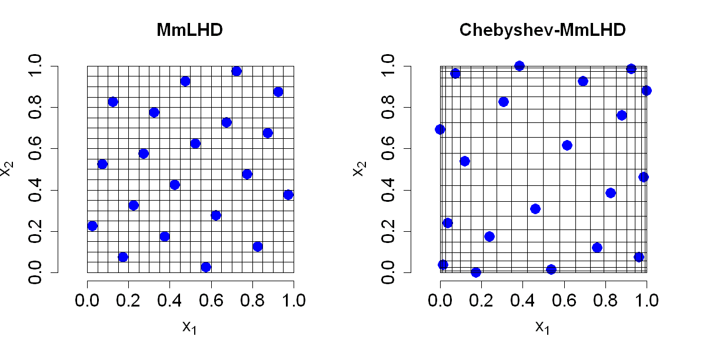

$$
\bigstar\;\diamond\;\bigstar\quad\boxed{\sigma_{\omega}\sigma}\quad\bigstar\;\diamond\;\bigstar
$$

# 图 4.9



$$
\bigstar\;\diamond\;\bigstar\quad\boxed{\sigma_{\omega}\sigma}\quad\bigstar\;\diamond\;\bigstar
$$

## 背景信息

上述所有拉丁超立方设计均采用式 (4.21) 中的中心取值形式,使得一维投影构成极小极大设计.德特与佩佩利舍夫(2010)提出在一维投影上采用切比雪夫设计.若将该思路与极大极小拉丁超立方设计相结合,可先构造极大极小拉丁超立方设计,再通过式 (2.5) 对坐标进行变换:$D_{ij}\leftarrow(1+\cos(\pi D_{ij}))/2$,其中 $D$ 为原始极大极小拉丁超立方设计.图 4.9 展示了一组 20 次试验的极大极小拉丁超立方设计,以及经过切比雪夫变换后的极大极小拉丁超立方设计.不难看出,切比雪夫变换会促使采样点向区域边界聚集.该方法与式 (4.18) 中的总倒数距离准则存在紧密联系.考虑一维情形,即 $p=1$,容易推得 $$\lim_{\alpha\to0}\left\{\sum_{i=1}^{n}\sum_{j\ne i}\frac{1}{|x_{i}-x_{j}|^{2\alpha}}\right\}^{1/\alpha}=-\sum_{i=1}^{n}\sum_{j\ne i}\log|x_{i}-x_{j}|.$$ 等式右侧被称为对数势能.当 $n\to\infty$ 时,最小化对数势能准则对应的设计服从反正弦分布 $$f(x)=\frac{1}{\pi \sqrt{x(1-x)}}$$(德特与斯图登,1992).$n$ 点切比雪夫设计能够对该密度实现最优分位数逼近.正如前文图 3.3 所示,切比雪夫设计在逼近光滑函数时效果优良,但针对非光滑函数表现欠佳.由此可见,经过切比雪夫变换得到的设计,对于相关参数的设定偏差不具备稳健性.

$$
\bigstar\;\diamond\;\bigstar\quad\boxed{\sigma_{\omega}\sigma}\quad\bigstar\;\diamond\;\bigstar
$$

## 指令

创建画布宽 10 英寸,高 5 英寸.将画布分为 1x2.设置种子为 `1`.使用 `SFDesign` 函数生成 `2` 维 `20` 次试验的极大极小拉丁超立方设计,返回的列表中 `design` 列为设计点,令其为 `D`.绘制设计点矩阵,其中点的类型为实心圆点,大小为 `2`,不显示边框,蓝色,$x$,$y$ 的范围为 `[0,1]`,$x$,$y$ 轴显示分别为 `expression(x[1])`,`expression(x[2])`,标题为 `MmLHD`.坐标轴,轴标签,标题大小均为 `1.5`,纵横比为 `1`.叠加网格,`i` 从 `1` 到 `n+1`,绘制竖线和横线.

```r
options(repr.plot.width=10,repr.plot.height=5)
par(mfrow=c(1,2))
p=2;n=20
set.seed(1)
library(SFDesign)
D=maximinLHD(n,p)$design
plot(D,pch=16,cex=2,bty="n",col="blue",xlim=c(0,1),ylim=c(0,1),xlab=expression(x[1]),ylab=expression(x[2]),main="MmLHD",cex.lab=1.5,cex.axis=1.5,cex.main=1.5,asp=1)
for(i in 1:(n+1))
{
  segments((i-1)/n,0,(i-1)/n,1)
  segments(0,(i-1)/n,1,(i-1)/n)
}
```

利用公式 $$D_{ij}\leftarrow(1+\cos(\pi D_{ij}))/2$$ 对设计点矩阵 `D` 进行切比雪夫变换,得到新的设计点矩阵令其为 `D1`.绘制 `D1`,余同上,只是标题变为 `Chebyshev-MmLHD`.叠加网格,将 `D1` 的行坐标排序,令其为 `d1`,计算 $$\left\{0,\frac{x_{1}+x_{2}}{2},\dots,\frac{x_{n-1}+x_{n}}{2},1\right\},$$ 令其为 `l1`.将 `D1` 的列坐标排序,令其为 `d2`,计算 $$\left\{0,\frac{y_{1}+y_{2}}{2},\dots,\frac{y_{n-1}+y_{n}}{2},1\right\},$$ 令其为 `l2`.绘制竖线和横线.将画布还原回 1x1.

```r
D1=(1+cos(pi*D))/2
plot(D1,pch=16,cex=2,bty="n",col="blue",xlim=c(0,1),ylim=c(0,1),xlab=expression(x[1]),ylab=expression(x[2]),cex.lab=1.5,cex.axis=1.5,main="Chebyshev-MmLHD",cex.main=1.5,asp=1)
d1=sort(D1[,1])
l1=c(0,(d1[-1]+d1[-n])/2,1)
d2=sort(D1[,2])
l2=c(0,(d2[-1]+d2[-n])/2,1)
for(i in 1:(n+1))
{
  segments(l1[i],0,l1[i],1)
  segments(0,l2[i],1,l2[i])
}
par(mfrow=c(1,1))
```

$$
\bigstar\;\diamond\;\bigstar\quad\boxed{\sigma_{\omega}\sigma}\quad\bigstar\;\diamond\;\bigstar
$$

## 最终效果

```r

# 图 4.9

options(repr.plot.width=10,repr.plot.height=5)
par(mfrow=c(1,2))
p=2;n=20
set.seed(1)
library(SFDesign)
D=maximinLHD(n,p)$design
plot(D,pch=16,cex=2,bty="n",col="blue",xlim=c(0,1),ylim=c(0,1),xlab=expression(x[1]),ylab=expression(x[2]),main="MmLHD",cex.lab=1.5,cex.axis=1.5,cex.main=1.5,asp=1)
for(i in 1:(n+1))
{
  segments((i-1)/n,0,(i-1)/n,1)
  segments(0,(i-1)/n,1,(i-1)/n)
}

D1=(1+cos(pi*D))/2
plot(D1,pch=16,cex=2,bty="n",col="blue",xlim=c(0,1),ylim=c(0,1),xlab=expression(x[1]),ylab=expression(x[2]),cex.lab=1.5,cex.axis=1.5,main="Chebyshev-MmLHD",cex.main=1.5,asp=1)
d1=sort(D1[,1])
l1=c(0,(d1[-1]+d1[-n])/2,1)
d2=sort(D1[,2])
l2=c(0,(d2[-1]+d2[-n])/2,1)
for(i in 1:(n+1))
{
  segments(l1[i],0,l1[i],1)
  segments(0,l2[i],1,l2[i])
}
par(mfrow=c(1,1))

```

$$
\bigstar\;\diamond\;\bigstar\quad\boxed{\sigma_{\omega}\sigma}\quad\bigstar\;\diamond\;\bigstar
$$