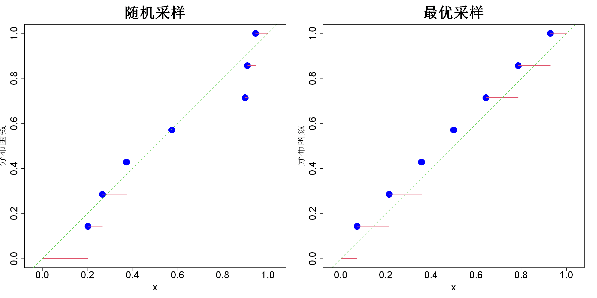

$$
\bigstar\;\diamond\;\bigstar\quad\boxed{\sigma_{\omega}\sigma}\quad\bigstar\;\diamond\;\bigstar
$$

# 图 5.1



$$
\bigstar\;\diamond\;\bigstar\quad\boxed{\sigma_{\omega}\sigma}\quad\bigstar\;\diamond\;\bigstar
$$

## 背景信息

首先考虑一维变量情形.假设我们在$\mathcal{U}[0,1]$上随机抽取7个样本,排序后得到:$D=\{0.202,0.266,0.372,0.573,0.898,0.908,0.945\}$.$$F_n(x)=\frac{1}{n}\sum_{i=1}^nI(x_i\le x)$$称为设计$D$的经验分布函数,其图像绘制于图5.1左子图.均匀随机变量的分布函数为$F(x)=x,\;x\in[0,1]$,在同一张图中以绿色虚线标出.我们可以通过对比$F_n(x)$与$F(x)$,衡量样本集$D$和均匀分布样本的接近程度.可以证明$$\left\{\frac{i-0.5}{n}\right\}_{i=1}^n$$能够最小化星偏差.该点集与式(4.12)中的极小极大设计完全一致,由此建立起均匀设计与填充空间设计之间紧密的联系.最优设计(即均匀设计)对应的经验分布绘制在图5.1右子图.

$$
\bigstar\;\diamond\;\bigstar\quad\boxed{\sigma_{\omega}\sigma}\quad\bigstar\;\diamond\;\bigstar
$$

## 指令

创建画布宽20英寸,高10英寸.将画布分为1x2.设置种子为1.从$\mathcal{U}[0,1]$中随机抽取7个样本,排序后命名为x.创建7x2的0矩阵d,将第一列替换为x,第二列替换为$1/7,2/7\dots,1$.绘制d的图像,其中x,y的范围均为c(0,1),大小为2,点的形状为16,颜色为蓝色,大小为3,横坐标标注为x,纵坐标标注为"分布函数",大小为2,标题为"随机采样",大小为3,横纵比为1.叠加分布函数阶梯线,但不画竖直线,颜色为2,线宽为2.叠加分布函数图像,其中截距为0,斜率为1,颜色为3,线性为2,类型为2.

```r
options(repr.plot.width=20,repr.plot.height=10)
par(mfrow=c(1,2))
set.seed(1)
n=7
x=sort(runif(n))
d=matrix(0,nrow=n,ncol=2)
d[,1]=x;d[,2]=(1:n)/n
plot(d,xlim=c(0,1),ylim=c(0,1),pch=16,col="blue",cex=3,xlab="x",ylab="分布函数",main="随机采样",cex.lab=2,cex.main=3,cex.axis=2,asp=1)
segments(0,0,x[1],0,col=2,lwd=2)
for(i in 1:(n-1))segments(x[i],i/n,x[i+1],i/n,col=2,lwd=2)
segments(x[n],1,1,1,col=2,lwd=2)
abline(0,1,col=3,lwd=2,lty=2)
```

依据$$\left\{\frac{i-0.5}{n}\right\}_{i=1}^n$$创建向量x,余同上.将画布还原回1x1.

```r
x=((1:n)-.5)/n
d=matrix(0,nrow=n,ncol=2)
d[,1]=x;d[,2]=(1:n)/n
plot(d,xlim=c(0,1),ylim=c(0,1),pch=16,col="blue",cex=3,xlab="x",ylab="分布函数",main="最优采样",cex.lab=2,cex.main=3,cex.axis=2,asp=1)
segments(0,0,x[1],0,col=2,lwd=2)
for(i in 1:(n-1))segments(x[i],i/n,x[i+1],i/n,col=2,lwd=2)
segments(x[n],1,1,1,col=2,lwd=2)
abline(0,1,col=3,lwd=2,lty=2)
par(mfrow=c(1,1))
```

$$
\bigstar\;\diamond\;\bigstar\quad\boxed{\sigma_{\omega}\sigma}\quad\bigstar\;\diamond\;\bigstar
$$

## 最终效果

```r

#图5.1

options(repr.plot.width=20,repr.plot.height=10)
par(mfrow=c(1,2))
set.seed(1)
n=7
x=sort(runif(n))
d=matrix(0,nrow=n,ncol=2)
d[,1]=x;d[,2]=(1:n)/n
plot(d,xlim=c(0,1),ylim=c(0,1),pch=16,col="blue",cex=3,xlab="x",ylab="分布函数",main="随机采样",cex.lab=2,cex.main=3,cex.axis=2,asp=1)
segments(0,0,x[1],0,col=2,lwd=2)
for(i in 1:(n-1))segments(x[i],i/n,x[i+1],i/n,col=2,lwd=2)
segments(x[n],1,1,1,col=2,lwd=2)
abline(0,1,col=3,lwd=2,lty=2)

x=((1:n)-.5)/n
d=matrix(0,nrow=n,ncol=2)
d[,1]=x;d[,2]=(1:n)/n
plot(d,xlim=c(0,1),ylim=c(0,1),pch=16,col="blue",cex=3,xlab="x",ylab="分布函数",main="最优采样",cex.lab=2,cex.main=3,cex.axis=2,asp=1)
segments(0,0,x[1],0,col=2,lwd=2)
for(i in 1:(n-1))segments(x[i],i/n,x[i+1],i/n,col=2,lwd=2)
segments(x[n],1,1,1,col=2,lwd=2)
abline(0,1,col=3,lwd=2,lty=2)
par(mfrow=c(1,1))

```

$$
\bigstar\;\diamond\;\bigstar\quad\boxed{\sigma_{\omega}\sigma}\quad\bigstar\;\diamond\;\bigstar
$$