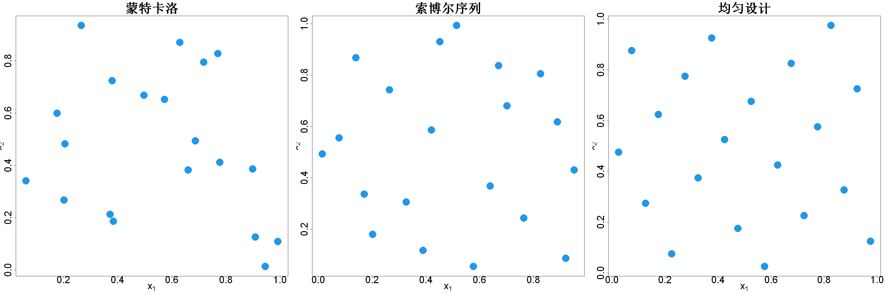

$$
\bigstar\;\diamond\;\bigstar\quad\boxed{\sigma_{\omega}\sigma}\quad\bigstar\;\diamond\;\bigstar
$$

# 图 5.2



$$
\bigstar\;\diamond\;\bigstar\quad\boxed{\sigma_{\omega}\sigma}\quad\bigstar\;\diamond\;\bigstar
$$

## 背景信息

最小化偏差度量属于复杂优化问题.因此拟蒙特卡洛领域大部分研究聚焦于构造低偏差点集,通常采用数论方法实现快速生成(方,王,1993).这类点集可以达到近乎$\mathcal{O}(1/n^{1-\epsilon})$的收敛阶(存在$\epsilon>0$),显著优于蒙特卡洛$\mathcal{O}(1/\sqrt{n})$.拟蒙特卡洛详细理论参见莱奥巴赫,皮利沙默(2014),欧文(2013).图5.2中间子图展示利用R包`spacefillr`生成的20点索博尔序列,定义在$[0,1]^2$(摩根–沃尔,2025).该包实现一类二维投影性质更优的索博尔序列(乔,郭,2008).直观可见,该点集相比图左子图同等规模的蒙特卡洛样本,在$[0,1]^2$上散布更加均匀.尽管低偏差序列生成速度快,适用场景广泛,但并不适合计算机试验场景:计算机代码单次求值成本高昂.当函数$h$的求值代价很大时,投入算力优化偏差,构造适用于积分的最优点集是合理选择.可以采用类似极大极小设计,Pro拉丁超立方设计的交换算法最小化偏差(金等人,2005).图5.2右侧子图展示由R包`SFDesign`生成,最小化环绕偏差的20点$[0,1]^2$均匀设计(王,约瑟夫,2025c).直观上,该设计相比索博尔序列具备更优秀的空间填充性与均匀性.量化对比:该均匀设计$\mathcal{W}(D)=0.0412$,显著小于索博尔序列的$\mathcal{W}(D)=0.0586$,以及蒙特卡洛样本的$\mathcal{W}(D)=0.0872$.

$$
\bigstar\;\diamond\;\bigstar\quad\boxed{\sigma_{\omega}\sigma}\quad\bigstar\;\diamond\;\bigstar
$$

## 指令

创建画布宽30英寸,高10英寸.将画布分为1x3.设置种子为1.从均匀分布中随机选择20x2个点作为蒙特卡洛样本,令其为R.绘制R的点图,其中点的形状为16,颜色为4,大小为5,坐标轴大小为3,标题为"蒙特卡洛",大小为4,x,y轴标注分别为"expression(x[1])","expression(x[2])",大小为3.

```r
options(repr.plot.width=30, repr.plot.height=10)
par(mfrow=c(1,3))
p=2;n=20
set.seed(1)
R=matrix(runif(n*2),ncol=2)
plot(R,pch=16,col=4,cex=5,cex.axis=3,main="蒙特卡洛",cex.main=4,xlab=expression(x[1]),ylab=expression(x[2]),cex.lab=3)
```

使用spacefillr包中的generate_sobol_set函数生成20x2的索博尔序列,令其为S.绘制S的点图,余同上,只是标题变为"索博尔序列".

```r
library(spacefillr)
S=generate_sobol_set(n,p)
plot(S,pch=16,col=4,cex=5,cex.axis=3,main="索博尔序列",cex.main=4,xlab=expression(x[1]),ylab=expression(x[2]),cex.lab=3)
```

使用SFDesign包中的uniformLHD函数生成20x2的拉丁超立方设计,再使用uniform.optim函数最小化环绕偏差,令其为D.绘制D的点图,余同上,只是标题变为"均匀设计".

```r
library(SFDesign)
D=uniform.optim(uniformLHD(n,p)$design)$design
plot(D,pch=16,col=4,cex=5,cex.axis=3,main="均匀设计",cex.main=4,xlab=expression(x[1]),ylab=expression(x[2]),cex.lab=3)
```

使用SFDesign包中的uniform.crit函数分布计算R,S,D的环绕偏差并输出.将画布还原为1x1.

```r
c(uniform.crit(R),uniform.crit(S),uniform.crit(D))
par(mfrow=c(1,1))
```

$$
\bigstar\;\diamond\;\bigstar\quad\boxed{\sigma_{\omega}\sigma}\quad\bigstar\;\diamond\;\bigstar
$$

## 最终效果

```r

#图5.2

options(repr.plot.width=30, repr.plot.height=10)
par(mfrow=c(1,3))
p=2;n=20
set.seed(1)
R=matrix(runif(n*2),ncol=2)
plot(R,pch=16,col=4,cex=5,cex.axis=3,main="蒙特卡洛",cex.main=4,xlab=expression(x[1]),ylab=expression(x[2]),cex.lab=3)

library(spacefillr)
S=generate_sobol_set(n,p)
plot(S,pch=16,col=4,cex=5,cex.axis=3,main="索博尔序列",cex.main=4,xlab=expression(x[1]),ylab=expression(x[2]),cex.lab=3)

library(SFDesign)
D=uniform.optim(uniformLHD(n,p)$design)$design
plot(D,pch=16,col=4,cex=5,cex.axis=3,main="均匀设计",cex.main=4,xlab=expression(x[1]),ylab=expression(x[2]),cex.lab=3)

c(uniform.crit(R),uniform.crit(S),uniform.crit(D))
par(mfrow=c(1,1))

```

$$
\bigstar\;\diamond\;\bigstar\quad\boxed{\sigma_{\omega}\sigma}\quad\bigstar\;\diamond\;\bigstar
$$