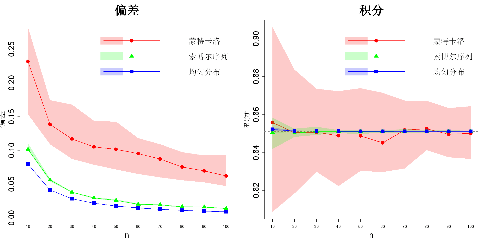

$$\bigstar\;\diamond\;\bigstar\quad\boxed{\sigma_{\omega}\sigma}\quad\bigstar\;\diamond\;\bigstar$$

# 图 5.3



$$\bigstar\;\diamond\;\bigstar\quad\boxed{\sigma_{\omega}\sigma}\quad\bigstar\;\diamond\;\bigstar$$

## 背景信息

举一个二维积分算例:

$$I=\int_{0}^{1}\int_{0}^{1}e^{-(x_1-0.5)^2-(x_2-0.5)^2}\mathrm{d}x_1\mathrm{d}x_2$$

该积分存在解析解:

$$I=\pi(\Phi(0.5\sqrt{2})-\Phi(-0.5\sqrt{2}))^2=0.8511$$

其中$\Phi(\cdot)$为标准正态分布累积分布函数.接下来采用样本均值估计积分,样本由三种方案生成:蒙特卡洛,索博尔序列,均匀设计.样本量$n$从10取至100,间隔10;每种$n$重复生成30组样本.因此,对每个样本量,三种方案各自得到30个积分估计值.图5.3右侧子图绘制各组估计值的中位数,5%与95%分位数(阴影区域);左侧子图对应各组点集的环绕偏差$\mathcal{W}(D)$.可以观察到:蒙特卡洛样本的环绕偏差最大,均匀设计偏差最小.虽然蒙特卡洛样本平均来看可以逼近真值,但估计结果波动极大;均匀设计得到的估计值围绕真值波动最小.这正是优质试验设计(更小偏差值)带来的优势:能够更好地抵御最坏情形带来的误差.

$$\bigstar\;\diamond\;\bigstar\quad\boxed{\sigma_{\omega}\sigma}\quad\bigstar\;\diamond\;\bigstar$$

## 指令

设置种子为1.依据公式$$I=\int_{0}^{1}\int_{0}^{1}e^{-(x_1-0.5)^2-(x_2-0.5)^2}\mathrm{d}x_1\mathrm{d}x_2$$定义函数h(x).定义样本量c(10,20,...,100),令其为n.创建空矩阵randw,sobw,uniw,rand,sob,uni用来储存各组样本的环绕偏差和积分估计值.对每个样本量,重复30次,生成蒙特卡洛样本,令其为R.生成索博尔序列样本,令其为S.生成均匀设计样本,令其为D;计算每组样本的环绕偏差和积分估计值.将各组结果储存到对应矩阵元素中.

```r
set.seed(1)
p=2
h=function(x) exp(-sum((x-.5)^2))
true=pi*(pnorm(.5*sqrt(2))-pnorm(-.5*sqrt(2)))^2
n=seq(10,100,by=10)
randw=sobw=uniw=rand=sob=uni=matrix(0,nrow=10,ncol=30)
library(spacefillr)
library(SFDesign)
for(j in 1:10){
  cat("n =",n[j],"\n")
  for(i in 1:30){
    R=matrix(runif(n[j]*2),ncol=2)
    S=generate_sobol_set(n[j],2,seed=sample(1:10000,1))
    D=uniform.optim(uniformLHD(n[j],p)$design)$design
    randw[j,i]=uniform.crit(R)
    sobw[j,i]=uniform.crit(S)
    uniw[j,i]=uniform.crit(D)
    rand[j,i]=mean(apply(R,1,h))
    sob[j,i]=mean(apply(S,1,h))
    uni[j,i]=mean(apply(D,1,h))
  }
}
```

创建设计因子design,其中包含3个方法"MC","Sobol","Uniform"各10行.创建矩阵integration,其中把rand,sob,uni矩阵按行合并,再在前面把design矩阵按列合并组成30x32矩阵.创建矩阵wd同理.将integration矩阵的第3:32列命名为V1:V30.wd矩阵同理.

```r
design=expand.grid(n=n,method=c("MC","Sobol","Uniform"))
integration=cbind(design,rbind(rand,sob,uni))
wd=cbind(design,rbind(randw,sobw,uniw))
names(integration)[3:32]=paste0("V",1:30)
names(wd)[3:32]=paste0("V",1:30)
```

由于上方嵌套循环的计算量巨大,因此为了保证后文图像绘制的可复现性,只运行1次,将结果存为csv方便后续读取.

```r
write.csv(integration,"data/integration_results.csv",row.names=FALSE)
write.csv(wd,"data/wd_results.csv",row.names=FALSE)
cat("完成!\n")
```

读取前文的csv文件.依据精确解$$I=\pi(\Phi(0.5\sqrt{2})-\Phi(-0.5\sqrt{2}))^2=0.8511$$定义精确解true.

```r
wd=read.csv("data/wd_results.csv")
integration=read.csv("data/integration_results.csv")
true=pi*(pnorm(.5*sqrt(2))-pnorm(-.5*sqrt(2)))^2
```

使用管道符,创建矩阵data_wd作为最终的处理结果矩阵,令其为wd.处理wd,将其V1:V30列转为长格式,列名命名为run,列值命名为value,此时的wd为900x4矩阵.处理现在的wd,按method和n分组.处理现在的wd,对每一组分别计算value列的5%分位数,中位数,95%分位数,每组返回成1行,最后取消分组,最终返回一个30x5矩阵.创建data_int矩阵同理.

```r
library(dplyr)
library(tidyr)
data_wd=wd%>%
  pivot_longer(V1:V30,names_to="run",values_to="value")%>%
  group_by(method,n)%>%
  summarize(l=quantile(value,0.05),m=quantile(value,0.5),u=quantile(value,0.95),.groups="drop")
data_int=integration%>%
  pivot_longer(V1:V30,names_to="run",values_to="value")%>%
  group_by(method,n)%>%
  summarize(l=quantile(value,0.05),m=quantile(value,0.5),u=quantile(value,0.95),.groups="drop")
```

绘制data_wd的图像.创建画布宽20英寸,高10英寸.将画布分为1x2.绘制空画框,x轴范围为10-100,y轴范围为data_wd矩阵的l和u列的最小值和最大值,设置x轴标签为n,y轴标签为"偏差",标题为"偏差",不显示x轴,标签大小为2,标题大小为3,刻度标签大小为2.叠加x轴,其中刻度为10-100,单位刻度为10.对每一种方法,从data_wd中提取对应方法的行,令其为sub.叠加阴影区域,范围为5%-95%的分位数区域,颜色依次为红,绿,蓝,透明度为0.2,不绘制边框.叠加中位数曲线,颜色依次为红,绿,蓝,点型依次为16,17,15,线宽为2.叠加中位数点,颜色依次为红,绿,蓝,点型依次为16,17,15,点大小为2.叠加图例,位置在c(30,.285),内容为c("蒙特卡洛","索博尔序列","均匀分布"),颜色依次为红,绿,蓝,点型依次为16,17,15,线宽为2,填充颜色依次为红,绿,蓝,透明度为0.2,不显示填充的边框,不显示图例的边框,点大小为2.绘制data_int的图像同理,余同上,只需将y轴标签改为"积分",标题改为"积分",图例位置改为c(30,.907).

```r
methods=c("MC","Sobol","Uniform")
methods_lenend=c("蒙特卡洛","索博尔序列","均匀分布")
cols=c("red","green","blue")
cols_alpha=c(rgb(1,0,0,0.2),rgb(0,1,0,0.2),rgb(0,0,1,0.2))
pchs=c(16,17,15)
options(repr.plot.width=20,repr.plot.height=10)
par(mfrow=c(1,2))
plot(0,type="n",xlim=c(10,100),ylim=range(data_wd$l,data_wd$u),xlab="n",ylab="偏差",main="偏差",xaxt="n",cex.lab=2,cex.main=3,cex.axis=2)
axis(1,at=seq(10,100,by=10))
for(k in 1:length(methods)){
  sub=filter(data_wd,method==methods[k])
  polygon(c(sub$n,rev(sub$n)),c(sub$l,rev(sub$u)),col=cols_alpha[k],border=NA)
  lines(sub$n,sub$m,col=cols[k],lwd=2)
  points(sub$n,sub$m,col=cols[k],pch=pchs[k],cex=2)
}
legend(30,.285,legend=c("蒙特卡洛","索博尔序列","均匀分布"),col=cols,pch=pchs,lwd=2,fill=cols_alpha,border=NA,box.lty=0,cex=2)
plot(0,type="n",xlim=c(10,100),ylim=range(data_int$l,data_int$u,true),xlab="n",ylab="积分",main="积分",xaxt="n",cex.lab=2,cex.main=3,cex.axis=2)
axis(1,at=seq(10,100,by=10))
abline(h=true,col="gray40",lty=2,lwd=2)
for(k in 1:length(methods)){
  sub=filter(data_int,method==methods[k])
  polygon(c(sub$n,rev(sub$n)),c(sub$l,rev(sub$u)),col=cols_alpha[k],border=NA)
  lines(sub$n,sub$m,col=cols[k],lwd=2)
  points(sub$n,sub$m,col=cols[k],pch=pchs[k],cex=2)
}
legend(30,.907,legend=c("蒙特卡洛","索博尔序列","均匀分布"),col=cols,pch=pchs,lwd=2,fill=cols_alpha,border=NA,box.lty=0,cex=2)
par(mfrow=c(1,1))
```

$$\bigstar\;\diamond\;\bigstar\quad\boxed{\sigma_{\omega}\sigma}\quad\bigstar\;\diamond\;\bigstar$$

## 最终效果

```r

# 图5.3-1
if(FALSE){
set.seed(1)
p=2
h=function(x) exp(-sum((x-.5)^2))
n=seq(10,100,by=10)
randw=sobw=uniw=rand=sob=uni=matrix(0,nrow=10,ncol=30)
library(spacefillr)
library(SFDesign)
for(j in 1:10){
  cat("n =",n[j],"\n")
  for(i in 1:30){
    R=matrix(runif(n[j]*2),ncol=2)
    S=generate_sobol_set(n[j],2,seed=sample(1:10000,1))
    D=uniform.optim(uniformLHD(n[j],p)$design)$design
    randw[j,i]=uniform.crit(R)
    sobw[j,i]=uniform.crit(S)
    uniw[j,i]=uniform.crit(D)
    rand[j,i]=mean(apply(R,1,h))
    sob[j,i]=mean(apply(S,1,h))
    uni[j,i]=mean(apply(D,1,h))
  }
}

design=expand.grid(n=n,method=c("MC","Sobol","Uniform"))
integration=cbind(design,rbind(rand,sob,uni))
wd=cbind(design,rbind(randw,sobw,uniw))
names(integration)[3:32]=paste0("V",1:30)
names(wd)[3:32]=paste0("V",1:30)

write.csv(integration,"data/integration_results.csv",row.names=FALSE)
write.csv(wd,"data/wd_results.csv",row.names=FALSE)
cat("完成!\n")
}

```

```r

#图5.3-2

wd=read.csv("data/wd_results.csv")
integration=read.csv("data/integration_results.csv")
true=pi*(pnorm(.5*sqrt(2))-pnorm(-.5*sqrt(2)))^2

library(dplyr)
library(tidyr)
data_wd=wd%>%
  pivot_longer(V1:V30,names_to="run",values_to="value")%>%
  group_by(method,n)%>%
  summarize(l=quantile(value,0.05),m=quantile(value,0.5),u=quantile(value,0.95),.groups="drop")
data_int=integration%>%
  pivot_longer(V1:V30,names_to="run",values_to="value")%>%
  group_by(method,n)%>%
  summarize(l=quantile(value,0.05),m=quantile(value,0.5),u=quantile(value,0.95),.groups="drop")

methods=c("MC","Sobol","Uniform")
methods_lenend=c("蒙特卡洛","索博尔序列","均匀分布")
cols=c("red","green","blue")
cols_alpha=c(rgb(1,0,0,0.2),rgb(0,1,0,0.2),rgb(0,0,1,0.2))
pchs=c(16,17,15)
options(repr.plot.width=20,repr.plot.height=10)
par(mfrow=c(1,2))
plot(0,type="n",xlim=c(10,100),ylim=range(data_wd$l,data_wd$u),xlab="n",ylab="偏差",main="偏差",xaxt="n",cex.lab=2,cex.main=3,cex.axis=2)
axis(1,at=seq(10,100,by=10))
for(k in 1:length(methods)){
  sub=filter(data_wd,method==methods[k])
  polygon(c(sub$n,rev(sub$n)),c(sub$l,rev(sub$u)),col=cols_alpha[k],border=NA)
  lines(sub$n,sub$m,col=cols[k],lwd=2)
  points(sub$n,sub$m,col=cols[k],pch=pchs[k],cex=2)
}
legend(30,.285,legend=c("蒙特卡洛","索博尔序列","均匀分布"),col=cols,pch=pchs,lwd=2,fill=cols_alpha,border=NA,box.lty=0,cex=2)
plot(0,type="n",xlim=c(10,100),ylim=range(data_int$l,data_int$u,true),xlab="n",ylab="积分",main="积分",xaxt="n",cex.lab=2,cex.main=3,cex.axis=2)
axis(1,at=seq(10,100,by=10))
abline(h=true,col="gray40",lty=2,lwd=2)
for(k in 1:length(methods)){
  sub=filter(data_int,method==methods[k])
  polygon(c(sub$n,rev(sub$n)),c(sub$l,rev(sub$u)),col=cols_alpha[k],border=NA)
  lines(sub$n,sub$m,col=cols[k],lwd=2)
  points(sub$n,sub$m,col=cols[k],pch=pchs[k],cex=2)
}
legend(30,.907,legend=c("蒙特卡洛","索博尔序列","均匀分布"),col=cols,pch=pchs,lwd=2,fill=cols_alpha,border=NA,box.lty=0,cex=2)
par(mfrow=c(1,1))

```

$$\bigstar\;\diamond\;\bigstar\quad\boxed{\sigma_{\omega}\sigma}\quad\bigstar\;\diamond\;\bigstar$$