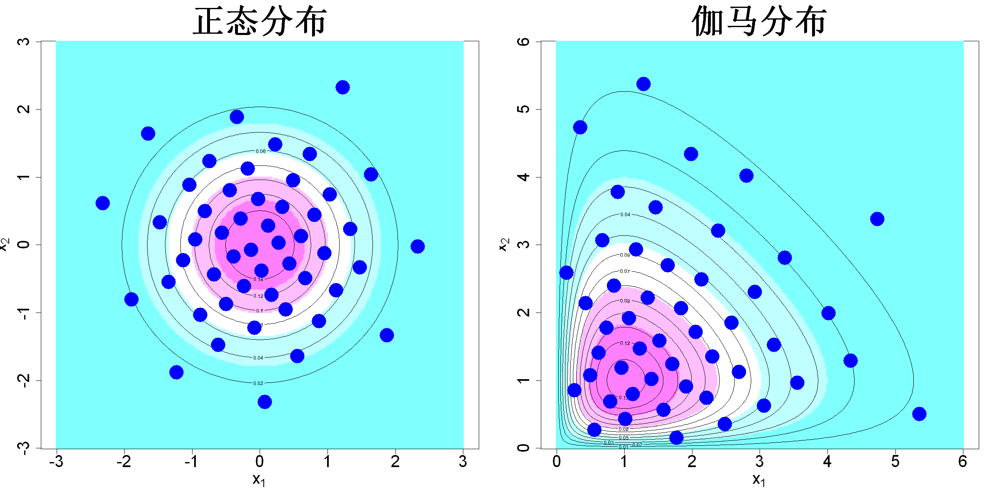

$$\bigstar\;\diamond\;\bigstar\quad\boxed{\sigma_{\omega}\sigma}\quad\bigstar\;\diamond\;\bigstar$$

# 图 5.4



$$\bigstar\;\diamond\;\bigstar\quad\boxed{\sigma_{\omega}\sigma}\quad\bigstar\;\diamond\;\bigstar$$

## 背景信息

图5.4左图展示:基于均匀设计做逆概率变换,生成服从独立二元正态分布的50个样本点;右图为50个服从独立伽马分布的样本点,形状参数与率参数依次取2,1.两组样本均能较好代表对应分布.李等人(2020)推导了保证逆概率变换生成优质代表性样本集所需满足的条件.

$$\bigstar\;\diamond\;\bigstar\quad\boxed{\sigma_{\omega}\sigma}\quad\bigstar\;\diamond\;\bigstar$$

## 指令

创建画布宽20英寸,高10英寸.设置画布为1x2.设置种子为6.依次使用SFDesign包里的uniformLHD与uniform.optim函数,先随机抽取50x2的均匀设计,再优化,令其为d.对d做逆概率变换,得到50x2的二元正态分布样本点D.依据公式$$f(\boldsymbol{x})=\frac{1}{2\pi}e^{-(x_{1}^{2}+x_{2}^{2})/2}$$定义二维正态分布密度函数f.创建c(-3,3)的300点等距网格,横纵分别命名为p1,p2.计算网格上每个点的密度值,令其为fc.做其灰度图,其中坐标轴大小为2,x,y轴标注分别为"expression(x[1])","expression(x[2])",颜色为col=cm.colors(5),标题为"正态分布",大小为4,纵横比为1.叠加等高线,其中条数为10.叠加观测点,点的形状为16,颜色为蓝色,大小为4.

```r
options(repr.plot.width=20,repr.plot.height=10)
par(mfrow=c(1,2))
p=2;n=50
set.seed(6)
library(SFDesign)
d=uniform.optim(uniformLHD(n,p)$design)$design
D=qnorm(d)
f=function(x)exp(-.5*sum(x^2))/(2*pi)
N.plot=300
p1=seq(-3,3,length.out=N.plot)
p2=seq(-3,3,length.out=N.plot)
fc=matrix(apply(expand.grid(p1,p2),1,f),nrow=N.plot,ncol=N.plot)
image(p1,p2,fc,cex.axis=2,xlab=expression(x[1]),ylab=expression(x[2]),cex.lab=2,col=cm.colors(5),main="正态分布",cex.main=4,asp=1)
contour(p1,p2,fc,add=TRUE,nlevels=10)
points(D,pch=16,col="blue",cex=4)
```

对d做逆概率变换,得到50x2的二元伽马分布样本点D.依据公式$$f(\boldsymbol{x})=f(x_{1})f(x_2)=\mathrm{Gamma}(x_1;2,1)\cdot\mathrm{Gamma}(x_2;2,1)$$定义二维正态分布密度函数f.创建c(0,6)的300点等距网格,横纵分别命名为p1,p2.计算网格上每个点的密度值,令其为fc.作图时余同上,只是标题改为"伽马分布".将画布还原回1x1.

```r
D=qgamma(d,2,1)
f=function(x)prod(dgamma(x,2,1))
N.plot=300
p1=seq(0,6,length.out=N.plot)
p2=seq(0,6,length.out=N.plot)
fc=matrix(apply(expand.grid(p1,p2),1,f),nrow=N.plot,ncol=N.plot)
image(p1,p2,fc,cex.axis=2,xlab=expression(x[1]),ylab=expression(x[2]),cex.lab=2,col=cm.colors(5),main="伽马分布",cex.main=4,asp=1)
contour(p1,p2,fc,add=TRUE,nlevels=10)
points(D,pch=16,col="blue",cex=4)
par(mfrow=c(1,1))
```

$$\bigstar\;\diamond\;\bigstar\quad\boxed{\sigma_{\omega}\sigma}\quad\bigstar\;\diamond\;\bigstar$$

## 最终效果

```r

#图5.4

options(repr.plot.width=20,repr.plot.height=10)
par(mfrow=c(1,2))
p=2;n=50
set.seed(6)
library(SFDesign)
d=uniform.optim(uniformLHD(n,p)$design)$design
D=qnorm(d)
f=function(x)exp(-.5*sum(x^2))/(2*pi)
N.plot=300
p1=seq(-3,3,length.out=N.plot)
p2=seq(-3,3,length.out=N.plot)
fc=matrix(apply(expand.grid(p1,p2),1,f),nrow=N.plot,ncol=N.plot)
image(p1,p2,fc,cex.axis=2,xlab=expression(x[1]),ylab=expression(x[2]),cex.lab=2,col=cm.colors(5),main="正态分布",cex.main=4,asp=1)
contour(p1,p2,fc,add=TRUE,nlevels=10)
points(D,pch=16,col="blue",cex=4)

D=qgamma(d,2,1)
f=function(x)prod(dgamma(x,2,1))
N.plot=300
p1=seq(0,6,length.out=N.plot)
p2=seq(0,6,length.out=N.plot)
fc=matrix(apply(expand.grid(p1,p2),1,f),nrow=N.plot,ncol=N.plot)
image(p1,p2,fc,cex.axis=2,xlab=expression(x[1]),ylab=expression(x[2]),cex.lab=2,col=cm.colors(5),main="伽马分布",cex.main=4,asp=1)
contour(p1,p2,fc,add=TRUE,nlevels=10)
points(D,pch=16,col="blue",cex=4)
par(mfrow=c(1,1))

```

$$\bigstar\;\diamond\;\bigstar\quad\boxed{\sigma_{\omega}\sigma}\quad\bigstar\;\diamond\;\bigstar$$