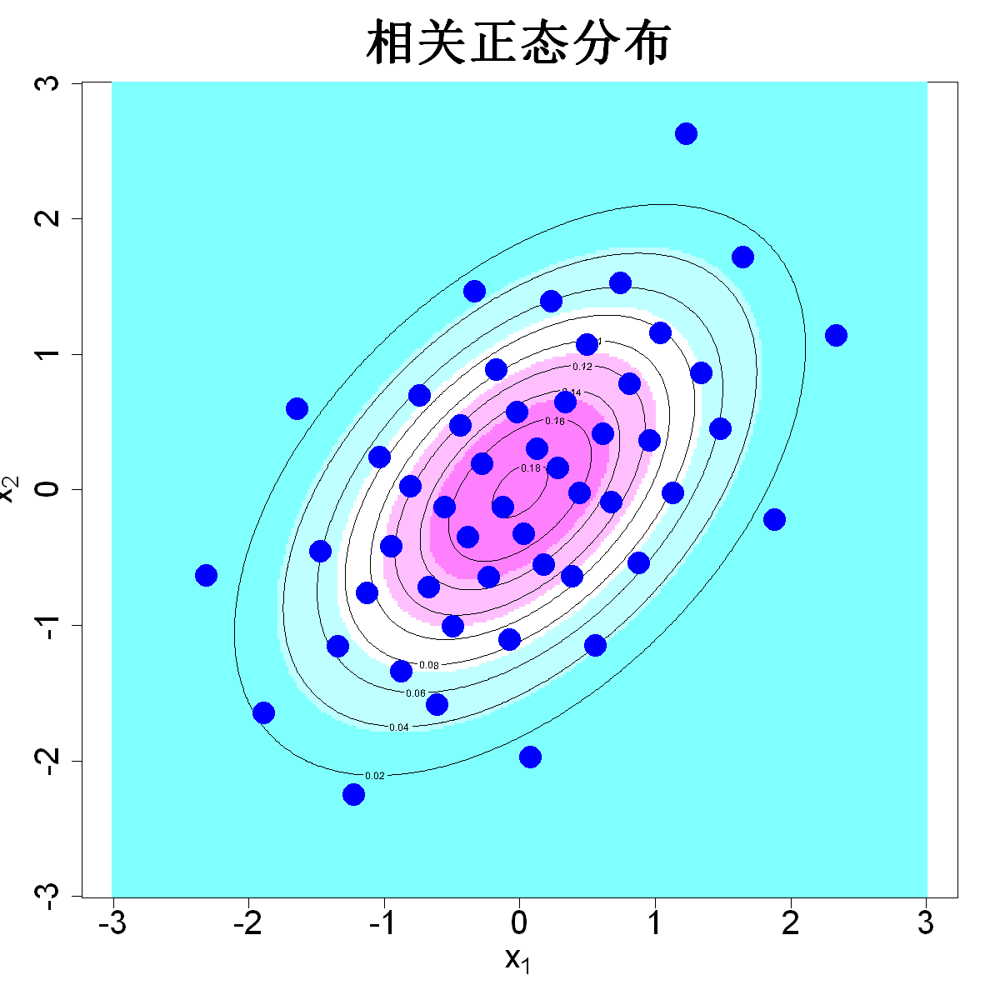

$$\bigstar\;\diamond\;\bigstar\quad\boxed{\sigma_{\omega}\sigma}\quad\bigstar\;\diamond\;\bigstar$$

# 图 5.5



$$\bigstar\;\diamond\;\bigstar\quad\boxed{\sigma_{\omega}\sigma}\quad\bigstar\;\diamond\;\bigstar$$

## 背景信息

举一个示例:构造服从下述二元正态分布的设计点:

$$\begin{bmatrix}x_1\\x_2\end{bmatrix}\sim\mathcal{N}_2\left(\begin{bmatrix}0\\0\end{bmatrix},\begin{bmatrix}1&\rho\\\rho&1\end{bmatrix}\right)\tag{5.8}$$

依据引理2.2可得:

$$\begin{aligned}x_1&\sim\mathcal{N}(0,1)\\x_2|x_1&\sim\mathcal{N}(\rho x_1,1-\rho^2)\end{aligned}$$

因此样本点可按如下方式生成:

$$\begin{aligned}x_{1i}&=\Phi^{-1}(u_{1i})\\x_{2i}&=\rho x_{1i}+\sqrt{1-\rho^2}\Phi^{-1}(u_{2i})\end{aligned}$$

$i=1,\dots,n$,其中$\{(u_{1i},u_{2i})\}_{i=1}^n$为均匀设计,$\Phi(\cdot)$是标准正态分布函数.图5.5展示了取$\rho=0.5$时生成的50个样本点,可以直观看到样本能够良好表征目标分布.

$$\bigstar\;\diamond\;\bigstar\quad\boxed{\sigma_{\omega}\sigma}\quad\bigstar\;\diamond\;\bigstar$$

## 指令

创建画布宽10英寸,高10英寸.设置种子为6.依次使用SFDesign包里的uniformLHD与uniform.optim函数,先随机抽取50x2的均匀设计,再优化,令其为d.依据公式$$\begin{aligned}x_{1i}&=\Phi^{-1}(u_{1i})\\x_{2i}&=\rho x_{1i}+\sqrt{1-\rho^2}\Phi^{-1}(u_{2i})\end{aligned}$$创建变量x1,x2.将x1,x2按列组合为D.依据公式$$\begin{bmatrix}x_1\\x_2\end{bmatrix}\sim\mathcal{N}_2\left(\begin{bmatrix}0\\0\end{bmatrix},\begin{bmatrix}1&\rho\\\rho&1\end{bmatrix}\right)\tag{5.8}$$定义二维正态分布密度函数f.创建c(-3,3)的300点等距网格,横纵分别命名为p1,p2.计算网格上每个点的密度值,令其为fc.做其灰度图,其中坐标轴大小为2,x,y轴标注分别为"expression(x[1])","expression(x[2])",颜色为col=cm.colors(5),标题为"正态分布",大小为3,纵横比为1.叠加等高线,其中条数为10.叠加观测点,点的形状为16,颜色为蓝色,大小为3.

$$\bigstar\;\diamond\;\bigstar\quad\boxed{\sigma_{\omega}\sigma}\quad\bigstar\;\diamond\;\bigstar$$

## 最终效果

```r

#图5.5

options(repr.plot.width=10,repr.plot.height=10)
p=2;n=50
set.seed(6)
library(SFDesign)
d=uniform.optim(uniformLHD(n,p)$design)$design
library(mnormt)
x1=qnorm(d[,1])
x2=qnorm(d[,2],mean=.5*x1,sd=sqrt(1-.5^2))
D=cbind(x1,x2)
f=function(x)dmnorm(x,mean=c(0,0),varcov=matrix(c(1,.5,.5,1),2,2))
N.plot=300
p1=seq(-3,3,length.out=N.plot)
p2=seq(-3,3,length.out=N.plot)
fc=matrix(apply(expand.grid(p1,p2),1,f),N.plot,N.plot)
image(p1,p2,fc,cex.axis=2,xlab=expression(x[1]),ylab=expression(x[2]),cex.lab=2,col=cm.colors(5),main="相关正态分布",cex.main=3,asp=1)
contour(p1,p2,fc,add=TRUE,nlevels=10)
points(D,pch=16,col="blue",cex=3)

```

$$\bigstar\;\diamond\;\bigstar\quad\boxed{\sigma_{\omega}\sigma}\quad\bigstar\;\diamond\;\bigstar$$