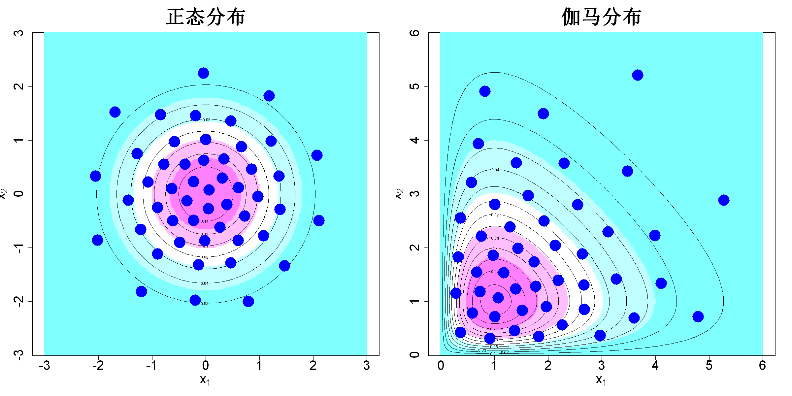

$$\bigstar\;\diamond\;\bigstar\quad\boxed{\sigma_{\omega}\sigma}\quad\bigstar\;\diamond\;\bigstar$$

# 图 5.6



$$\bigstar\;\diamond\;\bigstar\quad\boxed{\sigma_{\omega}\sigma}\quad\bigstar\;\diamond\;\bigstar$$

## 背景信息

图5.6展示了二元正态分布与伽马分布生成的50个支撑点.显而易见,这些点的分布效果远优于图5.4中通过均匀设计逆概率变换得到的样本.概率变换会破坏变换空间中的空间填充性质;而支撑点直接在原始分布空间内优化,能够更好表征目标分布.

$$\bigstar\;\diamond\;\bigstar\quad\boxed{\sigma_{\omega}\sigma}\quad\bigstar\;\diamond\;\bigstar$$

## 指令

创建画布宽20英寸,高10英寸.将画布分为1x2.设置种子为1.使用support包中的sp函数生成50个二元正态分布支撑点,令其为D.依据公式

$$f(\boldsymbol{x})=\frac{1}{2\pi}e^{-(x_{1}^{2}+x_{2}^{2})/2}$$

定义二维正态分布密度函数f.创建c(-3,3)的300点等距网格,横纵分别命名为p1,p2.计算网格上每个点的密度值,令其为fc.做其灰度图,其中坐标轴大小为2,x,y轴标注分别为"expression(x[1])","expression(x[2])",颜色为col=cm.colors(5),标题为"正态分布",大小为4,纵横比为1.叠加等高线,其中条数为10.叠加观测点,点的形状为16,颜色为蓝色,大小为4.

```r
options(repr.plot.width=20,repr.plot.height=10)
par(mfrow=c(1,2))
p=2;n=50
set.seed(1)
library(support)
D=sp(n,p,dist.str=rep("normal",p))$sp
f=function(x)exp(-.5*sum(x^2))/(2*pi)
N.plot=300
p1=seq(-3,3,length.out=N.plot)
p2=seq(-3,3,length.out=N.plot)
fc=matrix(apply(expand.grid(p1,p2),1,f),N.plot,N.plot)
image(p1,p2,fc,xlab=expression(x[1]),ylab=expression(x[2]),col=cm.colors(5),main="正态分布",cex.main=3,cex.lab=2,cex.axis=2,asp=1)
contour(p1,p2,fc,add=TRUE,nlevels=10)
points(D,pch=16,col="blue",cex=4)
```

使用support包中的sp函数生成50个二元伽马分布支撑点,令其为D,其中使用列表传参,每个维度的参数均为`c(2,1)`.依据公式

$$f(\boldsymbol{x})=f(x_{1})f(x_2)=\mathrm{Gamma}(x_1;2,1)\cdot\mathrm{Gamma}(x_2;2,1)$$

定义二维正态分布密度函数f.创建c(0,6)的300点等距网格,横纵分别命名为p1,p2.计算网格上每个点的密度值,令其为fc.作图时余同上,只是标题改为"伽马分布".将画布还原回1x1.

```r
dist.param=list(rep(NULL,p))
for(l in 1:p)dist.param[[l]]=c(2,1)
D=sp(n,p,dist.str=rep("gamma",p),dist.param=dist.param)$sp
f=function(x)prod(dgamma(x,2,1))
N.plot=300
p1=seq(0,6,length.out=N.plot)
p2=seq(0,6,length.out=N.plot)
fc=matrix(apply(expand.grid(p1,p2),1,f),N.plot,N.plot)
image(p1,p2,fc,xlab=expression(x[1]),ylab=expression(x[2]),col=cm.colors(5),main="伽马分布",cex.main=3,cex.lab=2,cex.axis=2,asp=1)
contour(p1,p2,fc,add=TRUE,nlevels=10)
points(D,pch=16,col="blue",cex=4)
par(mfrow=c(1,1))
```

$$\bigstar\;\diamond\;\bigstar\quad\boxed{\sigma_{\omega}\sigma}\quad\bigstar\;\diamond\;\bigstar$$

## 最终效果

```r

#图5.6

options(repr.plot.width=20,repr.plot.height=10)
par(mfrow=c(1,2))
p=2;n=50
set.seed(1)
library(support)
D=sp(n,p,dist.str=rep("normal",p))$sp
f=function(x)exp(-.5*sum(x^2))/(2*pi)
N.plot=300
p1=seq(-3,3,length.out=N.plot)
p2=seq(-3,3,length.out=N.plot)
fc=matrix(apply(expand.grid(p1,p2),1,f),N.plot,N.plot)
image(p1,p2,fc,xlab=expression(x[1]),ylab=expression(x[2]),col=cm.colors(5),main="正态分布",cex.main=3,cex.lab=2,cex.axis=2,asp=1)
contour(p1,p2,fc,add=TRUE,nlevels=10)
points(D,pch=16,col="blue",cex=4)

dist.param=list(rep(NULL,p))
for(l in 1:p)dist.param[[l]]=c(2,1)
D=sp(n,p,dist.str=rep("gamma",p),dist.param=dist.param)$sp
f=function(x)prod(dgamma(x,2,1))
N.plot=300
p1=seq(0,6,length.out=N.plot)
p2=seq(0,6,length.out=N.plot)
fc=matrix(apply(expand.grid(p1,p2),1,f),N.plot,N.plot)
image(p1,p2,fc,xlab=expression(x[1]),ylab=expression(x[2]),col=cm.colors(5),main="伽马分布",cex.main=3,cex.lab=2,cex.axis=2,asp=1)
contour(p1,p2,fc,add=TRUE,nlevels=10)
points(D,pch=16,col="blue",cex=4)
par(mfrow=c(1,1))

```

$$\bigstar\;\diamond\;\bigstar\quad\boxed{\sigma_{\omega}\sigma}\quad\bigstar\;\diamond\;\bigstar$$