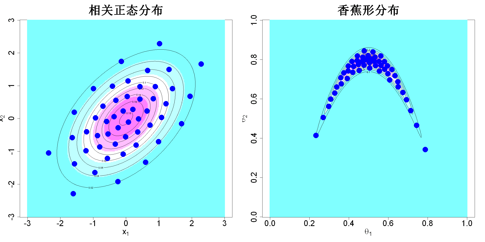

$$\bigstar\;\diamond\;\bigstar\quad\boxed{\sigma_{\omega}\sigma}\quad\bigstar\;\diamond\;\bigstar$$

# 图 5.7



$$\bigstar\;\diamond\;\bigstar\quad\boxed{\sigma_{\omega}\sigma}\quad\bigstar\;\diamond\;\bigstar$$

## 背景信息

我们考虑上一节讨论的相关二元正态分布.首先生成10000个蒙特卡洛样本,再借助`support`程序包求解100个支撑点,结果如图5.7左图所示.对比可见,该点集表现显著优于图5.5中经罗森布拉特变换得到的点集.接下来考察式(4.49)中形式更复杂的香蕉型后验密度案例,该密度仅已知比例常数.我们使用R包`adaptMCMC`实现的自适应梅特罗波利斯算法(沙伊德格,2024)抽取100000个样本,基于这些样本求解100个支撑点,绘制于图5.7右图,该点集同样能够很好地刻画底层分布.

$$\bigstar\;\diamond\;\bigstar\quad\boxed{\sigma_{\omega}\sigma}\quad\bigstar\;\diamond\;\bigstar$$

## 指令

创建画布宽20英寸,高10英寸.将画布分为1x2.设置种子为1.使用rnorm函数生成10000个来自二元正态分布

$$\begin{bmatrix}x_1\\x_2\end{bmatrix}\sim\mathcal{N}_2\left(\begin{bmatrix}0\\0\end{bmatrix},\begin{bmatrix}1&0.5\\0.5&1\end{bmatrix}\right)\tag{5.8}$$

的随机样本,令其为X.基于这10000个蒙特卡洛样本生成100x2个支撑点,令其为D.依据公式

$$\begin{bmatrix}x_1\\x_2\end{bmatrix}\sim\mathcal{N}_2\left(\begin{bmatrix}0\\0\end{bmatrix},\begin{bmatrix}1&0.5\\0.5&1\end{bmatrix}\right)\tag{5.8}$$

定义正态密度函数f.创建c(-3,3)的300点等距网格,横纵分别命名为p1,p2.计算网格上每个点的密度值,令其为fc.做其灰度图,其中坐标轴大小为2,x,y轴标注分别为"expression(x[1])","expression(x[2])",颜色为col=cm.colors(5),标题为"相关正态分布",大小为3,纵横比为1.叠加等高线,其中条数为10.叠加观测点,点的形状为16,颜色为蓝色,大小为3.

```r
options(repr.plot.width=20,repr.plot.height=10)
par(mfrow=c(1,2))
p=2;n=50
N=10000
library(support)
library(mnormt)
set.seed(1)
X=rmnorm(N,mean=c(0,0),varcov=matrix(c(1,.5,.5,1),nrow=2,ncol=2))
D=sp(n,p,dist.samp=X)$sp
f=function(x)dmnorm(x,mean=c(0,0),varcov=matrix(c(1,.5,.5,1),2,2))
N.plot=300
p1=seq(-3,3,length.out=N.plot)
p2=seq(-3,3,length.out=N.plot)
fc=matrix(apply(expand.grid(p1,p2),1,f),N.plot,N.plot)
image(p1,p2,fc,xlab=expression(x[1]),ylab=expression(x[2]),col=cm.colors(5),main="相关正态分布",cex.main=3,cex.lab=2,cex.axis=2,asp=1)
contour(p1,p2,fc,add=TRUE,nlevels=10)
points(D,pch=16,col="blue",cex=3)
```

依据公式

$$f(\boldsymbol{\theta})\propto\exp\left(-\frac{1}{2}\frac{\theta_1^2}{100}-\frac{1}{2}(\theta_2+0.03\theta_1^2-3)^2\right),\;\boldsymbol{\theta}\in\mathbb{R}^2\tag{4.49}$$

创建其对数函数logf.创建c(-3,3)的300点等距网格,横纵分别命名为p1,p2.计算网格上每个点的密度值,令其为fc.对目标分布的对数密度函数logf执行MCMC采样,其中要生成100000个MCMC样本,$\theta_1=0.5,\theta_2=0.8$,设置目标接受率为0.4,将提取出的样本矩阵命名为X.基于这100000个MCMC样本生成100x2个支撑点,令其为D.作图余同上,只是标题改为"香蕉型分布".将画布还原回1x1.

```r
logf=function(para){
  l1=-40;u1=40;l2=-25;u2=10
  x1=l1+(u1-l1)*para[1]
  x2=l2+(u2-l2)*para[2]
  -.5*(x1^2/100+(x2+.03*x1^2-3)^2)
}
N.plot=300
p1=seq(0,1,length.out=N.plot)
p2=seq(0,1,length.out=N.plot)
fc=matrix(exp(apply(expand.grid(p1,p2),1,logf)),N.plot,N.plot)
library(adaptMCMC)
X=MCMC(logf,n=100000,init=c(.5,.8),acc.rate=0.4)$samples
D=sp(n,p,dist.samp=X)$sp
image(p1,p2,fc,xlab=expression(theta[1]),ylab=expression(theta[2]),col=cm.colors(5),main="香蕉形分布",cex.main=3,cex.lab=2,cex.axis=2,asp=1)
contour(p1,p2,fc,add=TRUE,nlevels=10)
points(D,pch=16,col="blue",cex=3)
par(mfrow=c(1,1))
```

$$\bigstar\;\diamond\;\bigstar\quad\boxed{\sigma_{\omega}\sigma}\quad\bigstar\;\diamond\;\bigstar$$

## 最终效果

```r

#图5.7

options(repr.plot.width=20,repr.plot.height=10)
par(mfrow=c(1,2))
p=2;n=50
N=10000
library(support)
set.seed(1)
X=rmnorm(N,mean=c(0,0),varcov=matrix(c(1,.5,.5,1),nrow=2,ncol=2))
D=sp(n,p,dist.samp=X)$sp
f=function(x)dmnorm(x,mean=c(0,0),varcov=matrix(c(1,.5,.5,1),2,2))
N.plot=300
p1=seq(-3,3,length.out=N.plot)
p2=seq(-3,3,length.out=N.plot)
fc=matrix(apply(expand.grid(p1,p2),1,f),N.plot,N.plot)
image(p1,p2,fc,xlab=expression(x[1]),ylab=expression(x[2]),col=cm.colors(5),main="相关正态分布",cex.main=3,cex.lab=2,cex.axis=2,asp=1)
contour(p1,p2,fc,add=TRUE,nlevels=10)
points(D,pch=16,col="blue",cex=3)

logf=function(para){
  l1=-40;u1=40;l2=-25;u2=10
  x1=l1+(u1-l1)*para[1]
  x2=l2+(u2-l2)*para[2]
  -.5*(x1^2/100+(x2+.03*x1^2-3)^2)
}
N.plot=300
p1=seq(0,1,length.out=N.plot)
p2=seq(0,1,length.out=N.plot)
fc=matrix(exp(apply(expand.grid(p1,p2),1,logf)),N.plot,N.plot)
library(adaptMCMC)
X=MCMC(logf,n=100000,init=c(.5,.8),acc.rate=0.4)$samples
D=sp(n,p,dist.samp=X)$sp
image(p1,p2,fc,xlab=expression(theta[1]),ylab=expression(theta[2]),col=cm.colors(5),main="香蕉形分布",cex.main=3,cex.lab=2,cex.axis=2,asp=1)
contour(p1,p2,fc,add=TRUE,nlevels=10)
points(D,pch=16,col="blue",cex=3)
par(mfrow=c(1,1))

```

$$\bigstar\;\diamond\;\bigstar\quad\boxed{\sigma_{\omega}\sigma}\quad\bigstar\;\diamond\;\bigstar$$