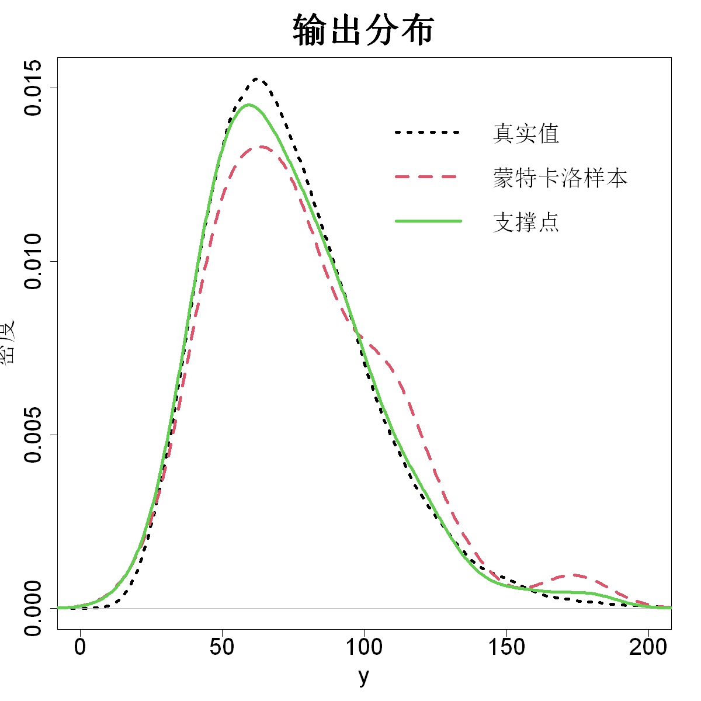

$$\bigstar\;\diamond\;\bigstar\quad\boxed{\sigma_{\omega}\sigma}\quad\bigstar\;\diamond\;\bigstar$$

# 图 5.8



$$\bigstar\;\diamond\;\bigstar\quad\boxed{\sigma_{\omega}\sigma}\quad\bigstar\;\diamond\;\bigstar$$

## 背景信息

举个例子,下述函数用于模拟水流通过钻孔的流量$y$(莫里斯等人,1993):

$$y=\frac{2\pi x_3(x_4-x_6)}{\log\left(\frac{x_2}{x_1}\right)\left(1+\frac{2x_7x_3}{\log(x_2/x_1)x_1^2x_8}+\frac{x_3}{x_5}\right)}$$

8个输入变量对应的不确定性分布如表5.1所示.为便于说明,假设该钻孔模型求值成本较高,但仍可以开展代理建模.

>**表5.1**钻孔模型输入变量及其不确定性分布

|输入变量|符号|不确定性分布|
|:--:|:--:|:--:|
|钻孔半径|$x_1$|$\mathcal{\mathcal{N}}(0.1,0.01618^2)$|
|影响半径|$x_2$|$\mathcal{\mathcal{L\mathcal{N}}}(7.71,1.0056^2)$|
|上部透射率|$x_3$|$\mathcal{\mathcal{U}}[63070,115600]$|
|上部水头|$x_4$|$\mathcal{\mathcal{U}}[990,1110]$|
|下部透射率|$x_5$|$\mathcal{\mathcal{U}}[63.1,116]$|
|下部水头|$x_6$|$\mathcal{\mathcal{U}}[700,820]$|
|钻孔长度|$x_7$|$\mathcal{\mathcal{U}}[1120,1680]$|
|钻孔导水系数|$x_8$|$\mathcal{\mathcal{U}}[9855,12045]$|

针对钻孔模型,我们首先生成100000组蒙特卡洛样本.钻孔模型求值难度较低,因此可以直接在100000组样本上计算模型输出,并通过核密度估计得到输出分布,对应图5.8中黑色虚线.下面采用支撑点方法实现不确定性传播:首先对100000组蒙特卡洛样本标准化,借助R语言程序包`support`(马克,2018)得到$n=100$个支撑点$\{\boldsymbol{z}_j\}_{j=1}^{100}$;再通过$x_{ji}=\mu_i+\sigma_iz_{ji}$将支撑点还原至原始尺度.在这100个支撑点上求解钻孔模型,基于得到的$y_i$构建核密度估计,对应图中绿色实线.可以看到,该结果能够很好逼近由100000组蒙特卡洛样本得到的"真实"密度.作为对照,图中同时给出100组蒙特卡洛样本得到的密度曲线(红色虚线).不难看出,支撑点得到的密度估计与真实密度更加接近.

$$\bigstar\;\diamond\;\bigstar\quad\boxed{\sigma_{\omega}\sigma}\quad\bigstar\;\diamond\;\bigstar$$

## 指令

创建画布宽10英寸,高10英寸.依据公式

$$y=\frac{2\pi x_3(x_4-x_6)}{\log\left(\frac{x_2}{x_1}\right)\left(1+\frac{2x_7x_3}{\log(x_2/x_1)x_1^2x_8}+\frac{x_3}{x_5}\right)}$$

定义函数f.设置种子为1.创建100000x8维矩阵X,每一列代表$x_i$按照其分布的随机取值集合.对X计算误差极小的蒙特卡洛估计值true.绘制true的核密度曲线,其中线的类型为3,线宽为4,x轴显示范围为c(0,200),大小为2,x轴标注为"y",y轴标注为"密度",大小为2,标题为"输出分布",大小为3.

```r
options(repr.plot.width=10,repr.plot.height=10)
f=function(x)2*pi*x[3]*(x[4]-x[6])/(log(x[2]/x[1])*(1+2*x[7]*x[3]/(log(x[2]/x[1])*x[1]^2*x[8])+x[3]/x[5]))
p=8;N=100000;n=100
lower=c(0.05,100,63070,990,63.1,700,1120,9855)
upper=c(0.15,50000,115600,1110,116,820,1680,12045)
set.seed(1)
X=matrix(0,nrow=N,ncol=p)
X[,1]=0.1+0.01618*rnorm(N)
X[,2]=exp(7.71+1.0056*rnorm(N))
X[,3:p]=matrix(runif(N*6),nrow=N)
X[,3:p]=sweep(X[,3:p],2,upper[3:p]-lower[3:p],"*")
X[,3:p]=sweep(X[,3:p],2,lower[3:p],"+")
true=apply(X,1,f)
plot(density(true),lty=3,lwd=4,xlim=c(0,200),cex.axis=2,xlab="y",ylab="密度",cex.lab=2,main="输出分布",cex.main=3)
```

从X的100000行中随机抽取100行作为蒙特卡洛样本,令其为x,计算误差较大的蒙特卡洛估计值mc.叠加mc的核密度曲线,其中颜色为2,线型为2,线宽为4.

```r
x=X[sample(1:N,n),]
mc=apply(x,1,f)
lines(density(mc),col=2,lty=2,lwd=4)
```

按列计算每个$x_i$的均值mu和标准差sigma.对X按列标准化为Z.使用sp函数计算Z的支撑点D,再将D按列还原为原始尺度.对D计算支撑点估计值y,叠加y的核密度曲线,其中颜色为3,线宽为4.添加图例,其中位置为c(100,.015),图例内容为c("真实值","蒙特卡洛样本","支撑点"),颜色为c(1,2,3),线宽为4,线型为c(3,2,1),边框类型为"n",大小为2.

```r
mu=apply(X,2,mean)
sigma=apply(X,2,sd)
Z=X|>
sweep(2,mu,"-")|>
sweep(2,sigma,"/")
library(support)
D=sp(n,p,dist.samp=Z)$sp
D=D|>
sweep(2,sigma,"*")|>
sweep(2,mu,"+")
y=apply(D,1,f)
lines(density(y),col=3,lwd=4)
legend(100,.015,legend=c("真实值","蒙特卡洛样本","支撑点"),col=c(1,2,3),lwd=4,lty=c(3,2,1),bty="n",cex=2)
```

$$\bigstar\;\diamond\;\bigstar\quad\boxed{\sigma_{\omega}\sigma}\quad\bigstar\;\diamond\;\bigstar$$

## 最终效果

```r

#图5.8

options(repr.plot.width=10,repr.plot.height=10)
f=function(x)2*pi*x[3]*(x[4]-x[6])/(log(x[2]/x[1])*(1+2*x[7]*x[3]/(log(x[2]/x[1])*x[1]^2*x[8])+x[3]/x[5]))
p=8;N=100000;n=100
lower=c(0.05,100,63070,990,63.1,700,1120,9855)
upper=c(0.15,50000,115600,1110,116,820,1680,12045)
set.seed(1)
X=matrix(0,nrow=N,ncol=p)
X[,1]=0.1+0.01618*rnorm(N)
X[,2]=exp(7.71+1.0056*rnorm(N))
X[,3:p]=matrix(runif(N*6),nrow=N)
X[,3:p]=sweep(X[,3:p],2,upper[3:p]-lower[3:p],"*")
X[,3:p]=sweep(X[,3:p],2,lower[3:p],"+")
true=apply(X,1,f)
plot(density(true),lty=3,lwd=4,xlim=c(0,200),cex.axis=2,xlab="y",ylab="密度",cex.lab=2,main="输出分布",cex.main=3)

x=X[sample(1:N,n),]
mc=apply(x,1,f)
lines(density(mc),col=2,lty=2,lwd=4)

mu=apply(X,2,mean)
sigma=apply(X,2,sd)
Z=X|>
sweep(2,mu,"-")|>
sweep(2,sigma,"/")
library(support)
D=sp(n,p,dist.samp=Z)$sp
D=D|>
sweep(2,sigma,"*")|>
sweep(2,mu,"+")
y=apply(D,1,f)
lines(density(y),col=3,lwd=4)
legend(100,.015,legend=c("真实值","蒙特卡洛样本","支撑点"),col=c(1,2,3),lwd=4,lty=c(3,2,1),bty="n",cex=2)

```

$$\bigstar\;\diamond\;\bigstar\quad\boxed{\sigma_{\omega}\sigma}\quad\bigstar\;\diamond\;\bigstar$$