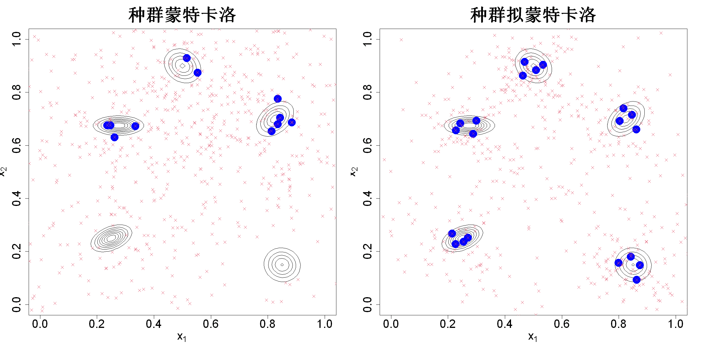

$$\bigstar\;\diamond\;\bigstar\quad\boxed{\sigma_{\omega}\sigma}\quad\bigstar\;\diamond\;\bigstar$$

# 图 5.9



$$\bigstar\;\diamond\;\bigstar\quad\boxed{\sigma_{\omega}\sigma}\quad\bigstar\;\diamond\;\bigstar$$

## 背景信息

举一个算例,考虑下面混合正态分布:

$$f(x)=\frac{1}{5}\sum_{i=1}^5\mathcal{N}(\boldsymbol{x};\boldsymbol{\mu}_i,\boldsymbol{\Sigma}_i)$$

其中$\boldsymbol{\mu}_1=(0.250,0.250)'$,$\boldsymbol{\mu}_2=(0.500,0.900)'$,$\boldsymbol{\mu}_3=(0.825,0.700)'$,$\boldsymbol{\mu}_4=(0.275,0.675)'$,$\boldsymbol{\mu}_5=(0.850,0.150)'$;$\boldsymbol{\Sigma}_1=40^{-2}\begin{bmatrix}2&0.6\\0.6&1\end{bmatrix}$,$\boldsymbol{\Sigma}_2=40^{-2}\begin{bmatrix}2&-0.4\\-0.4&2\end{bmatrix}$,$\boldsymbol{\Sigma}_3=40^{-2}\begin{bmatrix}2&0.8\\0.8&2\end{bmatrix}$,$\boldsymbol{\Sigma}_4=40^{-2}\begin{bmatrix}3&0\\0&0.5\end{bmatrix}$,$\boldsymbol{\Sigma}_5=40^{-2}\begin{bmatrix}2&-0.1\\-0.1&2\end{bmatrix}$.取参数$K=20,\;J=10,\;T=4$,该设置下总计需要800次密度求值.图5.9展示了种群蒙特卡洛(采用多项重抽样)与种群拟蒙特卡洛的样本以及最终重抽样得到的分布中心.可以看出,相比种群蒙特卡洛,种群拟蒙特卡洛的样本与建议分布中心能够很好地落在高密度区域.因此种群拟蒙特卡洛可以生成质量高得多的带权重样本.

$$\bigstar\;\diamond\;\bigstar\quad\boxed{\sigma_{\omega}\sigma}\quad\bigstar\;\diamond\;\bigstar$$

## 指令

创建画布宽20英寸,高10英寸.将画布分为1x2.依据公式

$$f(x)=\frac{1}{5}\sum_{i=1}^5\mathcal{N}(\boldsymbol{x};\boldsymbol{\mu}_i,\boldsymbol{\Sigma}_i)$$

其中$\boldsymbol{\mu}_1=(0.250,0.250)'$,$\boldsymbol{\mu}_2=(0.500,0.900)'$,$\boldsymbol{\mu}_3=(0.825,0.700)'$,$\boldsymbol{\mu}_4=(0.275,0.675)'$,$\boldsymbol{\mu}_5=(0.850,0.150)'$;$\boldsymbol{\Sigma}_1=40^{-2}\begin{bmatrix}2&0.6\\0.6&1\end{bmatrix}$,$\boldsymbol{\Sigma}_2=40^{-2}\begin{bmatrix}2&-0.4\\-0.4&2\end{bmatrix}$,$\boldsymbol{\Sigma}_3=40^{-2}\begin{bmatrix}2&0.8\\0.8&2\end{bmatrix}$,$\boldsymbol{\Sigma}_4=40^{-2}\begin{bmatrix}3&0\\0&0.5\end{bmatrix}$,$\boldsymbol{\Sigma}_5=40^{-2}\begin{bmatrix}2&-0.1\\-0.1&2\end{bmatrix}$创建函数的对数logmixture(转为对数让计算更精准).创建c(0,1)的等距网格,两边分别为p1,p2,各100点.展开成网格x.grid.计算网格上每个点的密度值exp(logf),并将其转换为矩阵density.

```r
options(repr.plot.width=20,repr.plot.height=10)
par(mfrow=c(1,2))
library(mvtnorm)
library(pmc)
logmixture=function(x){
  v=matrix(NA,nrow=5,ncol=2)
  v[1,]=c(-10,-10)
  v[2,]=c(0,16)
  v[3,]=c(13,8)
  v[4,]=c(-9,7)
  v[5,]=c(14,-14)
  v=(v+20)/40
  sigma=array(NA,dim=c(5,2,2))
  sigma[1,,]=matrix(c(2,0.6,0.6,1),nrow=2)/40^2
  sigma[2,,]=matrix(c(2,-0.4,-0.4,2),nrow=2)/40^2
  sigma[3,,]=matrix(c(2,0.8,0.8,2),nrow=2)/40^2
  sigma[4,,]=matrix(c(3,0,0,0.5),nrow=2)/40^2
  sigma[5,,]=matrix(c(2,-0.1,-0.1,2),nrow=2)/40^2
  logf=rep(0,5)
  for(i in 1:5)logf[i]=dmvnorm(x,mean=v[i,],sigma=sigma[i,,],log=TRUE)
  logaddexp(logf)-log(5)
}
x1=x2=seq(0,1,length=101)
x.grid=expand.grid(x1,x2)
density=matrix(exp(apply(x.grid,1,logmixture)),nrow=101,ncol=101)
```

设置种子为1.随机生成在均匀分布[0,1]上的20x2维的初始点,令其为ini.使用pmc函数,运行标准种群蒙特卡洛方法,其中自定义函数为logmixture,题干给出K=20,J=10,steps=4,随机初始值为ini,采样方法为随机采样,重抽样方法为多项式重抽样,初始sigma为0.2,不进行自适应sigma.将结果存储在pmc.mn中.绘制其等高线图,其中不显示标签,等高线数为10,标题为"种群蒙特卡洛",标题字体大小为3,横轴标签为expression(x[1]),纵轴标签为expression(x[2]),横纵轴标签字体大小为2,横纵轴刻度字体大小为2.叠加最后一次选择的分布中心的点,为center.all列中第81:100行的点,颜色为蓝色,点形状为16,点大小为3.叠加所有采样点,为samp.all列,颜色为2,点形状为4,点大小为1.

```r
set.seed(1)
Z=1;p=2;K=20;J=10;steps=4;sigma_init=0.2
ini=matrix(runif(K*p),ncol=p)
pmc.mn=pmc(logmixture,K,J,steps,ini,sampling="random",resampling="multinomial",sigma=sigma_init,sigma.adapt=FALSE)
contour.default(x=x1,y=x2,z=density,drawlabels=FALSE,nlevels=10,main="种群蒙特卡洛",cex.main=3,xlab=expression(x[1]),ylab=expression(x[2]),cex.lab=2,cex.axis=2)
points(pmc.mn$center.all[(K*steps+1):(K*steps+K),],col="blue",pch=16,cex=3)
points(pmc.mn$samp.all,col=2,pch=4,cex=1)
```

使用pmc函数,运行种群拟蒙特卡洛方法,其中自定义函数为logmixture,题干给出K=20,J=10,steps=4,随机初始值为ini,采样方法为qmc采样,重抽样方法为sp重抽样,初始sigma为0.2,进行自适应sigma.将结果存储在pqmc.isp中.绘制其等高线图,其中不显示标签,等高线数为10,标题为"种群拟蒙特卡洛",标题字体大小为3,横轴标签为expression(x[1]),纵轴标签为expression(x[2]),横纵轴标签字体大小为2,横纵轴刻度字体大小为2.叠加最后一次选择的分布中心的点,为center.all列中第81:100行的点,颜色为蓝色,点形状为16,点大小为3.叠加所有采样点,为samp.all列,颜色为2,点形状为4,点大小为1.将画布还原回1x1.

```r
pqmc.isp=pmc(logmixture,K,J,steps,ini,sampling="qmc",resampling="sp",sigma=sigma_init,sigma.adapt=TRUE)
contour.default(x=x1,y=x2,z=density,drawlabels=FALSE,nlevels=10,main="种群拟蒙特卡洛",cex.main=3,xlab=expression(x[1]),ylab=expression(x[2]),cex.lab=2,cex.axis=2)
points(pqmc.isp$center.all[(K*steps+1):(K*steps+K),],col="blue",pch=16,cex=3)
points(pqmc.isp$samp.all,col=2,pch=4,cex=1)
par(mfrow=c(1,1))
```

$$\bigstar\;\diamond\;\bigstar\quad\boxed{\sigma_{\omega}\sigma}\quad\bigstar\;\diamond\;\bigstar$$

## 最终效果

```r

#图5.9

options(repr.plot.width=20,repr.plot.height=10)
par(mfrow=c(1,2))
library(mvtnorm)
library(pmc)
logmixture=function(x){
  v=matrix(NA,nrow=5,ncol=2)
  v[1,]=c(-10,-10)
  v[2,]=c(0,16)
  v[3,]=c(13,8)
  v[4,]=c(-9,7)
  v[5,]=c(14,-14)
  v=(v+20)/40
  sigma=array(NA,dim=c(5,2,2))
  sigma[1,,]=matrix(c(2,0.6,0.6,1),nrow=2)/40^2
  sigma[2,,]=matrix(c(2,-0.4,-0.4,2),nrow=2)/40^2
  sigma[3,,]=matrix(c(2,0.8,0.8,2),nrow=2)/40^2
  sigma[4,,]=matrix(c(3,0,0,0.5),nrow=2)/40^2
  sigma[5,,]=matrix(c(2,-0.1,-0.1,2),nrow=2)/40^2
  logf=rep(0,5)
  for(i in 1:5)logf[i]=dmvnorm(x,mean=v[i,],sigma=sigma[i,,],log=TRUE)
  logaddexp(logf)-log(5)
}
x1=x2=seq(0,1,length=101)
x.grid=expand.grid(x1,x2)
density=matrix(exp(apply(x.grid,1,logmixture)),nrow=101,ncol=101)

set.seed(1)
Z=1;p=2;K=20;J=10;steps=4;sigma_init=0.2
ini=matrix(runif(K*p),ncol=p)
pmc.mn=pmc(logmixture,K,J,steps,ini,sampling="random",resampling="multinomial",sigma=sigma_init,sigma.adapt=FALSE)
contour.default(x=x1,y=x2,z=density,drawlabels=FALSE,nlevels=10,main="种群蒙特卡洛",cex.main=3,xlab=expression(x[1]),ylab=expression(x[2]),cex.lab=2,cex.axis=2)
points(pmc.mn$center.all[(K*steps+1):(K*steps+K),],col="blue",pch=16,cex=3)
points(pmc.mn$samp.all,col=2,pch=4,cex=1)

pqmc.isp=pmc(logmixture,K,J,steps,ini,sampling="qmc",resampling="sp",sigma=sigma_init,sigma.adapt=TRUE)
contour.default(x=x1,y=x2,z=density,drawlabels=FALSE,nlevels=10,main="种群拟蒙特卡洛",cex.main=3,xlab=expression(x[1]),ylab=expression(x[2]),cex.lab=2,cex.axis=2)
points(pqmc.isp$center.all[(K*steps+1):(K*steps+K),],col="blue",pch=16,cex=3)
points(pqmc.isp$samp.all,col=2,pch=4,cex=1)
par(mfrow=c(1,1))

```

$$\bigstar\;\diamond\;\bigstar\quad\boxed{\sigma_{\omega}\sigma}\quad\bigstar\;\diamond\;\bigstar$$